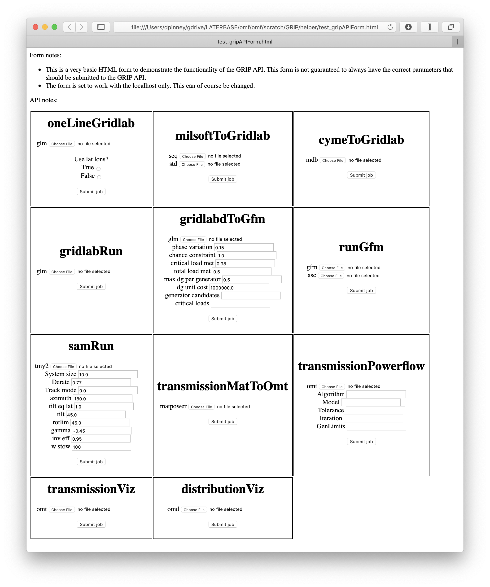

## Overview, Deployment, and Code

You can deploy the OMF inside a Docker container and access some of its functionality via an HTTP REST API.

Please see this [dockerfile](https://github.com/dpinney/omf/blob/master/omf/scratch/GRIP/grip.Dockerfile) and start/deploy via [dockerBuild.sh](https://github.com/dpinney/omf/blob/master/omf/scratch/GRIP/dockerBuild.sh).

All code and tests for this interface is in the [omf/scratch/GRIP](https://github.com/dpinney/omf/tree/master/omf/scratch/GRIP) subdirectory.

## Major Functionality

The major functionality available via the API is:

* /oneLineGridlab - generate a one line diagram of a GridLAB-D .glm file.
* /milsoftToGridlab - convert a Milsoft Windmil ASCII export (.std & .seq) in to a GridLAB-D .glm.
* /cymeToGridlab - convert an Eaton Cymdist .mdb export in to a GridLAB-D .glm.
* /gridlabRun - run a .glm through GridLAB-D and return the results as JSON.
* /gridlabdToGfm - convert a GridLAB-D to a LANL ANSI General Fragility Model file.
* /runGfm - calculate distribution damage using a LANL ANSI General Fragility Model file.
* /samRun - run NREL SAM with JSON inputs/outputs.
* /transmissionMatToOmt - convert a .mat or .m input in to a JSON .omt transmission circuit format.
* /transmissionPowerflow - run ACOPF for a .omt transmission circuit.
* /transmissionViz - generate an interactive and editable one line diagram of a transmission network.
* /distributionViz - generate an interactive and editable one line diagram of a distribution network.

For the full documentation on the API endpoints please see the docstrings in [grip.py](https://github.com/dpinney/omf/blob/master/omf/scratch/GRIP/grip.py).

## Test Interface

All of the endpoints are tested via [test_grip.py](https://github.com/dpinney/omf/blob/master/omf/scratch/GRIP/test_grip.py).

The test framework comes with a GUI in HTML (screenshot below) to easily test all the endpoints and inspect the results.

