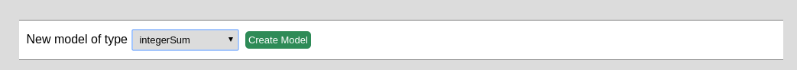
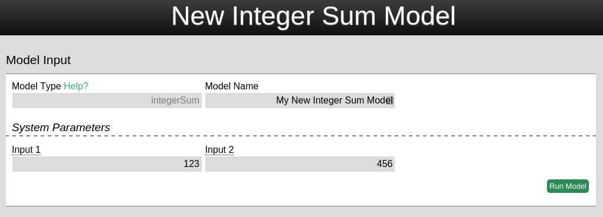
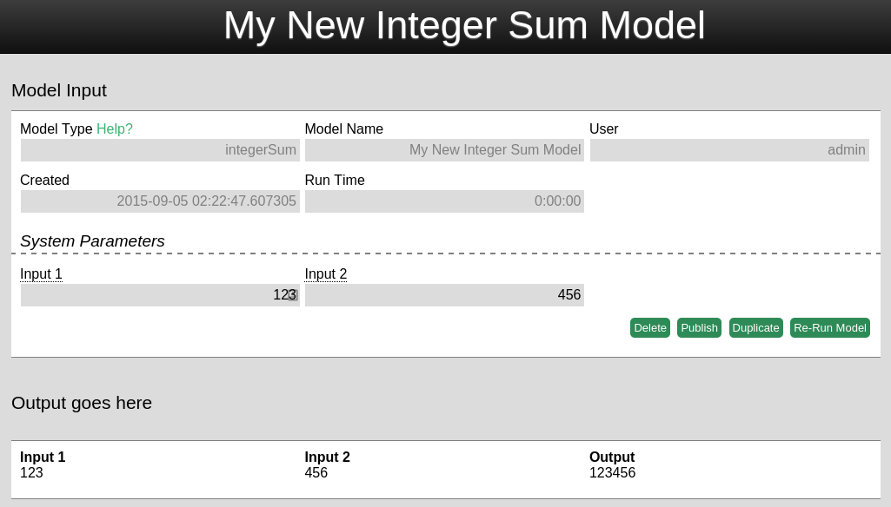
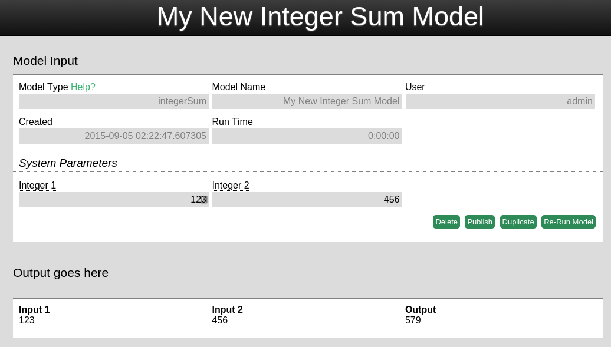

This document explains how to create a new kind of model in the OMF.

In this guide, we'll create a model named integerSum that adds two numbers and displays the result. Specifically, we will show how to start with the model skeleton files, adjust the file paths and modelType parameters, add new inputs and model logic, and finally create a default test case.

It assumes that the developer has successfully installed and setup the OMF per the wiki instructions [here](./Dev-~-Installation-Instructions). Also please read the OMF [code style guide here](./Dev-~-Architecture-Notes).

### Start With the modelSkeleton

Every OMF model is described in a pair of files: a .py file that does the calculation, and an .html file that defines the user interface.

0. Make a copy of the model skeleton python and template files: _modelSkeleton.py and _modelSkeleton.html, renaming them to "newModel.py" and "newModel.html". These are available under /omf/omf/models/.

1. (The skeleton model has the minimum code required for a new OMF model. Don't delete any of it.)

2. Open the python file (integerSum.py) and modify the html template filename at line 16 to the name of your template. The previous path should contain modelSkeleton.html and be changed to integerSum.html.

```
with open(pJoin(__metaModel__._myDir,"modelSkeleton.html"),"r") as tempFile:
template = Template(tempFile.read())
```

Becomes:

```
with open(pJoin(__metaModel__._myDir,"integerSum.html"),"r") as tempFile:
template = Template(tempFile.read())
```

This argument must be correct because it is passed to the renderTemplate function, which is responsible for loading all the inputs, outputs and other variables required by the user interface. The renderTemplate function is specifically used in the OMF for passing the input and output after the model successfully runs to the metaModel, the master controller of the OMF containing the functions common to all models which then loads the user interface on the web page.

3. Open the template file integerSum.html, and change the title text on line 23 and modelType text on lines 30-31 to match the new model. 

```
<p id="titleText">A barebones skeleton of a new model</p>
```

Becomes:

```
<p id="titleText">New Integer Sum Model</p>
```

And

```
<div class="shortInput">
	<label>Model Type <a href="./Models:-modelSkeleton" target="blank">Help?</a></label>
	<input type="text" id="modelType" name="modelType" value="modelSkeleton" readonly/>
</div>
```
Becomes:

```
<div class="shortInput">
	<label>Model Type <a href="./Models:-integerSum" target="blank">Help?</a></label>
	<input type="text" id="modelType" name="modelType" value="integerSum" readonly/>
</div>
```

4. Now test the changes so far before proceeding. Create and run a new model in your web browser ensuring the parameters changed before are correct. For the Integer Sum Model we have been working with so far, the screen will look as follows:





### Add Inputs and Functionality

You may have noticed the output does not mathematically add the sum of the two inputs as numbers. This is because the skeleton models logic only adds two inputs together as strings. The model has a run function where the logic for such operations should reside. We will modify the section in skeleton run function after "Model operations goes here".

5. Go to the section “Model operations goes here” at line 43. Modify the lines after line 43. For the integer sum model, the prior code from the skeleton will only have to be slightly modified to achieve the functionality desired. 

```
# Model operations goes here.
inputOne = inputDict.get("input1", 123)
inputTwo = inputDict.get("input2", 867)
output = inputOne + inputTwo
outData["output"] = output
# Model operations typically ends here.
```

Becomes:

```
# Model operations goes here.
Num1 = inputDict.get("integer1", 123)
Num2 = inputDict.get("integer2", 867)
output = float(Num1) + float(Num2)
outData["output"] = output
# Model operations typically ends here.
```

6. For function changes such as input name changes or additional inputs we'll have to add the inputs to the html template. For the integer model, we'll only have to modify the previous inputs input1 and input2 to integer 1 and integer 2 an (lines 55 and 59):

```
<label class="tooltip">Integer 1<span class="classic">Enter an input of any kind.</span></label>
<input type="text" id="integer1" name="integer1" required="required"/>
<label class="tooltip">Integer 2<span class="classic">Enter an input of another kind.</span></label>
<input type="text" id="integer2" name="integer2" required="required"/>
```

We'll also add input validation so that only integers can be submitted, via the pattern attribute:

```
# Model operations goes here.
<input type="text" id="integer1" name="integer1" pattern="^\d+\.?\d*$" required="required"/>
<input type="text" id="integer2" name="integer2” pattern="^\d+\.?\d*$" required="required"/>
```

7. Test the model functionality by re-running the integerSum model and confirming the results are now correct. We have now successfully created our first model to add up two numbers!



### Add a Test Case

The test case runs the model from the command line with pre-set values, without needing to run the entire OMF web application and manually enter the inputs. By default, the skeleton model includes a test case for the two inputs: input1 and input2 (at lines 75 and 76) but these input names are outdated for our new model. These must be modified to the work with the integerSum model by changing their names and default values. 

8. Change the names input1 and input 2 to integer1 and integer2, updating their default values as well. 

```
inData = {"input1": "abc1 Easy as...",
	"input2": "123 Or Simple as..."}
```

Becomes:

```
inData = {"integer1": "123",
	"integer2": "456"}
```

9. You can run the test by executing the models python file at commandline.  It should display output similar to when running the model from the web interface by opening two new browser tabs, one with a blank input-free template and one with the output derived from the test inputs.