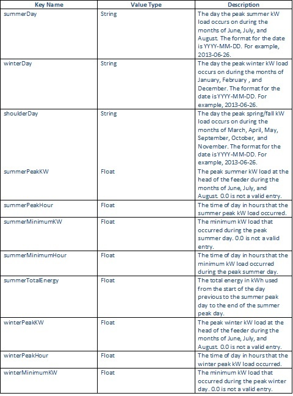

The function you need to call to calibrate a feeder is calibratCalibrate.startCalibration (working_directory, feederTree, scadaInfo, filename, feederConfig)
 
•	Working_directory – string containing the path you wish for the calibration to take place in.

•	feederTree – dict containing the feeder you wish to calibrate.

•	scadaInfo – dict containing calibration criteria that needs to be met for the calibration to be successful.

•	filename – string containing the desired name to give for calibration identification.

•	feederConfig – dict containing supplementary files and feeder ratings for calibrating the feeder.

scadaInfo dict is supposed to be determined from the SCADA data provided for the feeder. Information stored in scadaInfo is described below.

The player files given in the feederConfig are supposed to be generated from the SCADA data provided for the feeder. The contents of feederConfig are described below.

