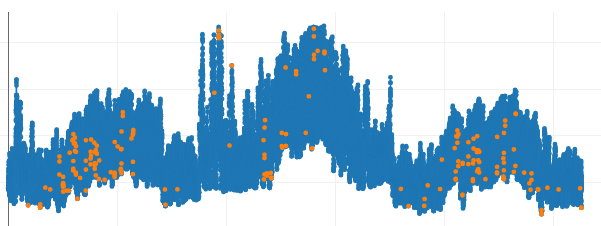
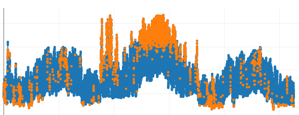
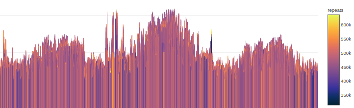

### Introduction

The various anomaly detectors in anomalyDetector take in some combination of forecasted temperature, date, and historical demand data to flag demand data-points as anomalously high or low.

The Prophet monovariate anomaly detector uses only historical demand and date to determine a range of expected demand values. Any data outside of this range is flagged as anomalous.

The Peak Forecast T-Test Method uses the Daily Peak Demand model from the loadForecast model to predict the time and size of the peak demand for a given day. A t-test interval is then constructed using the predicted demand as the expected mean, and data outside the specified confidence interval is flagged.

The Elliptic Envelope method uses the scikit-learn anomaly detection library to flag anomalies in data that appears to be Gaussian. [Read more here in the scikit-learn user guide.](https://scikit-learn.org/stable/modules/outlier_detection.html#fitting-an-elliptic-envelope)

The Local Outlier Factor method uses the scikit-learn anomaly detection library to flag anomalies in data based on local neighborhood densities; low density neighborhoods imply higher likelyhood of being an outlier. [Read more here in the scikit-learn user guide.](https://scikit-learn.org/stable/modules/outlier_detection.html#local-outlier-factor)

The Isolation Forest method uses the scikit-learn anomaly detection library to flag anomalies in data by creating a forrest of random decision trees and computing the average path length to each data point; Shorter paths imply a greater likelyhood of being an outlier. [Read more here in the scikit-learn user guide.](https://scikit-learn.org/stable/modules/outlier_detection.html#isolation-forest)

The SAX-Sequitur method is an adaptation of the work by Dr. Lin et. al. and uses grammars generated on symbolic representations of timeseries data to identify recurrent patterns; patterns that occur least frequently are considered outliers. [Read more here on the GrammarViz website.](http://grammarviz2.github.io/grammarviz2_site/) GrammarViz is a stand-alone tool developed by Lin et. al. that performs the SAX-sequitur analysis.
 
### Walkthrough

##### Data Format
 
This model can be used with any CSV, but it is recommended to follow the CSV formatting guidelines required by forecastLoad. If these guidelines are followed, there is a checkbox that can be ticked to indicate. If this box is not checked, the Peak Forecast T-Test Method will not be run. 

If the CSV is not in a forecastLoad compliant format, the dependent variable (i.e. which column to use for the monovariate Prophet forecast) can be specified by name in the Dependent variable column name field. Otherwise, the last column will be used.

Note: the LOF, Isolation forest and SAX-sequitur approaches were later additions to the model. As such the data format compatibility with prior models has not been fully tested. We can guarantee that these approaches will work with csv files with any number of rows as long as the file has numerical values in all columns, an equal number of columns for each row and no column names 

The LOF and Isolation Forest approaches are multi-variate and will consider each column to be a separate feature for the given point. The SAX-sequitur approach is mono-variate and will only consider the first column for all analysis.

#### Prophet Parameters
 
##### Data Start Date
Required for the Prophet detector.

#### Eliptic Envelope Parameters

##### Gaussian level for Elliptic Envelope (< 1)
The required confidence level to classify the data as Gaussian (if the confidence is less than this value, the elliptic envelope method will not be run).

#### Peak Forecast T-test Parameters

##### Anomalous confidence level (< 1)
The confidence level of the interval generated by the Peak Forecast T-test Method, if the observed data falls outside this interval it will be flagged.

#### Local Outlier Factor Parameters

##### Contamination Level 
The percent of data expected to be anomalous. The algorithm selects the number of points equal to (the contamination level) * (the total number of points) with the highest anomaly score and labels them as outliers. Contamination level must be between 0 and 0.5

##### Number of Neighbors
Used to define the neighborhood of a given point. The algorithm computes a given points density based on its n closest neighbors, where n is the user provided Number of Neighbors. 

#### Isolation Forest Parameters

##### Contamination Level
same as the contamination level for LOF

##### Number of Estimators
Number of decision tress to generate. The larger the number the more confident one can be in the predictions, but the longer the algorithm takes.

##### Sample Percentage
The percent of data to sample to create each decision tree. The larger the number the more confident one can be in the predictions, but the longer the algorithm takes. There is also a risk of overfitting if the sample percentage is too large. 

#### SAX-Sequitur Parameters

##### Normalization Window Size
The number of data points to consider for the normalization process, also determines how many letters there are in each SAX word and therefore the smallest size anomaly that is detectable

##### Alphabet Size
The number of symbols to use in representation, the greater the number of symbols the less generalized the outlier patterns are. The time-series data range is split into regions based on a gaussian distribution, each region corresponds to a symbol and every datapoint is assigned a symbol based on the region within which it falls

### Model Results

Prophet (Monovariate) Plot – This plot shows a graph of the actual data from user input in green, and in blue the upper and lower bounds of the Prophet forecast. Anomalous points are flagged in red.

Elliptic Envelope Plot – This plot shows a graph of the actual data from user input in green, and anomalous points are flagged in red.

Peak Forecast T-Test Method – This plot is color-coded the same as the previous one, with actual data in blue and anomalies in red.

Local Outlier Factor Method – This plot shows a graph of the actual data from user input in blue, and anomalous points are flagged in orange.

Isolation Forest Method – This plot is color-coded the same as the previous one, with actual data in blue and anomalies in orange.

SAX-Sequitur Method – This plot is color-coded by the frequency of pattern occurance. Each datapoint is colored based on the total number of occurances of all patterns that start at that given point. Lower number of occurances imply higher likelyhood of being an outlier

