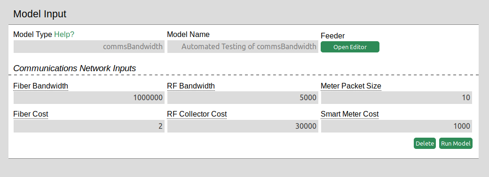
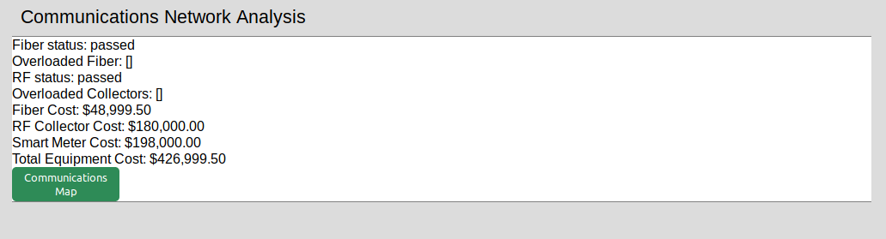
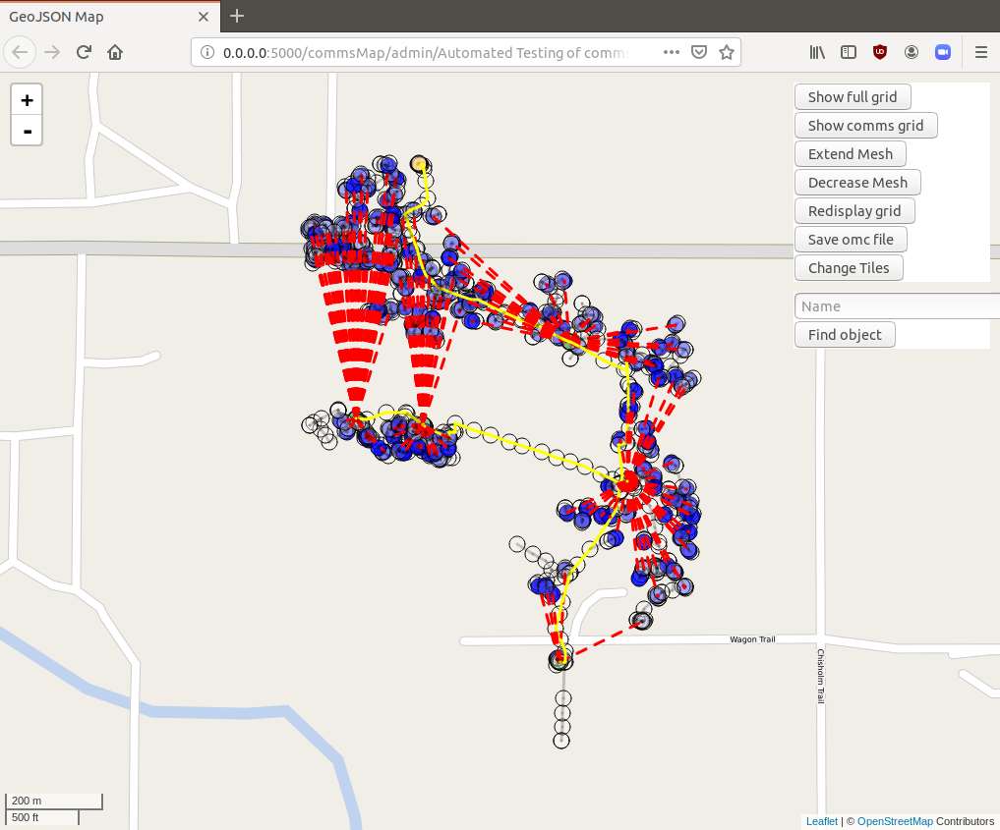
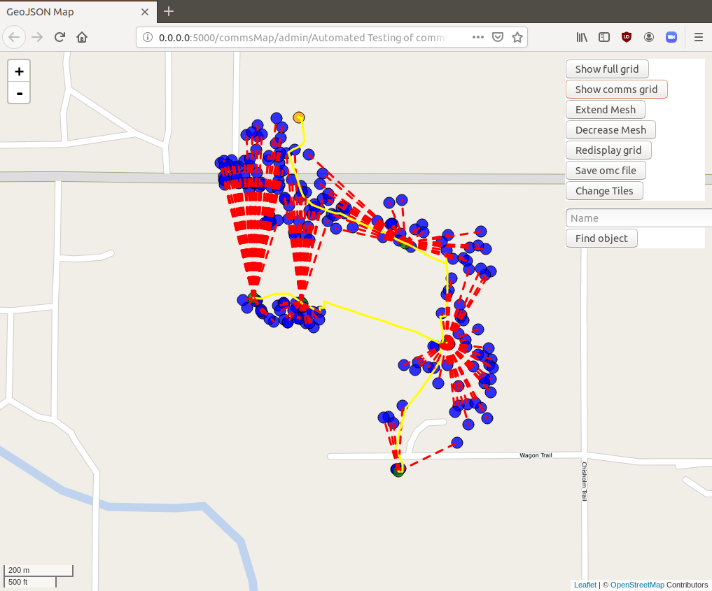
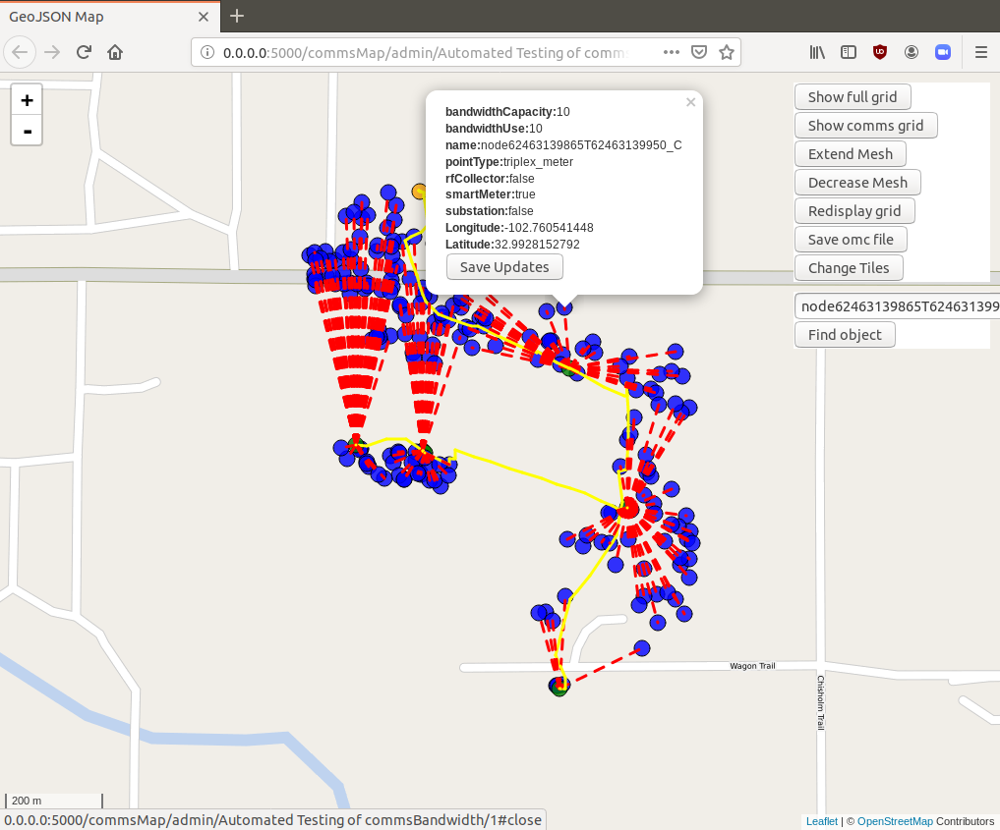

### Overview

This model generates a communications network on top of a feeder. It calculates the cost of the communications network equipment and if the bandwidth is sufficient to handle each meter sending a packet simultaneously.

### Walkthrough:

##### Defining the inputs:

Select a feeder to generate a communications map on top of. See here for information on selecting a feeder and [using the grid editing tool](./Other-~-gridEdit).

The model generates a communications network as follows:
Fiber is created between the substation and switches, following the grid.

An RF collector is created at each switch.

Every meter and triplex_meter is marked as a smart meter, and connected to the nearest RF collector via RF.

Bandwidth Inputs:
Fiber Bandwidth: Bandwidth capacity of fiber (kbps). 

RF Collector bandwidth: Bandwidth capacity of RF collectors

Meter Packet size: size of the packets that the meters send. This model simulates all meters sending packets at the same time to verify all RF collectors and fiber lines can handle a theoretical maximum as the packets travel to the substation. 

Cost inputs:
See buried deployment materials / aerial deployment materials for a guide.
Fiber cost per meter

See Wireless deployment section in guide
RF collector cost: Cost of each RF collector. Use the guide to generate an estimate. The model creates an RF collector on each switch on the grid. This can later be edited.

Smart Meter Cost: Cost to make each meter and triplex_meter a smart metert that can communicate with the RF collector. (Microwave reciever)

Guide for estimating comms network costs. 
https://broadbandusa.ntia.doc.gov/sites/default/files/resource-files/networkcosts_factsheet_may_2017.pdf

##### Outputs:

Fiber status: Displays whether there is sufficient fiber bandwidth to handle traffic from collectors to the substation.
Overloaded Fiber: List of fiber where the bandwidth is less than the aggregate size of packets.

RF Status: Displays whether all RF collectors have bandwidth to handle packets sent from connected meters.
Overloaded Collectors: List of collectors with insufficient bandwidth

Cost: Breakdown of cost for each component along with the total.

Communications Map: Click this button to view the communications map in a new window.
See instructions for interacting with the network below: 

Substation is orange.
Smart meters are blue.
RF Collectors are green.
Fiber lines are highlighted in yellow.
RF connections between RF collectors and smart meters are dotted red lines.

Click the show full grid option to display components on the grid that are non comms objects. They will show up semi transparent.

Click Show comms gird to display only objects that are a part of the grid.

Redisplay grid. This will redraw the grid with any edits you made.
Fiber will connect substation to all the RF Collectors.
Smart meters will connect to nearest RF Collector with RF lines.

Search Enter in the name of a node and click find object. This will trigger the popup

Change values in the object popup and click save updates. 
The placement of a node and it's properties will update immediately. You must click Redisplay grid to rerun the calculation to add or remove fiber and RF lines when objects on the grid change.

Click Save omc file to save your changes to the grid. If you want your edits saved, use this button to save the updated comms network. Note: If make edits in the grid editing tool first. Use the comms editor for comms specific changes.