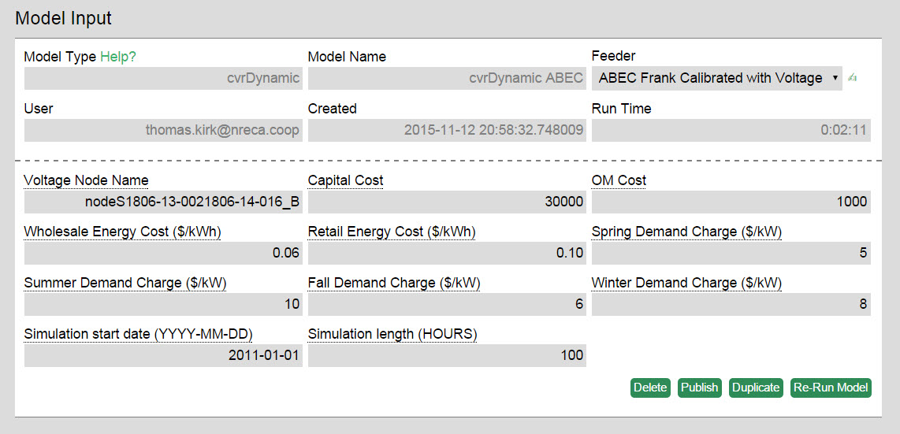
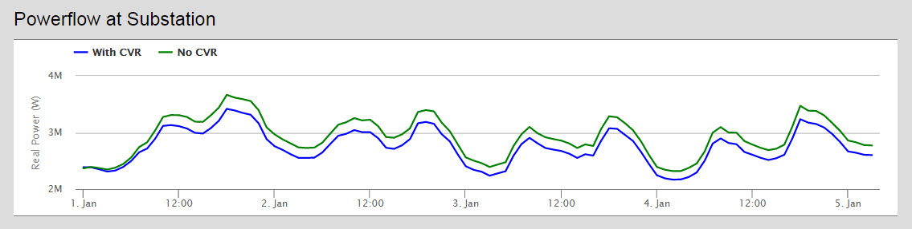
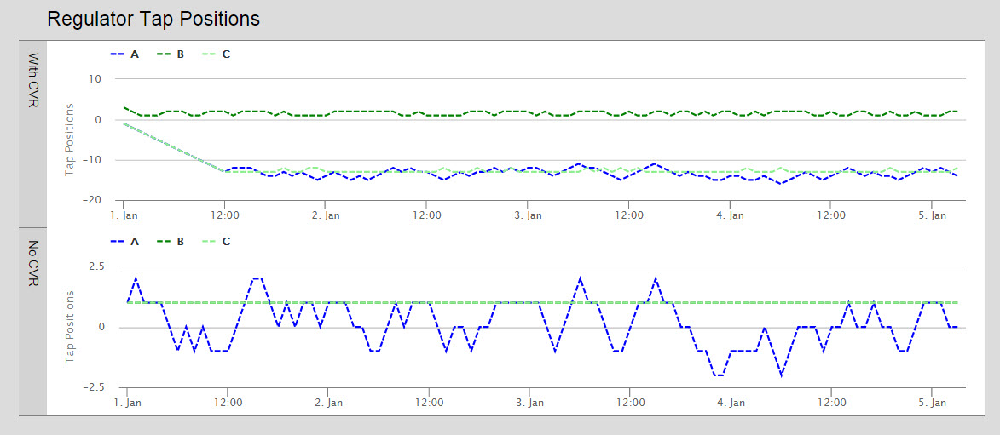
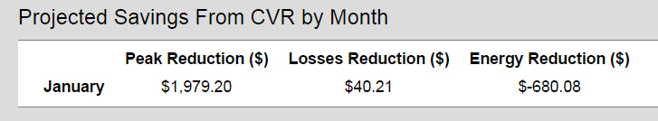

### Overview
The cvrDynamic model calculates the expected costs and benefits for implementing conservation voltage reduction on a given feeder circuit.  Compared to the cvrStatic model, which gives output at one point in time, the dynamic model gives output over a period of time.

### Walkthrough
The cvrDynamic has very similar economic inputs to the cvrStatic model including the costs for implementing a CVR program, the utility’s energy costs and demand charges (by season).  The most important inputs are the Feeder and the Voltage Node Name.  The Feeder needs to be calibrated to run cvrDynamic so many of the feeders listed will not run this model correctly.  ABEC Frank Calibrated with Voltage has been set up to run this model as a publically available feeder.  Once you have selected a feeder click the small green hand to the right of the name to enter the feeder editor and find a node at the edge of the feeder.  Click on the node, copy its name, and then paste it into the **Voltage Node Name** field.  

**Important!** When entering the simulation start date change the start date to 2011-01-01.  If left on the default year of 2012 you will receive a warning message and some of the calculations will be incorrect.

### Model Results

**Total Loads and Losses**- Bar graph of total loads and losses with and without CVR on the feeder.

**Powerflow at Substation**- Line graph comparing the amount of power being used by the feeder with and without CVR implemented during the simulation.

**Voltages at All Meters**- Graph comparing the mean, minimum and maximum voltages at the feeder’s meters with and without CVR.

**Regulator Tap Positions**- Shows regulator tap position every hour during the simulation.

**Capacitor Switch Positions**- Shows position of capacitor switches during the simulation.

**Substation Voltages**- Shows the substation voltages of the feeder during the simulation.

**Projected Savings from CVR by Month**- Table of savings from CVR.  Will display more months depending on the number of hours simulated.  Energy reduction is given as a negative value because the utility will be losing some revenue to decreased energy sales.

**Projected Savings from CVR over System Lifetime**- Uses the projected savings to forecast 30 years into the future total savings.
