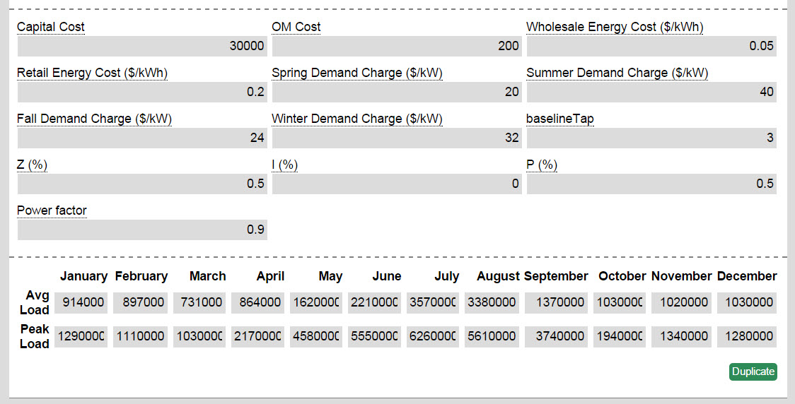
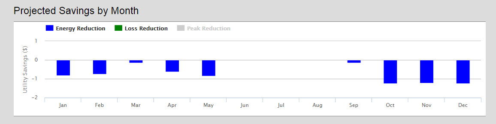
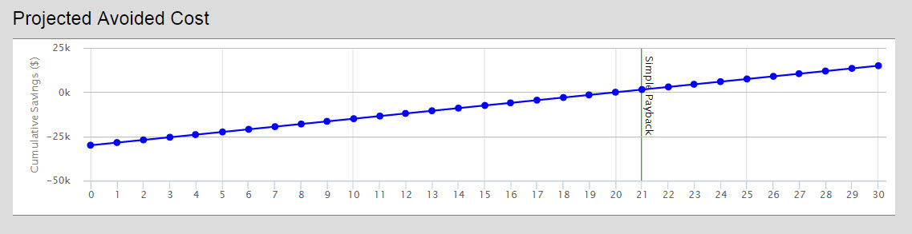

###Overview
The cvrStatic model calculates the expected costs and benefits (including energy, loss, and peak reductions) for implementing conservation voltage reduction on a given feeder circuit.   
For a longer discussion on Load Profile Effects of CVR, [click here](./Other-~-Load-Profile-effect-on-CVR).

###Walkthrough
This model requires inputs for the costs for implementing a CVR program, the utility’s energy costs and demand charges (by season), characteristics about the loads found feeder, and average load and peak for each month (in watts).  BaselineTap refers to the baseline positon of the tap on the tap changer.  Loads in this model are characterized by the ZIP model, or the percentage of loads that are constant resistance, constant load, or constant power.  Unless you have a clear understanding of the loads on your system, the default values can be used.  When estimating power factor note that there is a linear increase in savings when power factor is increased because there is a higher decrease in peak demand at higher power factors (more details on this see the [Load Profile Paper](./Other-~-Load-Profile-effect-on-CVR)).

##Model Results

**Historical Loads**- Shows the average and peak load for each month.  This allows you to visually check your inputs for errors.

**One Line Diagram**- Displays a map of the feeder to verify that the model ran on the correct feeder.  Colors refer to different component types modeled on the feeder.

**Projected Savings by Month**- Shows how much the utility will gain save or lose from peak, energy, and loss reduction.  Typically, not all three categories will be visible at the same time because their relative impact on utility savings varies by so much.

**Projected Avoided Cost**- This graph shows avoided cost over time from implementing a CVR program with an estimated 30 year life.  A simple payback line is also included.

**Power Flows at Various Loads**- Chart of monetary and system impact from energy, peak, and loss reduction for each month of the year.
