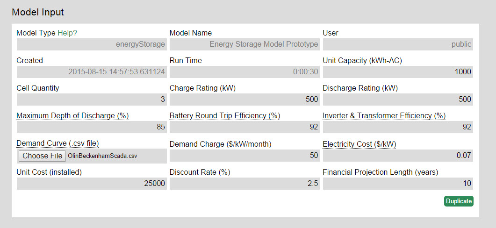

### Introduction

The [cyberInverters model](https://www.omf.coop/quickNew/cyberInverters) shows the impacts of inverter hacks on a feeder including system voltages, regulator actions, and capacitor responses. It leverages [PyCIGAR](https://dst.lbl.gov/security/project/ceds-cigar/), which is a computational framework for deep Reinforcement Learning and control experiments for the distributed grid, developed by LBNL.

### Installation of pycigar for local OMF instances
Install pycigar module by following [these instructions](). You may need to do the following: <br />
    pip install ray <br />
    pip install dataclasses <br />
    pip install ray[tune] <br />
    pip install gym <br />
    pip install dm-tree <br />
You may also need to ensure the following pycigar version restrictions are satisfied: <br />
    pyglet<=1.5.0,>=1.4.0 <br />
    setuptools>=41.0.0 <br />
    ray==1.0.0 <br />
    numpy<1.19.0 <br />
    scipy==1.4.1 <br />
    six>=1.12.0 <br />
    cloudpickle<1.4.0,>=1.2.0 <br />
    
if you receive an error indicating "no module named 'tree' ", try <br />
    pip uninstall tree <br />
    pip uninstall dm-tree <br />
    pip install --upgrade ray (optional) <br />
    pip install dm-tree <br />

### Walkthrough

Inputs:
Simulation start date: The date and time at which the simulation begins, in ISO (?) format YYYY-MM-DDTHH:mm:SSZ <br />
Simulation length: The duration of the simulation, in the units indicated by the Simulation Units input field. Note that the model applies a warm-up period of 100 to this number, making the full simulation time equal to this number plus 100. <br />
Simulation length units: The measurement units that are to be applied to the Simulation Length input field. <br />
Feeder: Click the button to visualize and modify the loaded circuit. ieee 37 is supplied by default. Users may also load a new .dss circuit definition file into the model by choosing File>OpenDSS Conversion... Note that certain syntax restrictions apply (link to a document of syntax requirements?) <br />
OpenDSS Editor: Click the button to edit the circuit elements in a text-based format using opendss syntax. Note that certain syntax restrictions apply (link to a document of syntax requirements?) <br />
Load and PV Output <br />
Brakpoints File Input: <br />
Miscellaneous File Input: <br />
Storage File Input: <br />
Attack Agent Variable: <br />
Hack Percetnage: <br />
Defense Agent Variable: <br />
Train: <br />



##### Load and PV Output CSV file format

This demand file must be a comma-separated value file (.csv). Microsoft Excel can output this format. It must have at minimum 2 columns, each with a header. One column must represent the demand from a single load, with the load name indicated in the column header. This load is assumed to be co-located with a PV system. A second column represents the amount of power generated by the PV system, where the column header contains the name of the associated load appended with "_pv". The power values within this file may be integer or floating-point demand measurements in watts (W) for every second over the simulation period. Because the model applies a warm-up period, this means that the file must contain at least 100 more rows than the value indicated by the Simulation Length input field (in addition to the header row).

An example of a valid .csv:
```csv
s701a,s701a_pv
153.4980952,123.8209212
153.8888622,123.437081
154.2969074,123.6283158
...
154.4709499,123.9691373
154.4376654,124.2434502
154.8067421,124.308612
```

If you would like to just try out the model, [an example demand file is available here](./images/demandExampleWinterPeak.csv).(TODO: Replace this link with a valid .csv file

##### Breakpoints File format


##### Miscellaneous File format


##### Storage File format


Outputs: 
