omf.models.derConsumer is a new model currently under development. Check back in the coming months for updates!

# Introduction
There is growing interest among electric cooperatives and utilities across the U.S. in adopting distributed energy resources (DER) for the financial benefit, increased community resilience during power outages, and progress towards a decarbonized future. DER can be adopted either as a utility-owned asset (e.g. one large battery) or by leveraging a fleet of behind-the-meter residential DER to form a "virtual power plant."

The derConsumer model evaluates the financial cost-benefit for a single residential home interested in enrolling their behind-the-meter DER with their utility. The DER options available in the model are: chemical battery energy storage systems (BESS), fossil fuel generators (GEN), gas/electric ignition water heaters (WH), air conditioners (AC), and air-source heat pumps (HP). The user can choose a mixture of DER technologies and assess the financial impact of receiving upfront and/or monthly ongoing incentives from their utility for initial and/or continued enrollment in the utility DER sharing program.

Modeling resources used in this model include the National Laboratory of the Rockies (NLR) Renewable Energy Optimization Tool (REopt) and the OMF virtual battery dispatch model omf.models.vbatDispatch. The BESS and GEN are modeled with REopt, while all thermal technologies are modeled with vbatDispatch.

The estimated runtime of the model (for the first time; including building and compiling the REopt Julia system image) is about 8.5 minutes for MacOS running with an Apple M2 CPU. On a Windows machine, the first run can take about 1.5 hours. Fortunately after the first run, the model should compile much faster (e.g. on the order of 30 seconds to 1 min for the same MacOS system). Runtimes may vary depending on computer specifications.

# Walkthrough
Default values for all settings are automatically loaded and ready to run. The user is encouraged to change the settings as desired. To tailor the model for a specific residential use case, the minimum number of inputs that are recommended for modification are:
- [Demand Curve](#demand-curve)
- [Temperature Curve](#temperature-curve)
- [Latitude](#latitude)
- [Longitude](#longitude)
- [Year](#year)
- Either inputting [URDB Label](#urdb-label) **OR** the optional input [(Optional) Residential Rate Structure (.json file)](#optional-residential-rate-structure). Make sure to toggle the [Use URDB Label?](#use-urdb-label) input ON/OFF to reflect the chosen option.
- [Enable GEN?](#enable-use-of-fossil-fuel-generator)
- [Enable BESS?](#enable-use-of-home-chemical-bess)
- [Enable Air Conditioner?](#enable-air-conditioner)
- [Enable Heat Pump?](#enable-heat-pump)
- [Enable Water Heater?](#enable-water-heater)

Model inputs are organized into sections: General Model Inputs, Financial Inputs, Fossil Fuel Generator Device Inputs, Home Chemical Battery Energy Storage Device Inputs, Home Air Conditioner Device Inputs, Home Heat Pump Device Inputs, and Home Water Heater Device Inputs. The following sections describe each input in detail, its default value, and an example file format if applicable. 

## General Model Inputs
This section contains the inputs for the demand curve, temperature curve, geographic location, and random seed inputs for the model. 

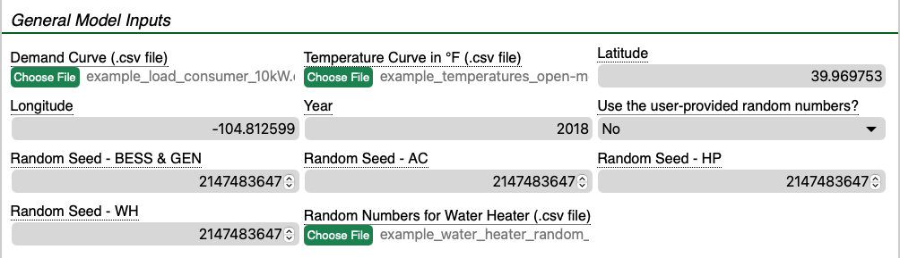

### Demand Curve
The demand curve is the hourly kW consumption of the home for an entire year. This must be formatted as a .csv file with a length of 8760 values representing the hourly demand (kW) for one entire year beginning on January 1. The demand curve data may be obtained from the utility.

Default: `example_load_consumer_10kW.csv` (.csv file)

>NOTE: All provided input data are assumed to begin on Jan 1. If the data correspond to a leap year, it is recommended to remove December 31 from the dataset. This preserves the extra day in February and allows the REopt model to run correctly (with 8760 total values).

An example of a valid .csv (shortened for brevity):
```csv
8.538
8.7564
8.6784
8.6524
9.11
10.0928
11.2472
10.8624
9.8068
9.0112
...
8.1844
8.1272
8.3768
10.5712
12.3236
12.8072
12.724
12.7188
11.7568
10.5036
10.7324
```

### Temperature Curve
The temperature curve is the outdoor air temperature in degrees Fahrenheit corresponding to the same year and geographic location of the provided [Demand Curve](#demand-curve). The format is a .csv file with a length of 8760 values representing the hourly temperature data in degrees Fahrenheit for the entire year. 

Default: `example_temperatures_open-meteo-denverCO-noheaders.csv` (.csv file)

An example of a valid .csv (shortened for brevity):
```csv
4.6
3.3
2.7
2.8
3.6
4.4
2.8
5.1
5.2
6
...
17.9
17.9
18.4
17.4
16
11.4
10.8
10.7
10.6
10.6
10.4
```
#### Creating a Temperature Curve file
The easiest way to obtain a temperature curve .csv is by using the OpenMeteo temperature archive.

Begin by navigating to the [OpenMeteo Historical Weather Data API](https://open-meteo.com/en/docs/historical-weather-api#latitude=39.986&longitude=-104.812&start_date=2018-01-01&end_date=2018-12-31&temperature_unit=fahrenheit&timezone=America%2FDenver) and complete the following steps:
<ol> 
    <li> Enter the approximate latitude and longitude of the utility or cooperative service area. </li>
    <li> The timezone should be the local time corresponding to the Demand Curve input data. </li>
    <li> Enter the Start Date (ex. 2018-01-01) and End Date (ex. 2018-12-31) of the year corresponding to the Demand Curve input data. </li>
    <li> Under the "Hourly Weather Variables" section, select “Temperature” only. </li>
    <li> Under "Settings" section, select Fahrenheit for the Temperature Unit. The other options may be left with the default values.</li>
    <li> Under the "API Response" section, reload the chart by pressing the “Reload Chart” button. </li>
    <li> Clicking the “Download CSV” button located under the API Response Chart that was just reloaded. </li>
    <br>
    <b> AFTER DOWNLOADING THE .CSV, YOU MUST EDIT THE .CSV FILE BY DOING THE FOLLOWING:</b>
    <ul>
        <li> Open the .csv file after downloading. It may be in your Downloads folder, or wherever your files go when they are downloaded. You want to be able to make changes and edit the file (e.g. the easiest way would be to open the file in Excel, Google Sheets, CryptPad Spreadsheet, OnlyOffice Spreadsheet, or some other spreadsheet program). The .csv file should look like this: </li>
        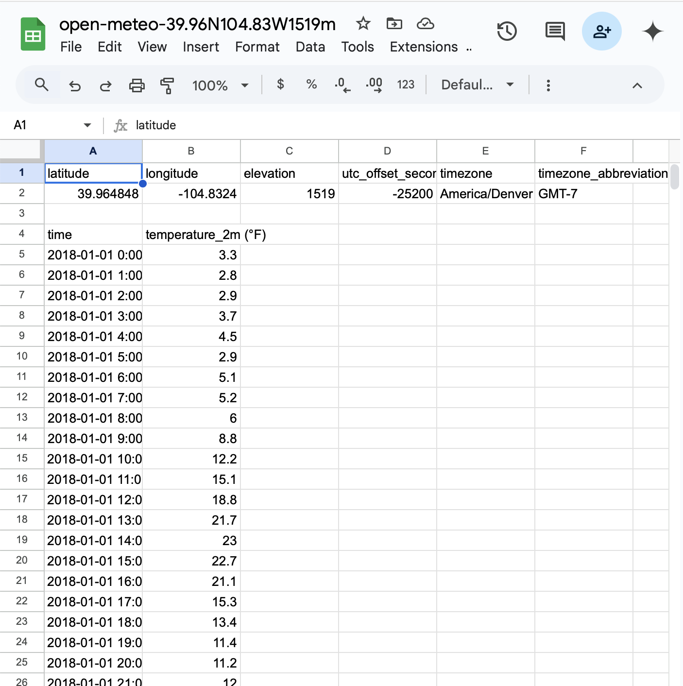
        <li> Delete the header rows and the timestamp column. The .csv file should look like this when you upload it to derUtilityCost:</li>
        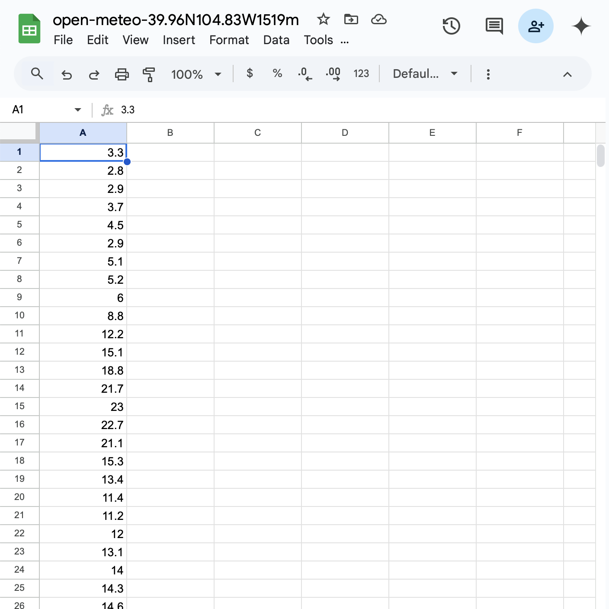
        <li> Be sure that there are 8760 rows total. Save the file (e.g. if you’re using Google Sheets, go to File > Download > Comma Separated Values (.csv). Now you can upload the .csv file to the Temperature Curve input!</li>
    </ul>
</ol>

### Latitude 
The latitude coordinate of the member-consumer’s house or meter. The default case assumes the latitude for Brighton, CO.

Default: `39.969753` (decimal)

### Longitude 
The longitude coordinate of the member-consumer’s house or meter. The default case assumes the latitude for Brighton, CO.

Default: `-104.812599` (decimal)

### Year
The year corresponding to the [Demand Curve](#demand-curve) values.

Default: `2018` (int)

### Use the user-provided random numbers? 
Toggle to use either the user-provided random numbers or generate them automatically in the model. This input is used when the user wants to reproduce the same model run in the future.

If 'Yes' is selected, model will use all user-provided inputs for the Random Seeds (BESS & GEN, AC, HP, WH) and the Random Numbers for Water Heater (.csv) file. 

If 'No' is selected, the model will generate all numbers needed and save them in the model outputs.

Default: `No` (Yes/No) 

### Random Seed - BESS & GEN 
A deterministic random seed number for the HiGHS optimizer used for the BESS and GEN technologies. Must be a positive integer between 0 and 2147483647. 

Default: `2147483647` (int) 

###  Random Seed - AC 
A deterministic random seed number for the PuLP optimizer used for the air conditioner technology. Must be a positive integer between 0 and 2147483647.

Default: `2147483647` (int) 

### Random Seed - WH 
A deterministic random seed number for the PuLP optimizer used for the water heater technology. Must be a positive integer between 0 and 2147483647.

Default: `2147483647` (int) 

### Random Seed - HP 
A deterministic random seed number for the PuLP optimizer used for the heat pump technology. Must be a positive integer between 0 and 2147483647.

Default: `2147483647` (int) 

### Random Numbers for Water Heater
A file with random numbers that will help determine the water heater's water draw in gallons per minute. If the [Use the user-provided random numbers?](#use-the-user-provided-random-numbers) input is set to 'Yes', the model will use the provided file. If 'No', the model will generate and save a water_heater_random_numbers.csv file in the ouput files, which the user can re-upload here.

Default: `example_water_heater_random_numbers.csv` (.csv file)

Example file:
```csv
16.0,-5.0,0.2092334309280378
16.0,-11.0,0.2745899659231128
7.0,-14.0,0.5489484822693608
1.0,-5.0,0.09139400225934302
16.0,-3.0,0.10289385741323365
4.0,-8.0,0.22365900110938863
18.0,-9.0,0.6779007018291736
15.0,-8.0,0.8535451643255744
9.0,-10.0,0.1500305671738359
0.0,-14.0,0.15522609801142717
7.0,-4.0,0.6510939156408193
10.0,-14.0,0.6588429262558114
7.0,-12.0,0.37739650648188483
9.0,-8.0,0.06891053041774076
1.0,-12.0,0.9234201707499036
18.0,-9.0,0.5719325012746554
10.0,-14.0,0.04001062962865709
6.0,-10.0,0.5998936023082809
0.0,-11.0,0.5138174552600452
12.0,-8.0,0.5616127576754277
14.0,-11.0,0.6225784880932328
10.0,-6.0,0.6467697799429435
11.0,-12.0,0.9760783132839952
12.0,-1.0,0.9197215740009584
13.0,-10.0,0.14526456212839922
9.0,-8.0,0.6786767390786106
7.0,-9.0,0.9636663619478575
0.0,-9.0,0.44224156114764224
3.0,-3.0,0.10156915120952226
2.0,-3.0,0.48449884928990516
0.0,-9.0,0.2282449787151043
14.0,-8.0,0.7371555612663239
13.0,-9.0,0.30349532304568594
6.0,-11.0,0.5328064314629861
15.0,0.0,0.5942292068693534
8.0,-4.0,0.8254863973602222
12.0,0.0,0.6099561570281333
13.0,-12.0,0.8241152639145998
12.0,-12.0,0.8553491706622669
3.0,-1.0,0.4908047336002531
17.0,-11.0,0.18887860946325252
5.0,-6.0,0.39583115105876754
8.0,0.0,0.6557597208727626
5.0,-9.0,0.7281912887423867
18.0,-8.0,0.4467830583804442
7.0,-7.0,0.04741084173487231
9.0,-10.0,0.009101483074423378
14.0,0.0,0.4397843601619892
9.0,-10.0,0.6117952886582574
6.0,-14.0,0.18089021913033387	
```

For instructions on how to generate a water_heater_random_numbers.csv file and reproduce the same water heater results between runs, see [How to Reproduce Model Results](#how-to-reproduce-model-results).

## Financial Inputs
This section contains the financial inputs for the model.
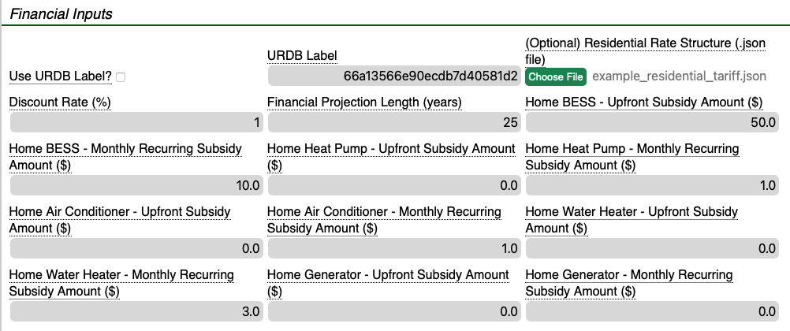

### Use URDB Label?
This input toggles the choice between using the [URDB Label](#urdb-label) **OR** the [(Optional) Residential Rate Structure (.json)](#optional-residential-rate-structure) file to upload the residential tariff information.

If checkbox is selected, the model will use the provided [URDB Label](#urdb-label) to obtain rate structure information for the financial analysis. 

If the checkbox is not selected, the model will instead use the provided [(Optional) Residential Rate Structure (.json)](#optional-residential-rate-structure) file for the financial analysis.

Default: Unchecked (Checked/Unchecked). The default uses the [(Optional) Residential Rate Structure (.json)](#optional-residential-rate-structure) file.

### URDB Label
The Utility Rate Database (URDB) Label is a string of letters and numbers that point to a specific residential rate structure. URDB is a free database developed by the National Laboratory of the Rockies containing rate structures for utilities and cooperatives across Turtle Island (a.k.a the United States) based on rate information maintained by the U.S. Department of Energy’s Energy Information Administration. 

Default: `66a13566e90ecdb7d40581d2` (string). The default case is a Residential Time of Day rate structure for an energy cooperative in Colorado.

The URDB label may be obtained by navigating to the [Utility Rate Database Homepage](https://apps.openei.org/USURDB/), searching for the desired residential tariff, and copying the string of letters and numbers found at the end of the tariff page's URL. For example:


> The URL `https://apps.openei.org/USURDB/rate/view/66a13566e90ecdb7d40581d2` would yield the URDB label: `66a13566e90ecdb7d40581d2` 
NOTE: Be sure to remove the suffix (e.g. 
`“#3__Energy”, “#2__Demand”, or “#1__Basic_Information”`)
from the URDB label, if present. This can be seen at the end of the website link when retrieving your URDB URL: 
`https://apps.openei.org/USURDB/rate/view/66a13566e90ecdb7d40581d2#3__Energy`. This can happen when you have clicked on one of those pages to view the rate information which changes the URL. 

### (Optional) Residential Rate Structure 
The residential rate structure input accepts a .json file describing the energy and/or demand rate structure that a residential consumer pays to the utility or cooperative for their electricity. This input allows the user to upload a custom rate structure if the URDB Label is not known or is incorrect. 

Default: `example_residential_tariff.json` (.json file) 

An example of a valid Residential Rate Structure (.json) file is: 

```json
{"energyweekdayschedule":[[1,1,1,1,1,1,1,1,1,1,1,1,1,1,1,1,1,1,1,1,1,1,1,1],[1,1,1,1,1,1,1,1,1,1,1,1,1,1,1,1,1,1,1,1,1,1,1,1],[1,1,1,1,1,1,1,1,1,1,1,1,1,1,1,1,1,1,1,1,1,1,1,1],[1,1,1,1,1,1,1,1,1,1,1,1,1,1,1,1,1,1,1,1,1,1,1,1],[1,1,1,1,1,1,1,1,1,1,1,1,1,1,1,1,1,1,1,1,1,1,1,1],[1,1,1,1,1,1,1,1,1,1,1,1,1,1,1,1,1,1,1,1,1,1,1,1],[1,1,1,1,1,1,1,1,1,1,1,1,1,1,1,1,1,1,1,1,1,1,1,1],[1,1,1,1,1,1,1,1,1,1,1,1,1,1,1,1,1,1,1,1,1,1,1,1],[1,1,1,1,1,1,1,1,1,1,1,1,1,1,1,1,1,1,1,1,1,1,1,1],[1,1,1,1,1,1,1,1,1,1,1,1,1,1,1,1,1,1,1,1,1,1,1,1],[1,1,1,1,1,1,1,1,1,1,1,1,1,1,1,1,1,1,1,1,1,1,1,1],[1,1,1,1,1,1,1,1,1,1,1,1,1,1,1,1,1,1,1,1,1,1,1,1]],"energyweekendschedule":[[1,1,1,1,1,1,1,1,1,1,1,1,1,1,1,1,1,1,1,1,1,1,1,1],[1,1,1,1,1,1,1,1,1,1,1,1,1,1,1,1,1,1,1,1,1,1,1,1],[1,1,1,1,1,1,1,1,1,1,1,1,1,1,1,1,1,1,1,1,1,1,1,1],[1,1,1,1,1,1,1,1,1,1,1,1,1,1,1,1,1,1,1,1,1,1,1,1],[1,1,1,1,1,1,1,1,1,1,1,1,1,1,1,1,1,1,1,1,1,1,1,1],[1,1,1,1,1,1,1,1,1,1,1,1,1,1,1,1,1,1,1,1,1,1,1,1],[1,1,1,1,1,1,1,1,1,1,1,1,1,1,1,1,1,1,1,1,1,1,1,1],[1,1,1,1,1,1,1,1,1,1,1,1,1,1,1,1,1,1,1,1,1,1,1,1],[1,1,1,1,1,1,1,1,1,1,1,1,1,1,1,1,1,1,1,1,1,1,1,1],[1,1,1,1,1,1,1,1,1,1,1,1,1,1,1,1,1,1,1,1,1,1,1,1],[1,1,1,1,1,1,1,1,1,1,1,1,1,1,1,1,1,1,1,1,1,1,1,1],[1,1,1,1,1,1,1,1,1,1,1,1,1,1,1,1,1,1,1,1,1,1,1,1]],"energyratestructure":[[{"rate":0,"unit":"kWh"}],[{"rate":0.02,"max":100.0,"unit":"kWh"},{"rate":0.04,"max":300,"unit":"kWh"},{"rate":0.120,"unit":"kWh"}]],"demandratestructure":[[{"rate":0,"unit":"kW"}],[{"rate":0.0,"unit":"kW"}],[{"rate":5.0,"unit":"kW"}]],"demandweekdayschedule":[[1,1,1,1,1,1,1,2,2,2,1,1,1,1,1,1,1,2,2,2,1,1,1,1],[1,1,1,1,1,1,1,2,2,2,1,1,1,1,1,1,1,2,2,2,1,1,1,1],[1,1,1,1,1,1,1,2,2,2,1,1,1,1,1,1,1,2,2,2,1,1,1,1],[1,1,1,1,1,1,1,2,2,2,1,1,1,1,1,1,1,2,2,2,1,1,1,1],[1,1,1,1,1,1,1,2,2,2,1,1,1,1,1,1,1,2,2,2,1,1,1,1],[1,1,1,1,1,1,1,2,2,2,1,1,1,1,1,1,1,2,2,2,1,1,1,1],[1,1,1,1,1,1,1,2,2,2,1,1,1,1,1,1,1,2,2,2,1,1,1,1],[1,1,1,1,1,1,1,2,2,2,1,1,1,1,1,1,1,2,2,2,1,1,1,1],[1,1,1,1,1,1,1,2,2,2,1,1,1,1,1,1,1,2,2,2,1,1,1,1],[1,1,1,1,1,1,1,2,2,2,1,1,1,1,1,1,1,2,2,2,1,1,1,1],[1,1,1,1,1,1,1,2,2,2,1,1,1,1,1,1,1,2,2,2,1,1,1,1],[1,1,1,1,1,1,1,2,2,2,1,1,1,1,1,1,1,2,2,2,1,1,1,1]],"demandweekendschedule":[[1,1,1,1,1,1,1,1,1,1,1,1,1,1,1,1,1,1,1,1,1,1,1,1],[1,1,1,1,1,1,1,1,1,1,1,1,1,1,1,1,1,1,1,1,1,1,1,1],[1,1,1,1,1,1,1,1,1,1,1,1,1,1,1,1,1,1,1,1,1,1,1,1],[1,1,1,1,1,1,1,1,1,1,1,1,1,1,1,1,1,1,1,1,1,1,1,1],[1,1,1,1,1,1,1,1,1,1,1,1,1,1,1,1,1,1,1,1,1,1,1,1],[1,1,1,1,1,1,1,1,1,1,1,1,1,1,1,1,1,1,1,1,1,1,1,1],[1,1,1,1,1,1,1,1,1,1,1,1,1,1,1,1,1,1,1,1,1,1,1,1],[1,1,1,1,1,1,1,1,1,1,1,1,1,1,1,1,1,1,1,1,1,1,1,1],[1,1,1,1,1,1,1,1,1,1,1,1,1,1,1,1,1,1,1,1,1,1,1,1],[1,1,1,1,1,1,1,1,1,1,1,1,1,1,1,1,1,1,1,1,1,1,1,1],[1,1,1,1,1,1,1,1,1,1,1,1,1,1,1,1,1,1,1,1,1,1,1,1],[1,1,1,1,1,1,1,1,1,1,1,1,1,1,1,1,1,1,1,1,1,1,1,1]]}
```
The example above was created using the REopt Web Tool custom electric rate tariff generator following thei instructions here: https://github.com/NatLabRockies/REopt-Analysis-Scripts/wiki/5.-Custom-Electric-Rates.

### Discount Rate
The discount rate is used to devalue future incomes in the financial analysis when calculating the [Net Present Value](#net-present-value). Income received now is generally more valuable than income received later.

Default: `1` (decimal, unit: \%)

### Financial Projection Length 
Number of years to project out the estimated savings. Must be between 1 and 75 years. Note that since the input Demand Curve and Energy Rate Curve are only given for the first year of the analysis, all subsequent years will duplicate the first year’s costs and savings. For example, if the total savings for the first year amount to $100 and the Financial Projection Length is 10 years, then each year will use $100 as the savings.

Default: `25` (int, unit: years) 

### Home BESS - Upfront Subsidy Amount 
The total upfront dollars paid to you by the utility for enrolling your home battery (not including any recurring subsidies).

Default: `50.0` (decimal, unit: $\$$)

### Home BESS - Monthly Recurring Subsidy Amount 
The total monthly recurring dollars paid to you by the utility for keeping your home battery enrolled (not including any upfront subsidies).

Default: `10.0` (decimal, unit: $\$$)

### Home Heat Pump - Upfront Subsidy Amount 
The total upfront dollars paid to you by the utility for enrolling your heat pump (not including any recurring subsidies).

Default: `0.0` (decimal, unit: $\$$)

### Home Heat Pump - Monthly Recurring Subsidy Amount 
The total monthly recurring dollars paid to you by the utility for keeping your home heat pump enrolled (not including any upfront subsidies).

Default: `1.0` (decimal, unit: $\$$)

### Home Air Conditioner - Upfront Subsidy Amount
The total upfront dollars paid to you by the utility for enrolling your air conditioner (not including any recurring subsidies).

Default: `0.0` (decimal, unit: $\$$)

### Home Air Conditioner - Monthly Recurring Subsidy Amount
The total monthly recurring dollars paid to you by the utility for keeping your home air conditioner enrolled (not including any upfront subsidies).

Default: `1.0` (decimal, unit: $\$$)

### Home Water Heater - Upfront Subsidy Amount 
The total upfront dollars paid to you by the utility for enrolling your water heater (not including any recurring subsidies).

Default: `0.0` (decimal, unit: $\$$)

### Home Water Heater - Monthly Recurring Subsidy Amount 
The total monthly recurring dollars paid to you by the utility for keeping your home water heater enrolled (not including any upfront subsidies).

Default: `3.0` (decimal, unit: $\$$)

### Home Generator - Upfront Subsidy Amount
The total upfront dollars paid to you by the utility for enrolling your home generator (not including any recurring subsidies). 

Default: `0.0` (decimal, unit: $\$$)

### Home Generator - Monthly Recurring Subsidy Amount
The total monthly recurring dollars paid to you by the utility for keeping your home generator enrolled (not including any upfront subsidies).

Default: `0.0` (decimal, unit: $\$$)

## Fossil Fuel Generator Device Inputs
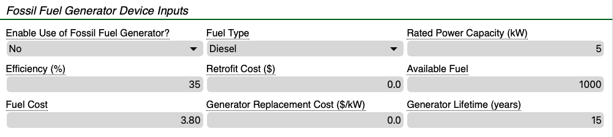

### Enable Use of Fossil Fuel Generator?
This toggle enables or disables the fossil fuel generator technology in the analysis. If "Yes" is selected, the model will include fossil fuel generators in the analysis. If "No" is selected, the model will not include fossil fuel generators in the analysis.

Default: `No` (Yes/No)

### Fuel Type
The type of fossil fuel used for all generators. Each fuel type has different default inputs for the Fuel Cost and Available Fuel inputs according to the table below.

Default: `Diesel` (Natural Gas/Propane/Diesel/Gasoline)

---
| Fuel Type     | Efficiency    | Fuel Cost[[1]](#references) | Available Fuel |
| :---: | --- | --- | --- |
| Natural Gas | 30\%[[4]](#references) |\$0.00386/cu.ft.| 1000 cu.ft.    |
| Propane  | 25\%[[2]](#references)[[4]](#references)  |\$2.70/gallon   | 1000 gallons   |
| Diesel  | 35\%[[3]](#references)[[4]](#references)  |\$3.80/gallon   | 1000 gallons   |
| Gasoline | 25\%[[3]](#references)[[4]](#references)  |\$3.17/gallon   | 1000 gallons   |
---

### Rated Power Capacity
The average capacity size (kW) of each home fossil fuel generator.

Default: `5` (int, unit: kW) 

### Efficiency 
The combustion efficiency of the generator. The default value corresponds to a diesel fuel generator. 

Default: `35` (int, unit: \%)

### Retrofit Cost 
Specify the cost to enable the generator for utility control.

Default: `0.0` (decimal, unit: $\$$)

### Available Fuel
The maximum amount of generator fuel available per device. The default value is based on a Generac 20 kW diesel model with a fuel tank capacity of 95 gallons. This input will change if a different fuel type is selected (see table above). 

Default: `95` (int, unit: gallons)

### Fuel Cost
The cost in USD per gallon (or cu.ft. in the case of natural gas) of fuel used for the generator. This input will change if a different fuel type is selected (see table above). 

Default: `3.49` (decimal, unit: $\$$/gal)

### Generator Replacement Cost
The cost of replacing the generator in $\$/\rm{kW}$. This value is usually around $450 every 15 years.

Default: `0.0` (decimal, unit: $\$/\rm{kWh}$)

### Generator Lifetime
The number of years until the generator will be replaced.

Default: `15` (int, unit: years) 

## Chemical Battery Energy Storage System (BESS)
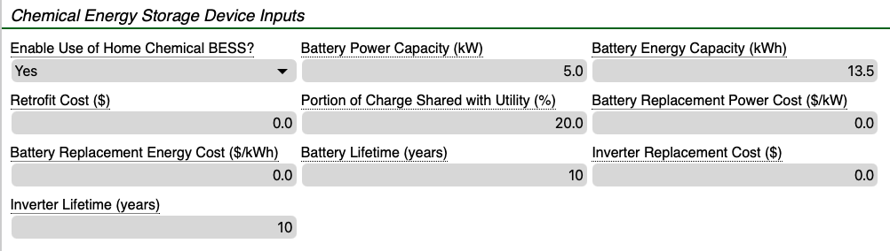

### Enable Use of Home Chemical BESS? 
This toggle enables or disables the use of home chemical battery energy storage system in the model. If Yes, the model will include Home Chemical BESS in the analysis. If No, the model will not include any. 

Default: `Yes` (Yes/No) 

### Home Battery Power Capacity
The battery power capacity in kW for each individual battery enrolled by a member-consumer. The default value corresponds to a Tesla Powerwall battery.

Default: `5.0` (decimal, unit: kW)

### Home Battery Energy Capacity 
The battery energy capacity in kWh for each individual battery enrolled by a member-consumer. The default value corresponds to a Tesla Powerwall battery.

Default: `13.5` (decimal, unit: kWh)

### Retrofit Cost
Specify the cost to enable the battery for utility control. Typically, the BESS will already be enabled and this cost will be $\$0$.

Default: `0.0` (decimal, unit: $\$$)

### Portion of Charge Shared with Utility
The maximum percentage of full charge that is available for the utility to use at any time.

Default: `20.0` (int, unit: %) 

### Battery Replacement Power Cost 
The cost of replacing the battery in $\$/\rm{kW}$. A suggested starting value of $324 is based on a Tesla Powerwall battery (see NOTE below).

Default: `0.0` (decimal, unit: $\$/\rm{kW}$)

> NOTE: The total battery replacement cost is modeled as (BESS kW Power Capacity) * ($324/kW) + (BESS kWh Energy Capacity) * ($351/kWh). These values were derived by reducing the 2022 values from Figure 4 in [NREL FY23 OSTI](https://www.nrel.gov/docs/fy23osti/85332.pdf) to 90%.

### Battery Replacement Energy Cost
The cost of replacing the battery in $\$/\rm{kWh}$. A suggested starting value is $351 based on a Tesla Powerwall battery.

Default: `0.0` (decimal, unit: $\$/\rm{kWh}$)

> NOTE: The total battery replacement cost is modeled as (BESS kW Power Capacity) * ($324/kW) + (BESS kWh Energy Capacity) * ($351/kWh). These values were derived by reducing the 2022 values from Figure 4 in [NREL FY23 OSTI](https://www.nrel.gov/docs/fy23osti/85332.pdf) to 90%.

### Battery Lifetime 
The number of years until the battery cells will need to be replaced at the cost specified in Battery Replacement Capacity Cost.

Default: `10` (int, unit: years)

### Inverter Replacement Cost 
The cost of replacing the inverter. A suggested starting value would be $2400.

Default: `0.0` (decimal, unit: $\$$)

### Inverter Lifetime 
The number of years until the battery inverter will need to be replaced at the cost specified in Inverter Replacement Cost.

Default: `10` (int, unit: years)

## Home Air Conditioner Device Inputs


### Enable Air Conditioner? 
This toggle enables or disables the Air Conditioner technology in the analysis. If Yes, the model will run with a home central air conditioner. If No, the model will not run with a home air conditioner.

Default: `Yes` (Yes/No)

### Rated Power 
Maximum input power of the air conditioner. Must be a positive rational number between 0.1 and 7.2. The default value 5.6 represents a central AC system. For in-window units, use a value of around 0.5.

Default: `5.6` (decimal, unit: kW)

### Retrofit Cost
The cost to equip the air conditioner to respond to utility load control signals. For an in-window unit, this would be the cost of installing a Wi-Fi enabled smart plug, typically about $13 (see References [[5]](#references)). For central air conditioner, this would be around $120 for something like a smart thermostat (see References [[7]](#references), a Google Nest smart thermostat). If the heat pump technology is also enabled, consider that typically only one smart thermostat is needed to control both the central AC and heat pump, depending on the home.

Default: `120` (decimal, unit: $\$$) 

### Thermal Capacitance 
Thermal capacitance of the air conditioner. Must be between 0.2 and 2.5 with exactly one decimal digit.

Default: `2.0` (decimal, unit: kWh/°C)

### Thermal Resistance 
Thermal resistance of the air conditioner. Must be between 1.5 and 140.

Default: `2.0` (decimal, unit: °C/kW)

### Coefficient of Performance
Coefficient of performance for the air conditioner. Must be between 1 and 3.5.

Default: `2.5` (decimal)

### Temperature Setpoint
Target temperature for the air conditioner, set at the thermostat. Must be between 35.06 and 129.2.

Default: `72.5` (decimal, unit: °F) 

### Temperature Deadband 
Deadband around the setpoint temperature to alleviate temperature swings. Must be between 0.225 and 3.6. 

Default: `2.0` (decimal, unit: °F)

## Home Heat Pump Device Inputs
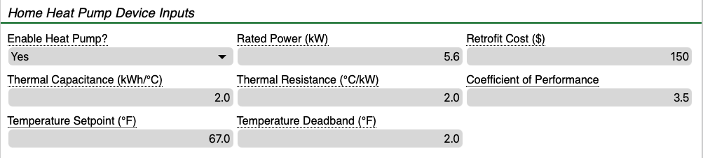

### Enable Heat Pump?
This toggle enables or disables the heat pump technology in the analysis. If 'Yes', the model will run with a home air-source heat pump. If 'No', the model will not run with a heat pump.

Default: `Yes` (Yes/No)

### Rated Power 
Maximum input power of the heat pump. Must be a positive rational number between 0.1 and 7.2.  

Default: `5.6` (decimal, unit: kW)

### Retrofit Cost 
The cost to equip heat pump to respond to utility load control signals (e.g. see References #7, Google Nest smart thermostat). If the air conditioner technology is also enabled, consider that typically a single smart thermostat is needed to control both the central AC and heat pump, depending on the home.

Default: `150` (decimal, unit: $\$$)

### Thermal Capacitance
Thermal capacitance of the heat pump. Must be between 0.2 and 2.5 with exactly one decimal digit. 

Default: `2.0` (decimal, unit: kWh/°C)

### Thermal Resistance 
Thermal resistance of the heat pump. Must be between 1.5 and 140.  

Default: `2.0` (°C/kW)

### Coefficient of Performance
Coefficient of performance for the heat pump. Must be between 1 and 3.5 

Default: `3.5` (decimal)

### Temperature Setpoint 
Target temperature for the heat pump, set at the thermostat. Must be between 35.06 and 129.2.  

Default: `67.0` (decimal, unit: °F)

### Temperature Deadband 
Deadband around the setpoint; avoids excessive cycling of heat pump. Must be between 0.225 and 3.6.  

Default: `2.0` (decimal, unit: °F)


## Home Water Heater Device Inputs
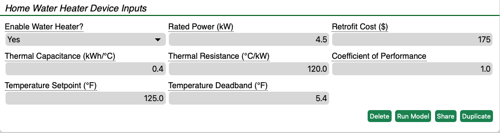

### Enable Water Heater?
This toggle enables or disables the water heater technology in the analysis. If 'Yes', model will run with home water heaters. If 'No', model will not use any water heaters.

Default: `Yes` (Yes/No)

### Rated Power
Maximum input power of the water heater. Must be a positive rational number between 0.1 and 7.2.  

Default: `4.5` (decimal, unit: kW)

### Retrofit Cost
The cost to equip water heater to respond to utility load control signals. E.g. for a virtual power plant program, this would be the cost of installing a Wi-Fi enabled water heater control unit, typically about $\$175$ [[6]](#references).

Default: `175` (int, unit: $\$$)

### Thermal Capacitance 
Thermal capacitance of the water tank. Must be between 0.2 and 2.5 with exactly one decimal digit.  

Default: `0.4` (decimal, unit: kWh/°C). 

### Thermal Resistance
Thermal resistance of the water tank. Must be between 1.5 and 140.  

Default: `120` (decimal, unit: °C/kW)

### Coefficient of Performance
Coefficient of performance for the water heater. Must be between 1 and 3.5 

Default: `1.0` (int)

### Temperature Setpoint
Target temperature for the tank, set at the thermostat. Must be between 35.06 and 129.2.

Default: `125.0` (decimal, unit: °F)

### Temperature Deadband
Deadband around the setpoint temperature to alleviate swings in temperature. Must be between 0.225 and 5.4.

Default: `5.4` (decimal, unit: °F)


# Model Results
The chosen color schemes used for these plots are based on the following guide for color-blind friendly color schemes: [2022 NCEAS Science Communication Resource Corner by Alexandra Phillips](https://www.nceas.ucsb.edu/sites/default/files/2022-06/Colorblind%20Safe%20Color%20Schemes.pdf)

## Plot: Impact to Demand
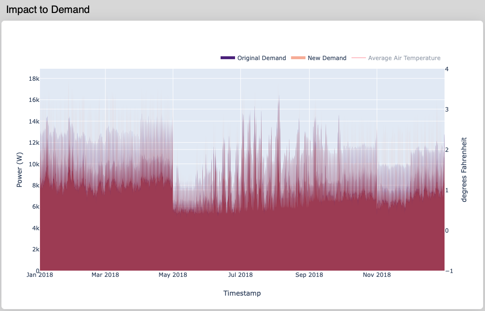
This plot shows the Original Demand (demand curve without DER) and the New Demand (demand curve with DER). The Outdoor Air Temperature variable can be toggled on/off by clicking on the name.

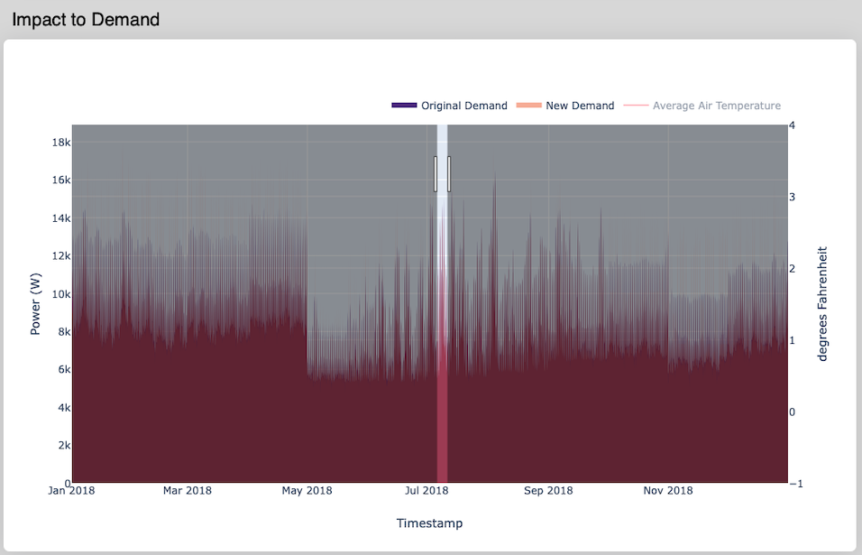
To zoom in, drag and hold the mouse cursor across the desired timeframe. The plot will zoom in when you let go of the cursor.

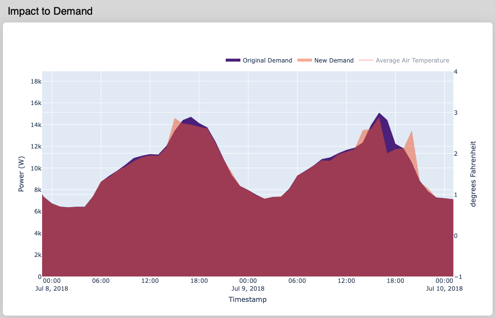 
This is a zoomed-in plot showing a two day timescale.

To reset the window or zoom all the way back out, hover the mouse over the top right corner of the plot and select "Reset Axes". 

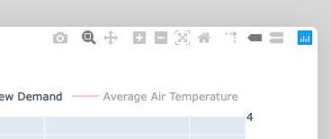

To pan around the plot, select the "Pan" icon and then drag the plot around. If you are zoomed in and want to shift the plot left or right, hold down the COMMAND key (on MacOS) while dragging the plot left or right.

## Plot: DER Serving Load Overview
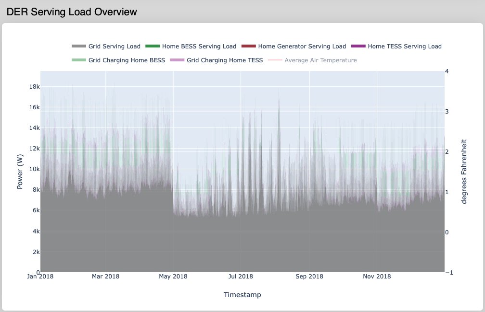
This plot shows the breakdown of all DER serving the load and charging from the grid. All thermal technologies are aggregated into the Thermal Energy Storage System (TESS) variable. Like the [Impact to Demand Plot](#plot-impact-to-demand), this plot can be zoomed into if desired.

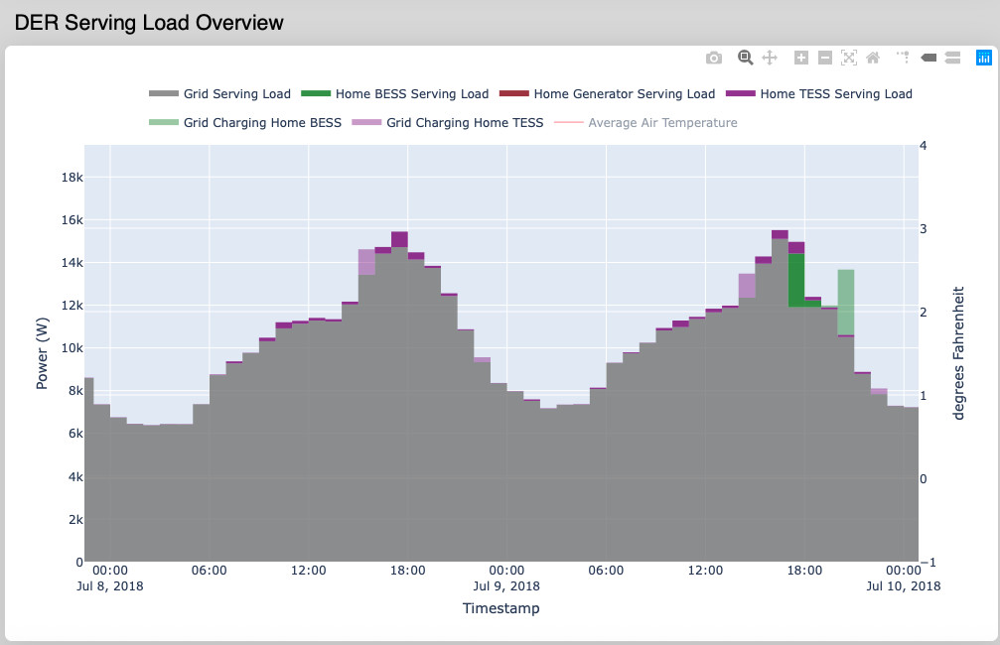
This shows a zoom-in on a two-day window.

## Plot: Thermal DER Serving Load Overview

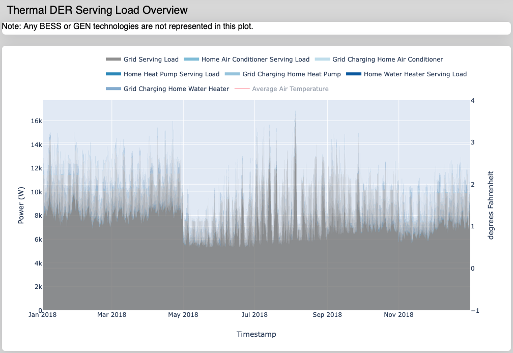
This plot shows a more detailed breakdown of the thermal DER technologies (Water Heater, Air Conditioner, and Heat Pump) that serve the utility’s load throughout the year. Note that this plot does not show the BESS or GEN technologies, it is purely for looking at the thermal technologies. The Grid Serving Load is still present in this plot, however (see the previous DER Serving Load Overview plot).

This detailed view of the thermal technologies allows a utility to analyze the behavior for a specific thermal technology during a specific hour, day, or month of the year.

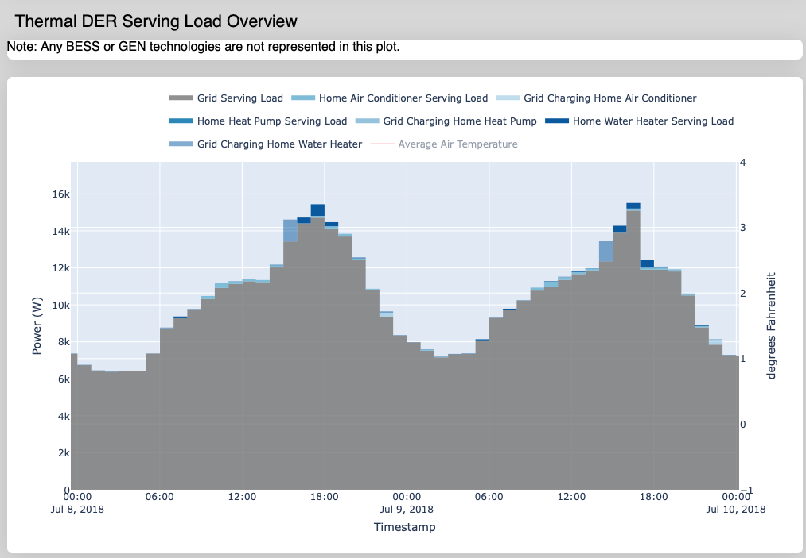 
The plot is zoomed into a two-day timescale here.

### Prioritization of Water Heater, Air Conditioner, and Heat Pump
Each type of thermal technology (WH, AC, HP) is calculated independently from the others because of the constraints of the vbatDispatch model. A result of this decoupling is instances of two or more technologies charging at the same time, which can create a larger peak demand (and thus larger expense) for the utility. To address this, a thermal DER prioritization plan was introduced into the code that prevents multiple devices from charging simultaneously. The thermal technologies are prioritized in the following order: 

        Water Heater > Air Conditioner > Heat Pump

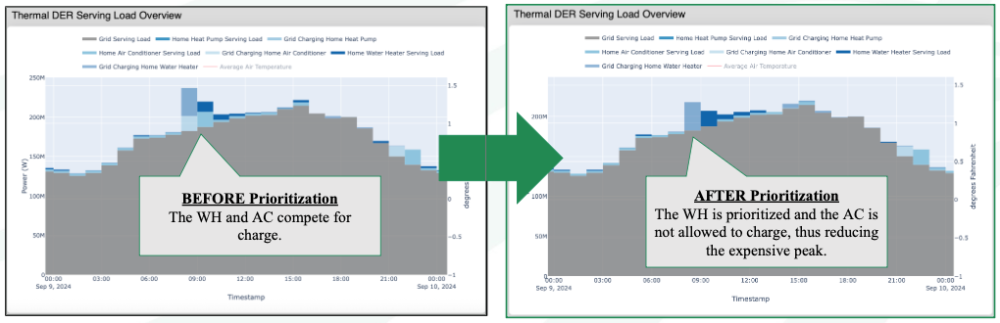

When two or more technologies compete for charge at the same time, only the highest priority technology is allowed to charge and discharge. In the case of the figures shown above, the WH and AC competed for charge time before the prioritization code was implemented. After the prioritization, only the WH is allowed to charge (and thus the AC does not charge or discharge). Be aware of the bias towards Water Heaters in the results of your model run.

## How to Reproduce Model Results
It is useful to investigate how changing certain input parameters affects the model results. To do this, one would need to reproduce the same exact model with only the user changes reflected. Normally, there is some variation in the model results due to the optimization methods used inside the model. Specifically, this is due to changes in the random seed for every model run in addition to an optimality tolerance parameter in the optimizers (i.e. HiGHS and CBC) used by REopt and vbatDispatch. The Water Heater code additionally uses random numbers to generate a water draw rate.

To reproduce the results of a model run:
<ol>
<li> If you have a completed run already, skip this step. If you do not have a model run you'd like to reproduce, simply run a model with any desired inputs and/or run the model with `Use the user provided random numbers?` input to 'No'.
<li> In the completed model run that you'd like to reproduce the results of, navigate to the <b> Raw Input and Output Files</b> section at the bottom of the model screen.
<li> Save the `water_heater_random_numbers.csv` file. On MacOS, this is done by right-clicking the file and selecting "Download Linked File As..."
<li> Also in the Raw Input and Output files, locate the random_seeds.csv file. Contained in that file for each technology enabled is a random seed number between 0 and 2147483647. Record or note the values for each technology.
<li> Go back up to the end of the Model Inputs and Duplicate the model using the green button. Give it a new name.
<li> In the duplicated model, input the corresponding random seed numbers into the random seed inputs in the General Model Inputs section (i.e. Random Seed - BESS \& GEN, Random Seed - AC, etc.) and upload the water_heater_random_numbers.csv file you saved earlier.
<li> Ensure that the `Use the User-provided random numbers?` input is set to `Yes`.
<li> For the `Use the user-provided random numbers?` input, select `Yes`.
<li> Ensure that all model inputs are the same as your previous model run. Do not change any inputs yet.
<li> Run the duplicated model.
<li> Compare the output plot results with the previous desired model. I like to look at the Cash Flow Projection Plot and see if the Utility Savings is identical. If not, carefully review that all steps were done correctly.
<li> After confirming that the results can be reproduced, you can make changes to the inputs in your duplicated model, run again, and continue your analysis!
</ol>

## Plot: Home Thermal Battery Power Profile 
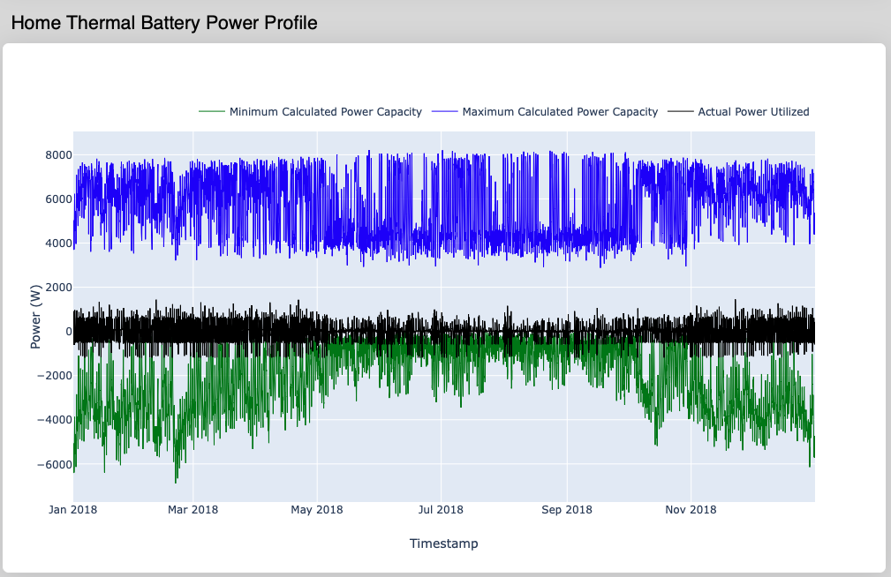
This plot shows the minimum and maximum calculated power capacity and the Actual Power Utilized for all of the thermal technologies combined. This is useful for diagnosing the behavior of the thermal technologies and/or the underlying vbatDispatch model used to simulate them.

## Plot: Home Chemical BESS State of Charge (Consumer Portion)
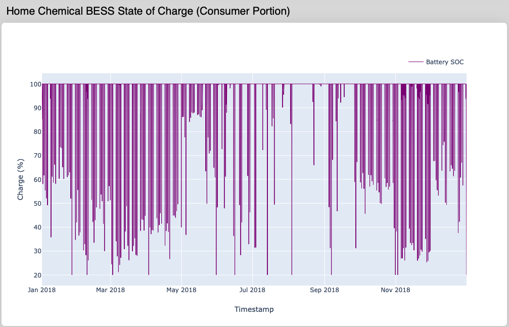

This plot shows the state of charge of the home chemical batteries in the analysis. 100% here means the maximum charge of the battery used by the household. If the [Portion of Charge Shared with Utility (%)](#portion-of-charge-shared-with-utility) input is 20\%, then that means 20\% of the BESS is allowed for use by the utility, and the other 80\% is modeled for the consumer. 100\% state of charge in this plot would correspond to the full 80\% of the chemical battery's energy power (kW) and capacity (kWh) allowed for consumer use.

## Table: Monthly Cost Comparison
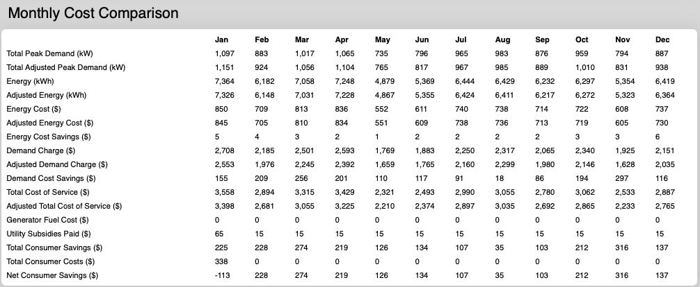
This table shows the monthly cost breakdown with and without DER.

### Total Peak Demand (kW)
This is the total peak demand (kW) for each month. 

If the [Use URDB Label?](#use-urdb-label) is selected and the user provides demand rate structure information in that .json file, the [Total Peak Demand (kW)](#total-peak-demand-kw) is the sum of all the corresponding kW for the maximum dollar amount (peak kW x rate $\$/\rm{kW}$) in each rate period window during that month. 

For example, if the `demandratestructure` in the .json file has rates of 0, 0.01, 1, this corresponds Rate Periods numbered 0, 1, 2. For the month of January, let's say Rate Period 1 is applied every day from 12am-12pm, and Rate Period 2 is applied every day from 12pm - 12am. Within each rate period, the hourly kW in January from the [Demand Curve](#demand-curve) is multiplied by the demand rate for that rate period (e.g. at 1am on Jan 1 if the kW is 2.4 kW, then the demand charge dollar amount is equal to $2.4 \rm{kW} \times \$0.01\rm{/kW} = \$0.024$). Then, the corresponding kW of the maximum dollar amount between all the demand charge dollar amounts in Period 1 on Jan 1 is added to the [Total Peak Demand (kW)](#total-peak-demand-kw), and the same is done for Period 2 on Jan 1, Period 1 on Jan 2, Period 2 on Jan 2, and so on. 

### Total Adjusted Peak Demand (kW): 
This is similar to the [Total Peak Demand (kW)](#total-peak-demand-kw) but performed e for the demand curve that has been adjusted by the DERs discharging and charging.

### Demand Charge: 
If the [Use URDB Label?](#use-urdb-label) is selected and the residential rate structure contains demand (kW) tariff information, the demand charge is calculated as the total monthly peak demand cost ($\$$). If the demand rate tariff is a flat rate $\$/\rm{kW}$ for each month, this is simply the maximum dollar amount for the month when each hour's demand (kW) is multiplied by the $\$/\rm{kW}$ of that month. If the demand rate tariff is more complex (e.g. a weekday window of 2-8pm is charged at some $\$/\rm{kW}$ rate, whereas a weekend window could be 5-10pm at a different $\$/\rm{kW}$ rate, and so on), then the maximum peak dollar amount ($\$$) is the sum of all the maximum peak dollar amounts in each rate period window of that month (i.e. in each 2-8pm window there is a maximum $\$$ amount found by multiplying each hour kW by the corresponding $\$/\rm{kW}$ rate and taking the maximum $\$$. All maximum $\$$ amounts in each 2-8pm window in that month is added together to get the total monthly $\$$ for that window. If there are any other windows such as the 5-10pm weekend rate example, those are calculated similarly and added together for the month. All total maximum $\$$ for all rate period windows are added together to give the total monthly demand charge).

If the [Use URDB Label?](#use-urdb-label) is not selected and the user provides demand rate structure information in the [(Optional) Residential Rate Structure](#optional-residential-rate-structure) json file, then the demand charge is calculated the same as described above.

### Adjusted Demand Charge: 
Similar to the [Demand Charge](#demand-charge) calculation, but performed for the demand curve that has been adjusted by DERs discharging and charging.

### Demand Cost Savings: 
For each month of the year, this shows the demand savings given by [Demand Charge](#demand-charge) - [Adjusted Demand Charge](#adjusted-demand-charge).

### Energy (kWh): 
For each month of the year, this shows the sum total kWh of the [Demand Curve](#demand-curve).

### Adjusted Energy (kWh): 
The monthly [Energy](#energy-kwh) that includes the adjustments made by all DERs discharging and charging.

### Energy Cost ($\$$):
For each month of the year, this is the sum total of [Energy](#energy-kwh) multiplied by each corresponding hourly energy tariff $\$/\rm{kWh}$.

### Adjusted Energy Cost ($\$$): 
For each month, the adjusted energy cost is the sum total of the [Adjusted Energy](#adjusted-energy-kwh) multiplied by the energy tariff ($\$/\rm{kWh}$) for each corresponding hour. The adjusted energy cost is similar to [Energy Cost](#energy-cost-), but it uses the demand curve that has been adjusted by all DERs discharging and charging.

### Energy Cost Savings ($\$$): 
This is calculated by taking the difference between [Energy Cost](#energy-cost-) - [Adjusted Energy Cost](#adjusted-energy-cost-).

### Total Cost of Service ($\$$): 
This is calculated by adding [Energy Cost](#energy-cost-) + [Demand Charge](#demand-charge).

### Adjusted Total Cost of Service ($\$$): 
This is calculated by adding [Adjusted Energy Cost](#adjusted-energy-cost-) + [Adjusted Demand Charge](#adjusted-demand-charge).

### Utility Subsidies Paid ($\$$): 
This is the sum total dollar amount paid to the member-consumer for all subsidies.

### Generator Fuel Cost ($\$$): 
The cost to the consumer for all fossil fuel consumption used in the program.

### Total Consumer Savings ($\$$): 
This is the total savings for the consumer given by [Energy Cost Savings](#energy-cost-savings-) + [Demand Cost Savings](#demand-cost-savings) + [Utility Subsidies Paid](#utility-subsidies-paid-).

### Total Consumer Costs ($\$$): 
For each month, this is the total cost to the consumer. Costs include replacement costs, fuel costs, and retrofit costs. All of the retrofit costs are applied to the first month. 

### Net Consumer Savings ($\$$): 
This is the net savings for the consumer given by [Total Consumer Savings](#total-consumer-savings-) - [Total Consumer Costs](#total-consumer-costs-).

## Plot: Cash Flow Projection
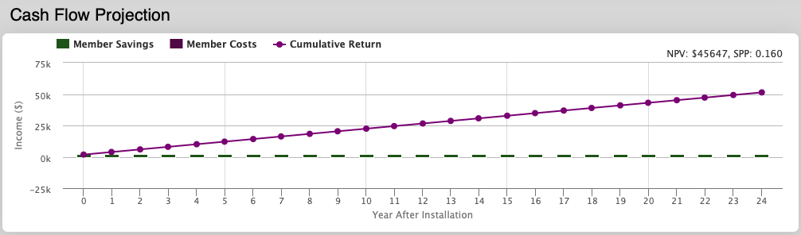
This plot shows the yearly cash flow projection based only on the results from year 1 (see Monthly Cost Comparison table for year 1 values). The `Consumer Savings` are the sum of the monthly [Total Consumer Savings](#total-consumer-savings) values in the Monthly Cost Comparison chart, and the `Consumer Costs` are similarly the sum of the monthly [Total Consumer Costs](#total-consumer-costs) in the Monthly Cost Comparison chart. The `Cumulative Return` series is the cumulative sum of the [Net Consumer Savings](#net-consumer-savings) cash flow.

Simply click on the variable names to toggle them on/off.

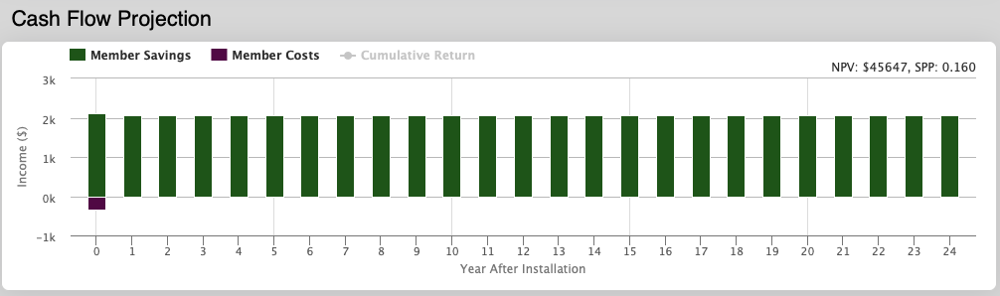 
Here the `Cumulative Return` is toggled OFF.

Note the Net Present Value (NPV) and Simple Payback Period (SPP) are shown in the top right corner of this plot. 

### Net Present Value 
The NPV is the value of all future cash flows over an investment’s lifetime, discounted to the present. This is represented by the equation:

$\displaystyle\sum_{t=0}^{M-1} \frac{values_t}{(1+rate)^t}$ [[8]](#references)

Where `rate` is the discount rate given as user input in the General Model Inputs, and `values` are the projected cash flows = (`Consumer Savings` – `Consumer Costs`)$_t$ for each year, $t$, up to a total projection length of $M$ years.

`Consumer Savings` = all DER kW Demand Savings ($\$$) + all DER kWh Consumption Savings ($\$$) + all subsidies ($\$$)

`Consumer Costs` = retrofit costs ($\$$)

### Simple Payback Period
The SPP is the number of years it takes to recover all initial costs based on the first year’s cash flows. It is represented by the following equation:

$\frac{\rm{Initial \ Investment}}{\rm{Consumer \ Savings} - \rm{Consumer \ Costs}}$

Where `Initial Investment` = startup costs ($\$$) + one-time operational costs ($\$$) + one-time subsidies ($\$$).

`Consumer Savings` = all DER kW Demand Savings ($\$$) in Year 1 + all DER kWh Consumption Savings ($\$$) in Year 1 + all subsidies ($\$$) in Year 1.

`Consumer Costs` = retrofit costs ($\$$) in Year 1.


## Plot: Savings Breakdown Per Technology
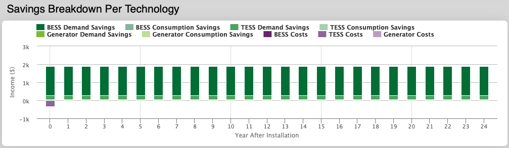
This plot shows the yearly savings and incentives breakdown for the BESS, TESS, and GEN technologies (if enabled).

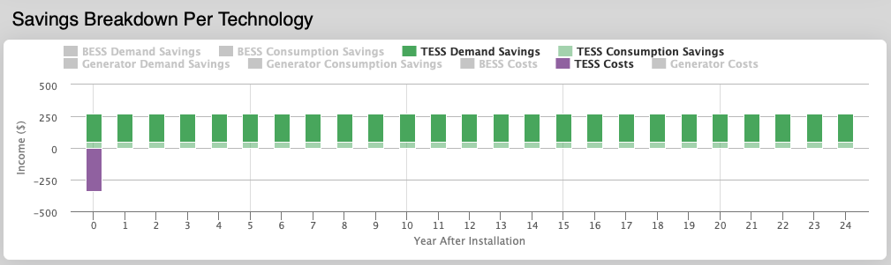 
This shows only the TESS Savings and TESS Incentives toggled on, for example.

This plot is useful for technology-specific insights for evaluating the overall benefit of individual DER. TESS here is an aggregate of all thermal technologies (i.e. WH + AC + HP). 

The incentives represent the subsidy amounts for each technology. The savings are broken up into a Demand (kW) Savings and a Consumption (kWh) savings for each DER.

## Plot: Savings Breakdown of Thermal Technologies
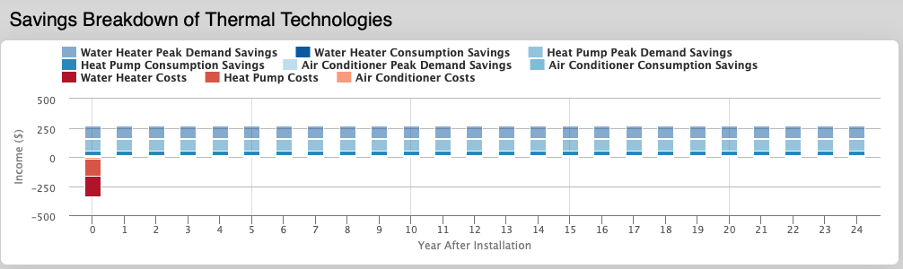
This plot shows the yearly savings and incentives breakdown of only the TESS technologies: Water Heater, Heat Pump, and Air Conditioner, if enabled.

This is useful for evaluating the individual thermal DER.

## Raw Input and Output Files
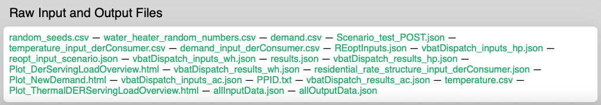
At the very end of the model outputs is a collection of all raw inputs and outputs for that model run:
- random_seeds.csv 
- water_heater_random_numbers.csv
- demand.csv
- Scenario_test_POST.json
- temperature_input_derConsumer.csv
- demand_input_derConsumer.csv
- REoptInputs.json 
- vbatDispatch_inputs_hp.json 
- reopt_input_scenario.json
- vbatDispatch_inputs_wh.json 
- results.json 
- vbatDispatch_results_hp.json 
- Plot_DerServingLoadOverview.html 
- vbatDispatch_results_wh.json 
- residential_rate_structure_input_derConsumer.json 
- Plot_NewDemand.html 
- vbatDispatch_inputs_ac.json 
- PPID.txt
- vbatDispatch_results_ac.json 
- temperature.csv 
- Plot_ThermalDERServingLoadOverview.html 
- allInputData.json 
- allOutputData.json

# References
<a id=“1”>[1]</a> These values were based on the reported values from NRECA’s [Weekly Fuel Price Watch](https://www.electric.coop/weekly-fuel-price-watch) in March 2025.

<a id=“2”>[2]</a> 
Thermal Efficiency of Propane fuel can range from 25-34\%. See Figure 10 in this study [Comparisons Between Effective Efficiency for Gasoline and Propane](https://www.researchgate.net/figure/a-Comparisons-between-effective-efficiency-for-Gasoline-and-Propane-for-various_fig18_263874565). The research article shows the effective thermal efficiencies for various engine speeds, specifically for propane and gasoline. The efficiency ranges from 25-34\% for propane, and 28-33\% for gasoline.

<a id=“3”>[3]</a> 
See article [The Efficiency of Diesel Generators: A Comprehensive Analysis](https://www.ourmechanicalcenter.com/archives/12117). This resource claims that the thermal efficiency range is 20-30\% for gasoline fuel and 35-45\% for diesel fuel.

<a id=“4”>[4]</a> 
Thermal Efficiency of Gasoline fuel, see [Sustainable Maintenance: How Does Generator Efficiency Vary Across Fuel Types?](https://www.sustainablemaintainance.com/2025/02/how-does-generator-efficiency-vary.html). This resource claims that the thermal efficiencies are 20-30\% for gasoline fuel, 25-35\% for natural gas fuel, 25-30\% for propane fuel, and 30-40\% for diesel fuel. 

<a id=“5”>[5]</a> 
See [Enbrighten 125-Volt-1-Outlet Indoor Smart Plug](https://www.lowes.com/pd/Enbrighten-125-Volt-1-Outlet-Indoor-Smart-Plug/1003202046) About \$13 in April 2025. 

<a id=“6”>[6]</a> 
See [Aquanta Smart Electric Water Heater Controller](https://www.nysegsmartsolutions.com/Water-Fixtures/I-AQCAG100E-01-XXXX-XXXX-V1.html?srsltid=AfmBOoo--7Idu156g5c0j01oWowfjP4G50-wJW0ENwo3sZHoE7iQsvuL), about $175.

<a id=“7”>[7]</a> 
See [Google Nest Smart Thermostat](https://store.google.com/us/product/nest_thermostat), about $120-$150.

<a id=“8”>[8]</a> 
The NPV is calculated using the [NumPy Financial NPV](https://numpy.org/numpy-financial/latest/npv.html) function.