# Overview
The Distributed Energy Resource (DER) Interconnection model carries out the key modelling and analysis steps involved in a DER impact study including Load Flow computations, Short Circuit Analysis, and Effective Grounding Screenings. This analysis is presented in a static point-of-view of a 24hr simulation period, and not as a time series analysis.

# Walkthrough 
The inputs to the model are used to identify the locations at which to induce faults, as well as the conditions under which to perform the analysis. The pre-assigned values in the inputs are default values that are expected to be updated by the user. The Olin Barre Geo Modified DER public feeder has been setup to run with this model, but the user can utilize their own model if they choose.

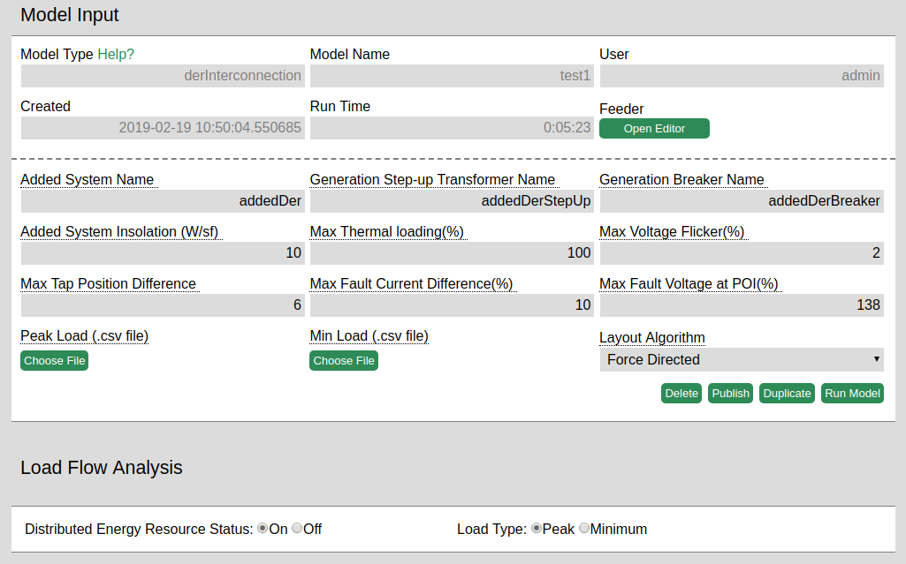
 
Once a feeder has been selected, the user must identify the added DER in the feeder with respect to which the analysis will be run, and copy its name property from the editor to the **Added System Name** input box. Similarly, the user must identify the transformer and the fuse for the added DER and populate the **Generation Step-up Transformer Name** and the **Generation Breaker Name** inputs respectively. 

The **Added System Insolation** input is a value between 0 and 1000 that represents the solar insolation at the added DER; values greater than 1000 will be converted to 1000 and values lower than 0 will be converted to 0. The default value of 30 W/sf (~7 KWh/m2/day) is a slight overestimation of the highest solar insolation in the US for an average year. We encourage the user to experiment with values they think are suitable for their feeder; a good reference for insolation values in the US can be found [here](https://www.nrel.gov/gis/solar.html). The reference provides values in units of KWh/m2/day which can be converted to W/sf by multiplying by a thousand and dividing by 24 to get W/m2, and then dividing by 10.764 to get W/sf. For example 7 Kwh/m2/day = 291.67 W/m2 = 27.10 W/sf.

The **Max Thermal Loading** input is the percentage of current above which values will be highlighted as violations in the results. 

**Max Voltage Flicker** is the difference between the DER on and DER off scenarios as a percentage of the DER on voltage, above which values will be highlighted as violations in the results

**Max Tap Position Difference** is the difference in tap position between the DER on and DER off scenarios such that higher measured values will be highlighted as violations 

**Max Fault Current Difference** is the absolute difference in pre-fault and post-fault current values as a percentage of pre-fault current, above which values will be highlighted as violations in the results 

**Max Fault Voltage at POI** is the post-fault voltage as a percentage of the pre-fault voltage above which measured values will be highlighted as violations. 

The **Peak Load** and **Min load** file upload options allow the user to provide csv files such that each row in the file contains the key of a node in the .omd file followed by a comma and the corresponding load value for the given node. If a file is not provided, the peak load value will be determined from the provided feeder and the min load value will be calculated as (peak load / 3) + noise, where noise is a uniformly sample value between +- 10% of the peak load value. 

The Load Flow Analysis radio buttons determine the scenario for which the load flow plots will be generated.

# Model Results

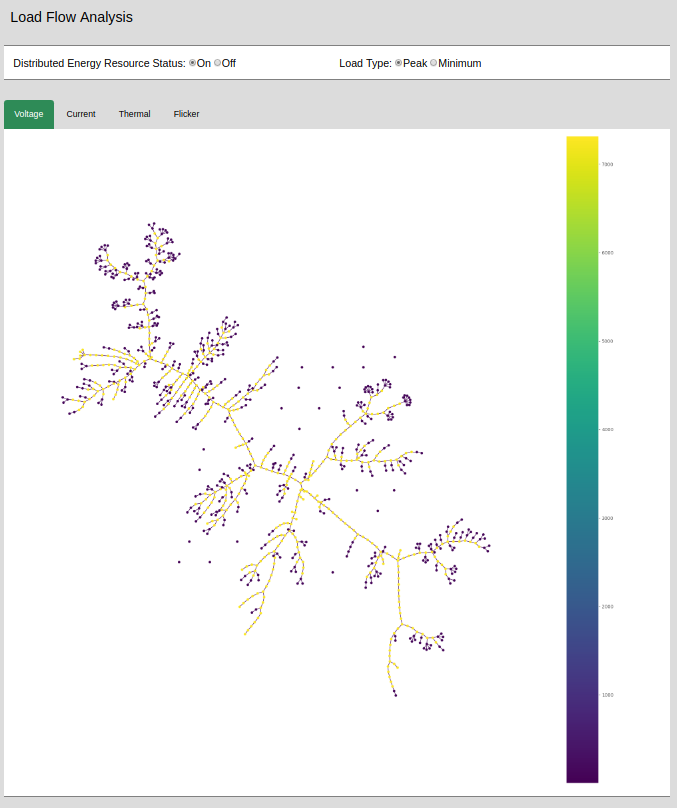

**Load Flow Analysis:** A visualization of Voltage, Current, and Thermal Loading values under all combinations of the DER (on/off) and load type(peak/min) settings, as well as the Flicker values under the two load types. The user can toggle between the load flow scenarios using the radio buttons, and toggle between visualizations by clicking on the tabs corresponding to the desired property.

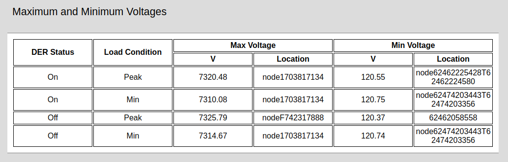

**Maximum and Minimum Voltages:** Max and Min voltages as well as the corresponding location under all four DER and Load combinations.

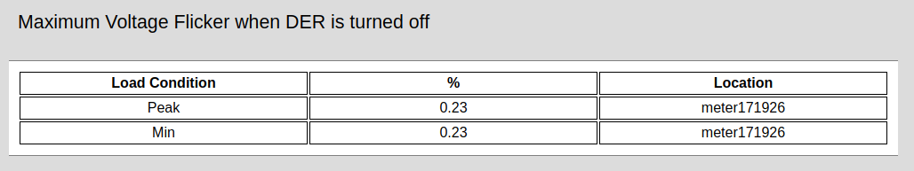

**Maximum Voltage Flicker when DER is turned off:** Max flicker and flicker location under the 2 different loads. Flicker is computed as 100*(1-(DER off volts/DER on volts)).

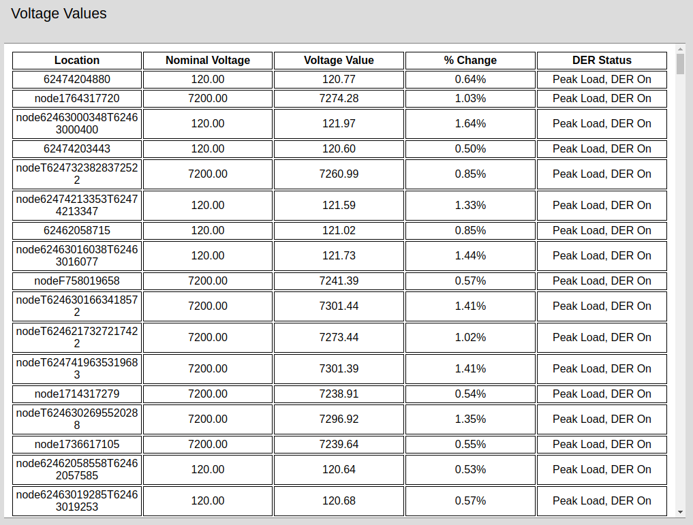

**Voltage Values:** Voltage values at every node in the feeder under all four DER and Load combinations. Percent change reflects the change from the nominal value as a percent of the nominal value. Voltage values non-compliant with ANSI C84.1 Range A Service voltages are displayed in red.

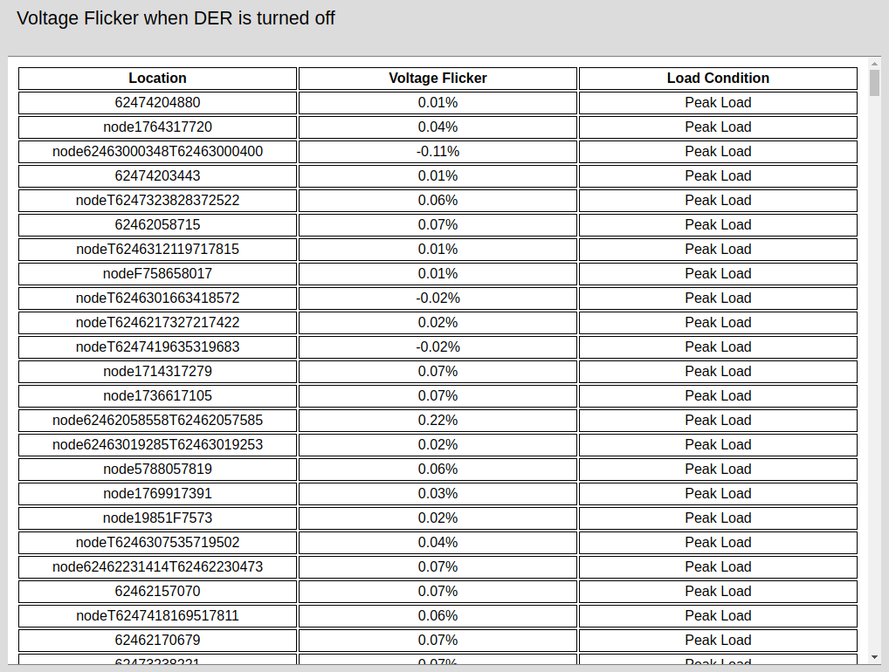

**Voltage Flicker when DER is turned off:** Voltage flicker at every node in the feeder under the two load conditions. Flicker is computed as 100*(1-(DER off volts/DER on volts)). Negative values mean the voltage when the DER was turned off were higher than when the DER was on. Flicker values greater than or equal to the input **Max Voltage Flicker** are displayed in red.

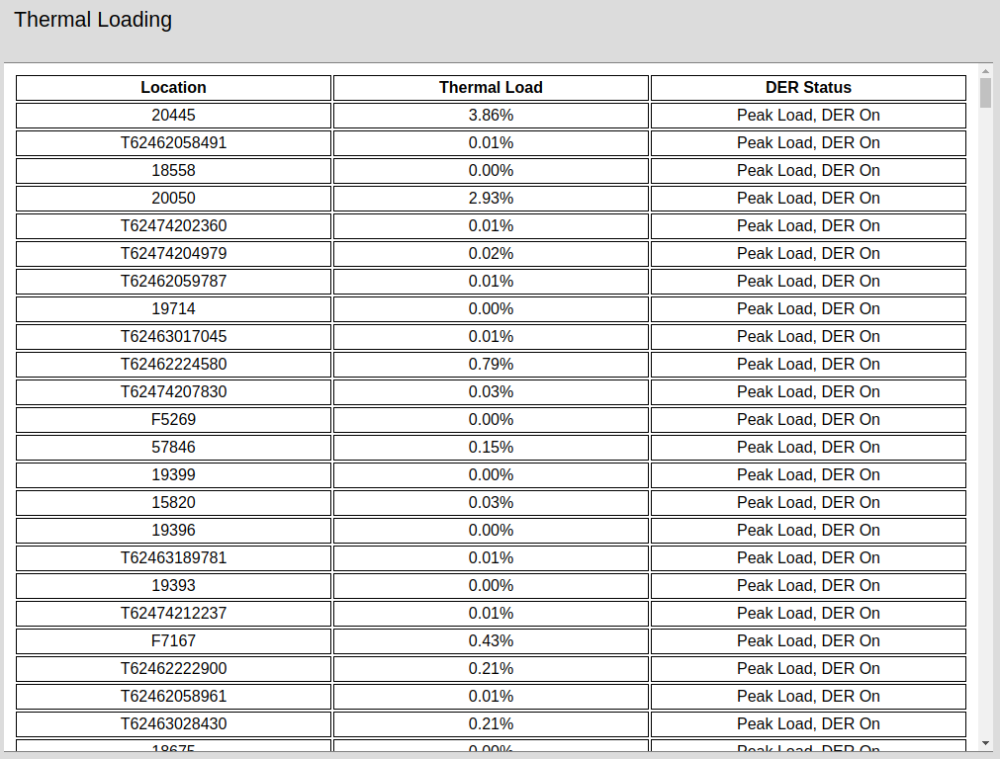

**Thermal Loading:** Thermal Loading at each link in the feeder under all four DER and Load combinations. Values greater than or equal to the input **Max Thermal Loading** are displayed in red.

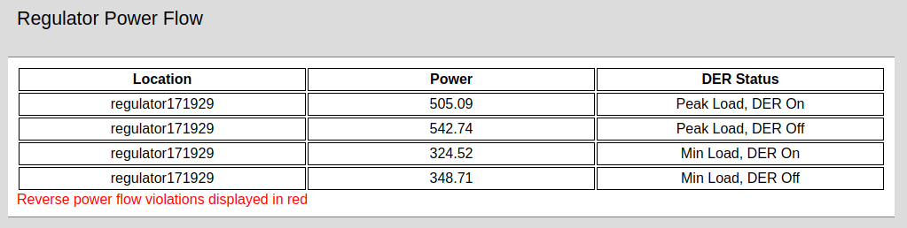

**Regulator Power Flow:** Power flow values at each regulator in the feeder under all four DER and Load combinations. Regulators with reverse power flow are displayed in red.

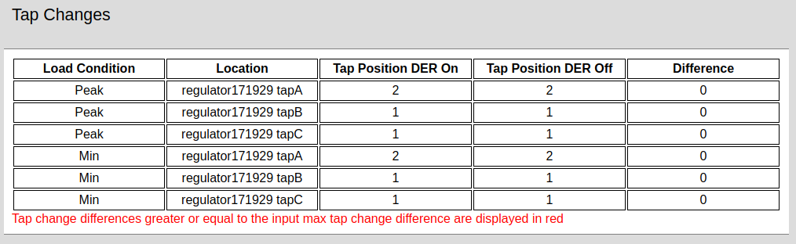

**Tap Changes:** Tap positions for each regulator under all four DER and Load combinations as well as the difference in position between DER on and DER off scenarios. Difference greater than or equal to the input **Max Tap Position Difference** are displayed in red.

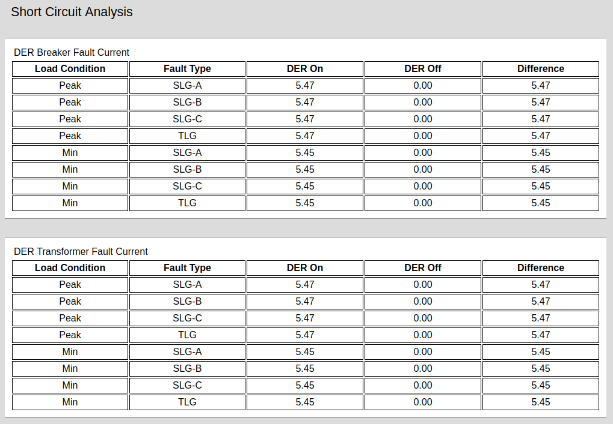

**Short Circuit Analysis:** Fault are induced, and current values are measured, at the user provided **Generation Step-up Transformer Name** and the **Generation Breaker Name** under all four DER and Load combinations for all 3 Single line-to-ground faults (SLG) and the triple line-to-ground faults (TLG) as well as the difference in current values between the DER on and DER off scenarios. 

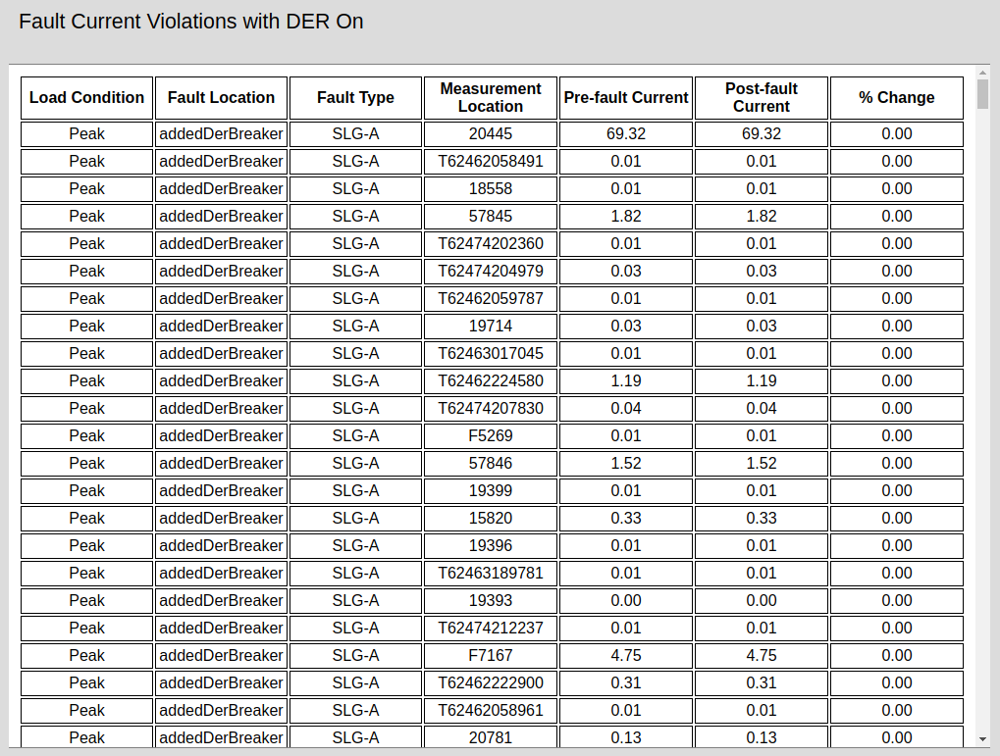

**Fault Current Violations with DER On:** Fault current values at every link in the feeder under both load conditions with the DER on for all 3 Single line-to-ground faults (SLG) and the triple line-to-ground faults (TLG) as well as the percent change in pre-fault and post-fault conditions. Faults are induced at the user provided **Generation Step-up Transformer Name** and the **Generation Breaker Name**. Fault current percent changes greater than or equal to the user provided input **Max Fault Current Difference** are displayed in red. 

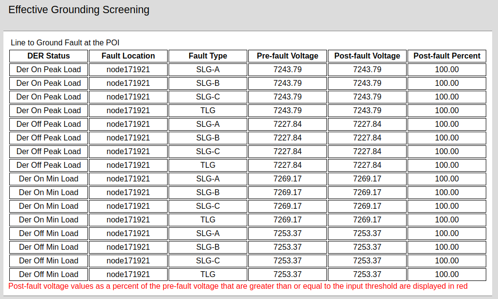

**Effective Grounding Screening:** Fault voltage values at the point of interconnection for the DER under all four DER and Load combinations on for all 3 Single line-to-ground faults (SLG) and the triple line-to-ground faults (TLG) as well as the percent change in pre-fault and post-fault conditions. Faults are induced at the user provided **Generation Step-up Transformer**. Fault current percent changes greater than or equal to the user provided input **Max Fault Voltage at POI** are displayed in red. 