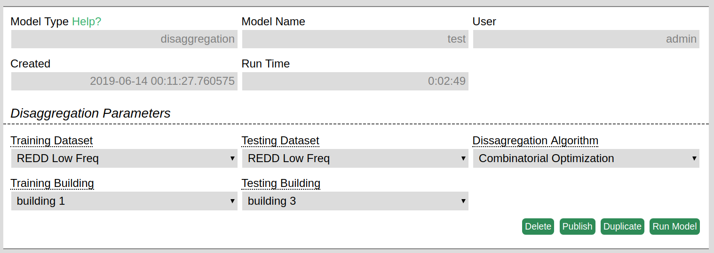
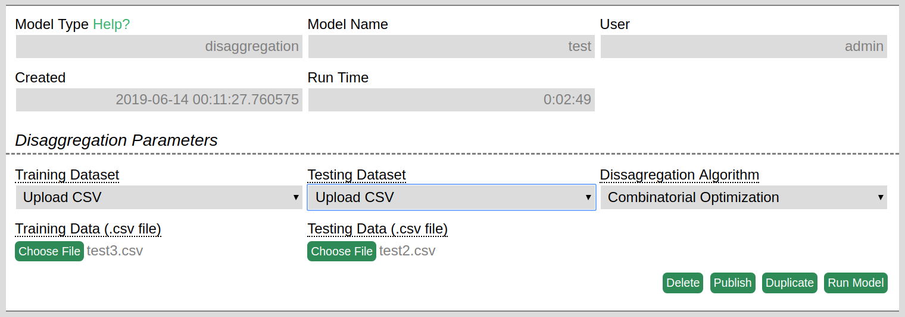
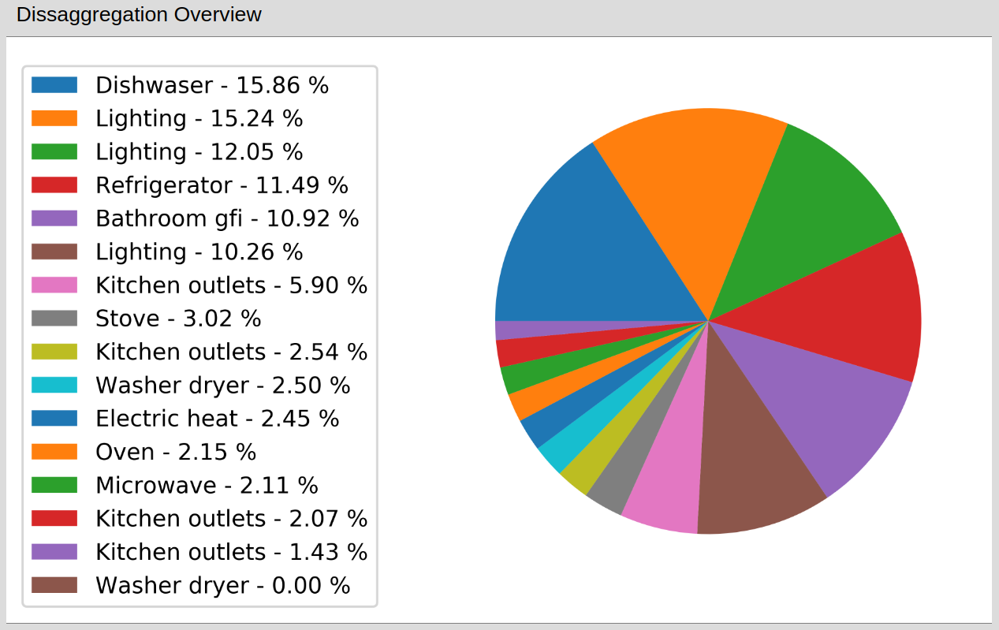
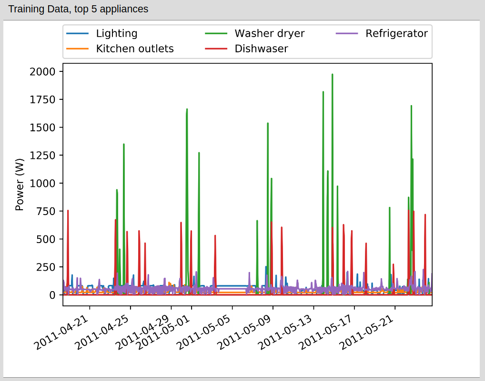
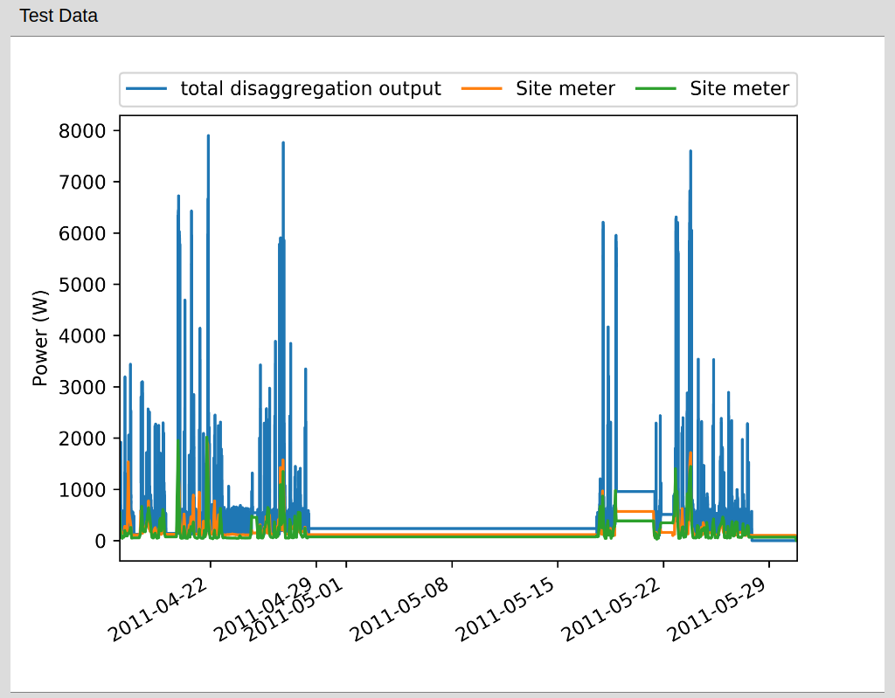
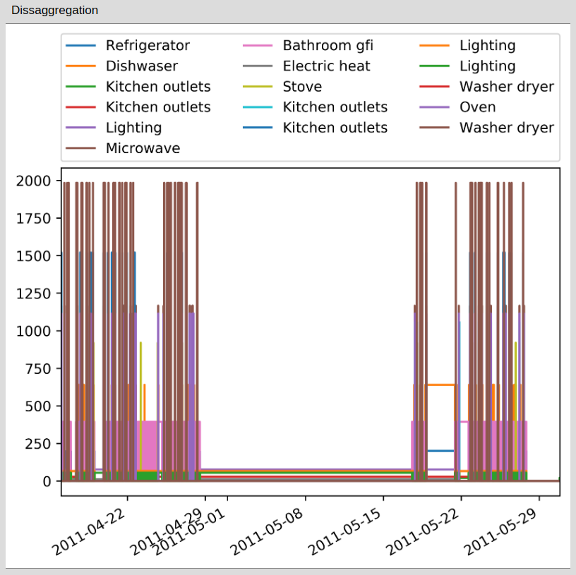

# Overview
The Disaggregation model breaks down provided power consumption data from a given meter into the constituent appliances. This model relies on training data to make accurate predictions and returns both an overall appliance level disaggregation and a disaggregation over time.

# Model Inputs 
The inputs to the model are related to the training and test sets, as well as the algorithm to use for the analysis.

 
**Training/Test Dataset:** The model currently supports the REDD low frequency datasets as well as the ability to upload user-provided data. The training dataset is used to determine which appliances the test set will be disaggregated into, as well as to extract patterns of appliance level consumption. If the REDD dataset is selected, the user will be further prompted to selected the building in the dataset with respect to which the analysis will be performed. If the user decides to provide their own data, they will be prompted to upload a csv. The format of the csv is as follows:

- The first row contains sampling frequency for the data, i.e. the number of seconds between datapoints.
- Each subsequent row contains a timestamp in 'yyyy-mm-dd HH:MM:SS' format followed by a comma, followed by the meter reading in watts.
- In the training csv, the meter reading should be followed by a comma and then the name of the appliance that the given reading corresponds to.
- If multiple appliances were used at a given time point, each appliance should be listed on a separate row with its meter reading and the time of occurrence even if the time of occurrence is shared with another appliance.

# Model Outputs

**Disaggregation Overview:** An appliance level breakdown for the entire time period of interest is provided. This output shows appliance usage in sorted order and informs the user on the percent of consumption that each appliance constitutes.

**Training Data, Top 5 appliances:** A visualization of the top five appliances in the training data with regard to power consumption over the given time period.

**Test Data:** A visualization of the provided test data as well as the total predicted power consumption (sum of the power consumption across all appliances). These two values are not always the same because the disaggregation is an approximation largely dependent on the fidelity of the training data.

**Disaggregation:** A visualization of the predicted appliance use pattern during the provided time period. This is the data that is summed to provide the total predicted consumption value for the **Test data** output.