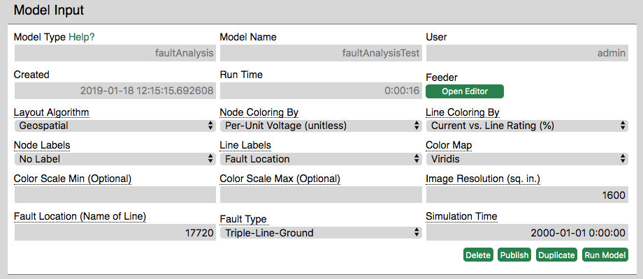
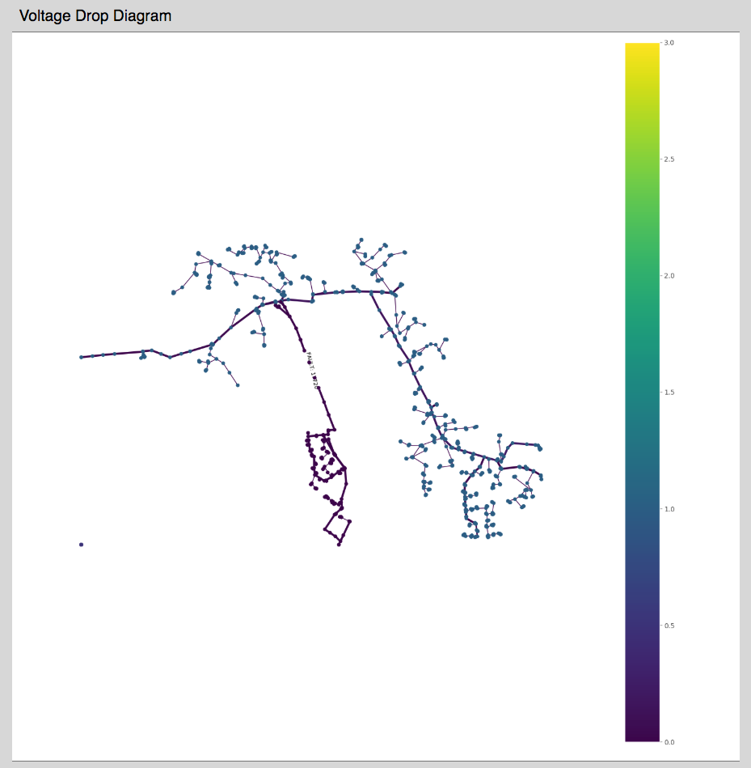
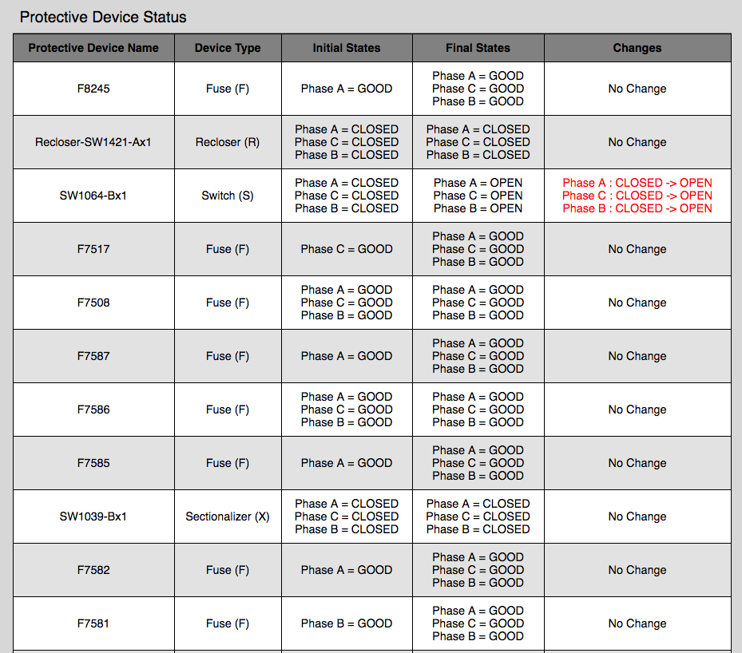

### Overview
The faultAnalysis model calculates and displays the effects of a fault on a given feeder circuit. It is similar to the voltageDrop model, with the addition of a fault to the provided circuit.
### Walkthrough
The faultAnalysis model calculates and displays the effects of a fault on a given feeder circuit. It is similar to the voltageDrop model, with the addition of a fault to the provided circuit. The "Node Coloring By" and "Line Coloring By" fields denote the values that nodes and edges will be colored by in the loadflow output image. Similarly, "Node Labels" and "Line Labels" provide an option to label nodes and lines by name or value. The user can also choose to display only the line label for the location of the fault on the circuit. "Color Map" is set to Viridis by default for optimal readability of the scale. "Color Scale Min" and "Color Scale Max" allow the user to specify a specific range for the color scale, which is set by default when these fields are left empty. "Image Resolution" allows the user to specify the size of the output image, which is useful for varying circuit sizes. "Fault Location" and "Fault Type" specify where the fault occurs and what type of fault occurs. Finally, "Simulation Time" denotes the date and time at which the simulation is run.

### Model Results
**Voltage Drop Diagram -** Powerflow diagram showing the circuit with the specified coloring, scale, and labels. 

**Protective Device Status -** Table showing information for all the protective devices on the circuit (fuses, switches, sectionalizers, and reclosers) and their states for each phase before and after the fault occurs and the simulation is run. Changed states are denoted in red in the rightmost column, labeled "Changes."

