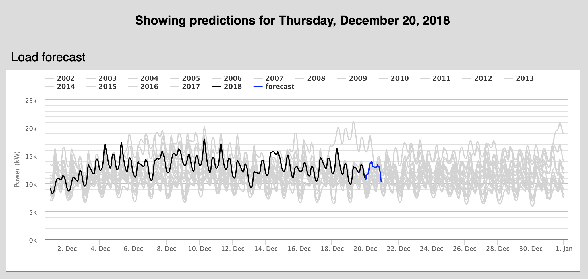
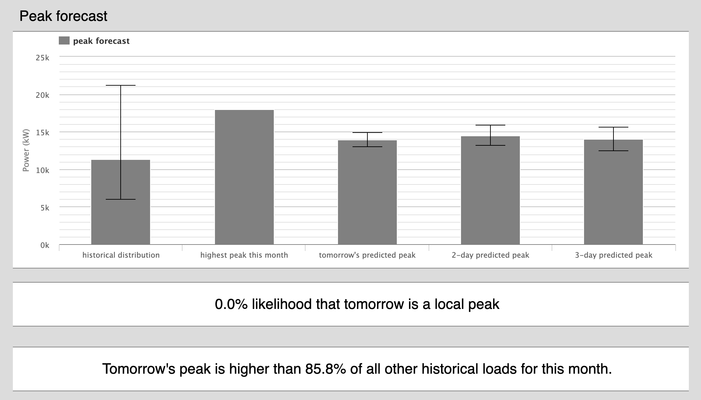

### Overview

The forecastTool model attempts to predict the next day’s electric consumption. Furthermore, it attempts to place tomorrow's peak in a monthly context, giving the statistical likelihood that tomorrow will be the monthly peak.

Detailed information on the model implementation and results: https://towardsdatascience.com/an-electric-utilitys-3-part-guide-to-peak-shaving-with-neural-networks-de5c7752d946

### Inputs

* Epochs: some integer 1 - 100. One should expect ~ 30 seconds per epoch, but typically more epochs means a higher accuracy. If no improvement is seen within 20 epochs, the model will stop training

* Historical CSV: 6-column CSV with at least three years of historical load data. Column names matter, including capitalization.
     * `load`: hourly load in kW
     * `tempc`: hourly temperature (can be Celcius or Fahrenheit
     * `year`, `month`, `day`, `hour`: corresponding datetime. Use integers and military time.
          * If preferred, you can include a `dates` column in lieu of these four; however, our date-parsing software is prone to error, so breaking them into 4 column is safer.
     * The predicted day will be the 12am-11pm of the day following the last date in this CSV.
          * Fill out data to end at 11pm of the day prior.

* 72-hour temperature forecast: a file with no header that lists each hour's temperature forecast on a new line.

### Outputs

The zoomable graph that shows tomorrow’s forecast (blue) and compares that to historical monthly loads (gray) as well as the current month’s load so far (black).

The three-day peak forecast, the highest peak so far, and their appropriate error bars. Given those inputs, the model predicts the statistical likelihood that tomorrow’s peak will be the monthly peak. For even better context, the historical distribution of hourly load is also given, helping utilities place tomorrow’s forecast in context.

