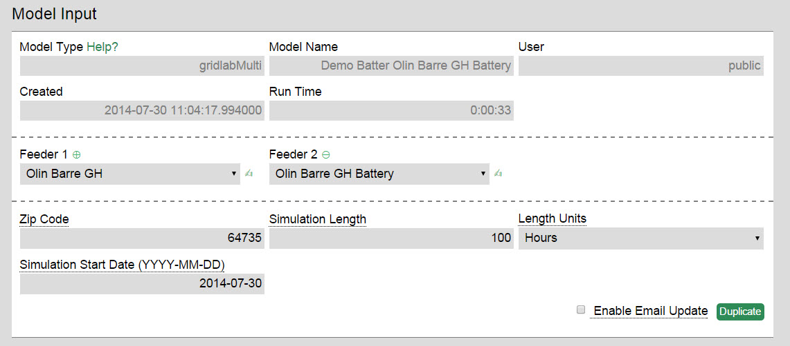
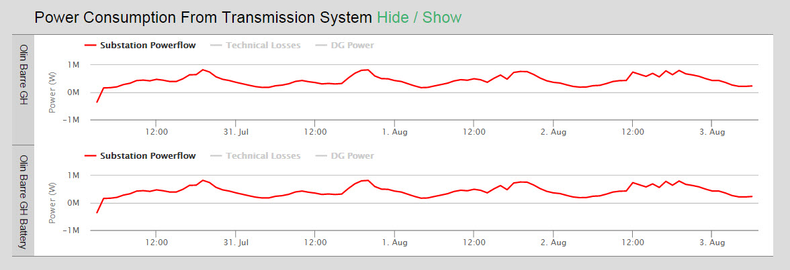
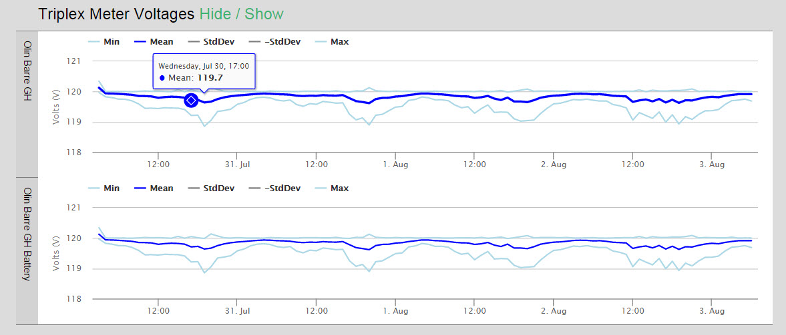
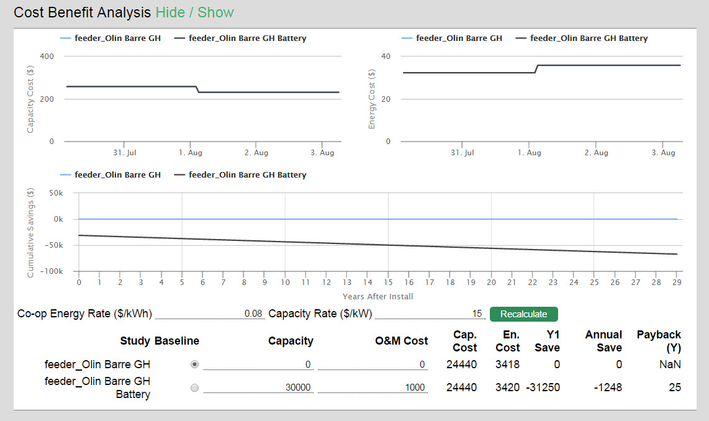

###Overview
The gridlabMulti model allows you to run multiple instances of GridLAB-D and compare their output visually.  This allows the user to change a feeder (typically to simulate installing a new technology) and then see how that change impacts feeder power flow.  The model also performs a simple cost/benefit analysis.

###Walkthrough
The gridlabMulti model runs using the GridLAB-D engine and requires only a few inputs.  The most important inputs are the feeder/s that the user wants to compare.  More feeders (up to 15) can be added to the model by clicking the + sign.  Feeders can be edited within the OMF in the feeder editor mode, or a feeder editor program compatible with the OMF. For more on editing feeders, see [Feeder Editing](./Other-~-Walkthrough-of-a-Solar-Analysis.md#3--feeder-editing).

In addition to the feeder enter a location for the simulation and a length.  Due to the complexity of running gridLAD-D, a year-long simulation may take a few hours to run.

###Model Results

**Power Consumption from Transmission System**- Shows how much power is being drawn from, or pushed back to the substation over the course of the simulation.  Technical Losses and power generated from DG sources (typically solar) can be displayed as well. Hovering the mouse over the line gives the exact value at each point in time along the simulation.

**Energy Balance**- Gives the sum of the loads, losses, and DG in Watt-hours over the simulation.

**Triplex Meter Voltages**- Graph of each feeder’s spread of meter voltages through their mean, minimum, and maximum.

**Cost Benefit Analysis**- Simple calculator to do cost benefit analysis of the technology modeled on the different feeders.  The CBA can be run on its own in order to quickly see how different assumptions impact the costs and savings without having to re-run a large GridLAB-D simulation again.

Other model outputs include the simulation location, grid components, climate during simulation (based on TMY-2 data), as well as runtime statistics.