## Introduction

The [hostingCapacity model](https://omf.coop/newModel/hostingCapacity/fromWiki) calculates hosting capacity for DERs.

Three methods are available which can be used together or individually: <br />

* An AMI-based option or the "Model Free Hosting Capacity Analysis" ( MoHCA ) option <br />
  * Voltage-constrained and/or thermal-constrained.
* A model-based or "Traditional" circuit-based option <br />
  * Voltage-constrained and thermal-constrained
* A "Downline Load" option which provides a rough estimate of hosting capacity

## Walkthrough <br />

### Defining the Inputs <br />

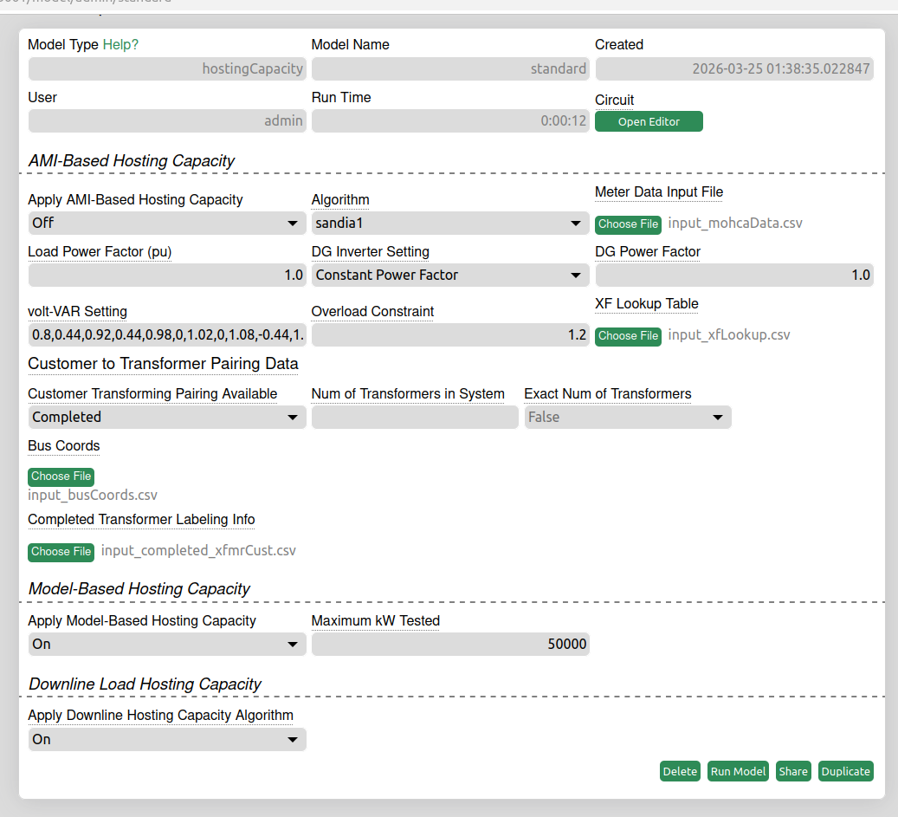

**Input 0: Circuit File**<br />
The first input for the model. Required for model-based and downline load to run. Not required for model-free. Map interface is built off circuit so if you are only running model-free then no map interface will be displayed.

To upload a circuit file:

1. Click "Open Editor" on hosting capacity model page.
2. Click "File" on the top left navigation bar in map interface.
3. Click "OpenDSS Conversion" to upload OpenDSS circuit file.

### AMI-Based Inputs <br />

The AMI-Based Hosting Capacity provides voltage-constrained and thermal-constrained hosting capacity results depending on given inputs.

**Input 1: Apply AMI-Based Hosting Capacity**
If you would like to run AMI-based hosting capacity - select on.

**Input 2: Algorithm Type**

* There are two model-free algorithm options: <br />
  * Regression-Based - sandia1 <br />
  * PINN-Based - Iowa State <br />
    * Requires slight change in datetime: 2019-01-01 00:00:00+00:00 <br />

**Input 3: Meter Data Input File**

CSV files are used to input meter data with 5 columns: <br />

* [busname, datetime, volts reading, kwWatts reading, kVAR reading]

| Input Title      | Input Datatype                                  |
| -------------    | -------------                                   |
| busname          | string                                          |
| datetime         | YYYY-MM-DDTHH:mm                                |
| v_reading        | float/decimal, must be actual not PU            |
| kw_reading       | float, avg over the measurement interval        |
| kvar_reading     | float, avg over the measurement interval        |

* Input titles much match those in the chart for both model-free algorithms to run successfully.
* A minimum of 1 year of readings at the hourly level are required to run the model (i.e. 8,760 time steps). Performance can be improved by user higher resolution data, for example 15-minute intervals (35,040 time steps).

#### Example of .csv input file (sandia1): <br />

```text
busname,datetime,v_reading,kw_reading,kvar_reading
bus1,2019-01-01T00:00,124.8201353,3.907200098,0.712799966
bus1,2019-01-01T00:15,124.589564,4.658400059,0.686399996
bus1,2019-01-01T00:30,124.6299914,4.963200092,1.051200032
```

#### Example of .csv input file (Iowa State): <br />

```text
busname,datetime,v_reading,kw_reading,kvar_reading
bus1,2019-01-01 00:00:00+00:00,124.8201353,3.907200098,0.712799966
bus1,2019-01-01 01:00:00+00:00,124.589564,4.658400059,0.686399996
bus1,2019-01-01 02:00:00+00:00,124.6299914,4.963200092,1.051200032
```

#### Additional Model-Free Inputs for Further Specifications - sandia1 algorithm ONLY

The sandia1 algorithm has the option to return both voltage and thermal constrained hosting capacity algorithms
<br />

If the user does not input kvar_readings thermal constrained hosting capacity will not be calculated.

**Input 4 - Load Power Factor (pu)** := If no reactive power ( kvar_reading ) is available in the dataset, a power factor can be included to help calculate voltage-constrianed hosting capacity. This has no impact in thermal-constrained hosting capacity since that will not be calculated if kvar_reading is not present.
It is estimated that the percentage of error from lack of reactive power and assumed power factor is that of the power factor. i.e. if missing reactive power and given load power factor is 0.9 - the results are 90% accurate.<br />
**Input 5 - DG Inverter Setting** := Calculate hosting capacity based on the assumption DG is either fixed or following a voltVAR curve.<br />
**Input 6 - DG Power Factor** := Default = 1.0.<br />
**Input 7 - voltVAR Setting** := Points to voltVAR response curve. Only needed when DG Interver Setting is toggled to voltVAR curve. Default provided. (x1,y2,x2,y2,x3,y3) Note: commas in between values, no spaces in between commas. If voltVAR is selected, DG Power Factor input is not used.<br />
**Input 8 - Overload Constraint** := Default = 1.2. Required for thermal-constrained hosting capacity.

**Input 9 - XF Lookup Table (Optional)** := optional dataframe that provides a look-up table of known service transformer kVA ratings and impedances. For thermal-constrained hosting capacity. If one is not given - hosting capaacity model will make one. Formatting:

| Input Title      | Input Datatype                               |
| -------------    | -------------                                |
| kVA              | int                                          |
| R_ohms_LV        | float                                        |
| X_ohms_LV        | float                                        |

##### Example of .csv input file for xf_lookup table: <br />

```text
kVA,R_ohms_LV,X_ohms_LV
5,0.164960640000000,0.167040000000000
10,0.0757440000000000,0.0952704000000000
15,0.0398380218181818,0.0702541963636364
```

**Input 10 - Customer to Transformer Pairing Available**
Customer to Transformer Pairing information is required for thermal-constrained hosting capacity. There are three options for this requirement.

* Off := If user does not have the required data for this pairing, off is an option. The sandia1 algorithm will only return voltage-constrained hosting capacity results
* Compute := The Hosting Capacity model will compute the pairing and automatically use that output for thermal-constrained hosting capacity.
  * This requires inputs 11, 12, and 13.
* Completed := If user has completed customer to transformer pairing information already they can upload it and the model will use that data.
  * Input 14

**Input 11 - Number of Transformers in the System** := Must be an integer <br />
**Input 12 - Exact Number of Transformers ( bool )** := If the number of transformers inputted in the previous box is the exact number, set as True. Otherwise set as False. Default = False<br />
**Input 13 - Transformer & Customer Bus Coords Inputs** := If given, will be used to calculated transformer-customer pairing.

| Input Title      | Input Datatype                               |
| -------------    | -------------                                |
| busname          | string                                       |
| X                | float                                        |
| Y                | float                                        |

##### Example of .csv input file for transformer & Customer bus coords: <br />

```text
busname,X,Y
bus1,0.15,0.435
bus2,0.33,0.44
```

**Input 14** - Completed Transformer Labeling Info := If transformer-customer pairing has already been completed, you can input the completed results here and the other input won't be used. The [TransformerPairing](./Models-~-transformerPairing) model in the OMF provides a way to get results.

| Input Title               | Input Datatype                               |
| -------------             | -------------                                |
| busname                   | string                                       |
| Transformer Index         | int                                          |
| X                         | float                                        |
| Y                         | float                                        |

##### Example of .csv input file for completed transformer customer pairing <br />

```text
busname,Transformer Index,X,Y
bus1,1,0.15,0.435
bus2,2,0.33,0.44
```

### Model-Based Inputs <br />

The potential maximum kW threshold that would be added to the system

### Downline Load Inputs <br />

Algorithm relies on the circuit, no other inputs needed.

## Defining the Outputs:

### Model-Free Outputs

Map view of the given circuit and colored hosting capacity per bus.
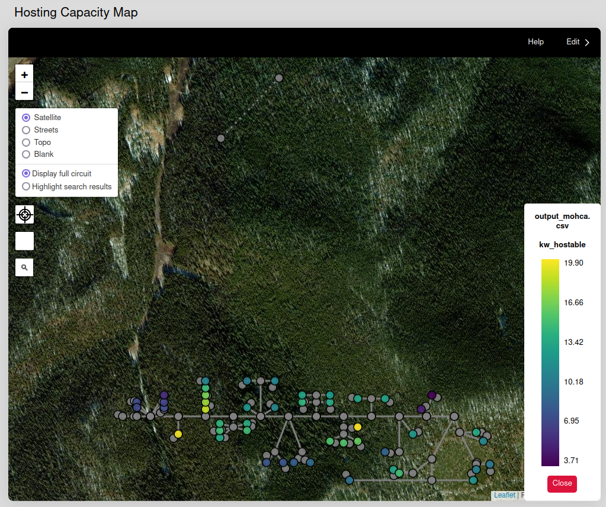 <br />

A distribution of the voltage hosting capacity calculated by the MoHCA algorithm based on AMI data.
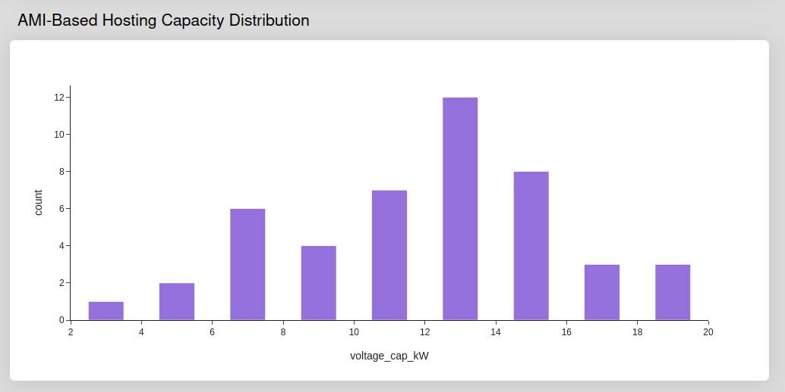 <br />

A graph of the voltage and thermal hosting capacity by bus computed by MoHCA algorithm based on AMI data. Additional bar specifies the maximum hosting capacity for that bus.
The maximum hosting capacity is determined by the minimum between the voltage and thermal HC results.
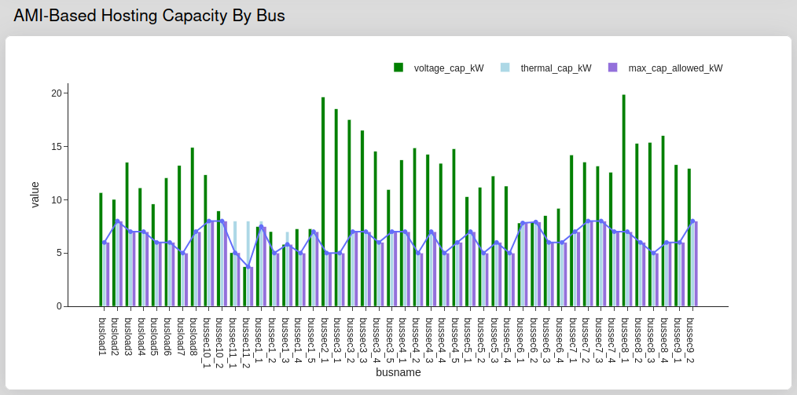 <br />

Data table of value outputs from the MoHCA algorithm based on AMI data.
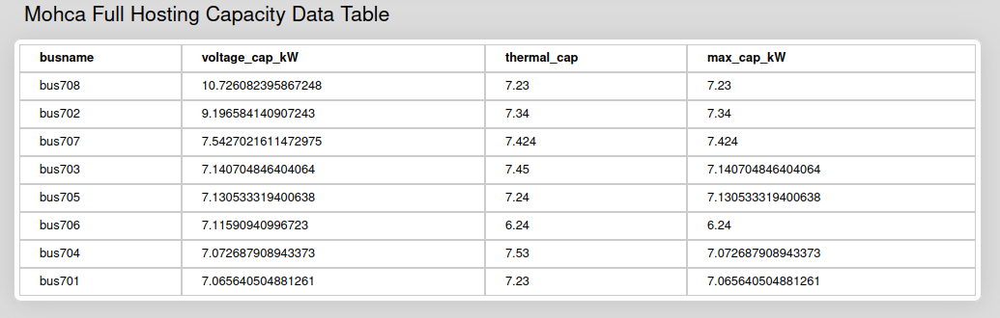 <br />

### Model-Based Outputs

Bar graph of voltage and/or thermal hosting capacity violation by bus computed by model-based or "traditional" hosting capacity calculations
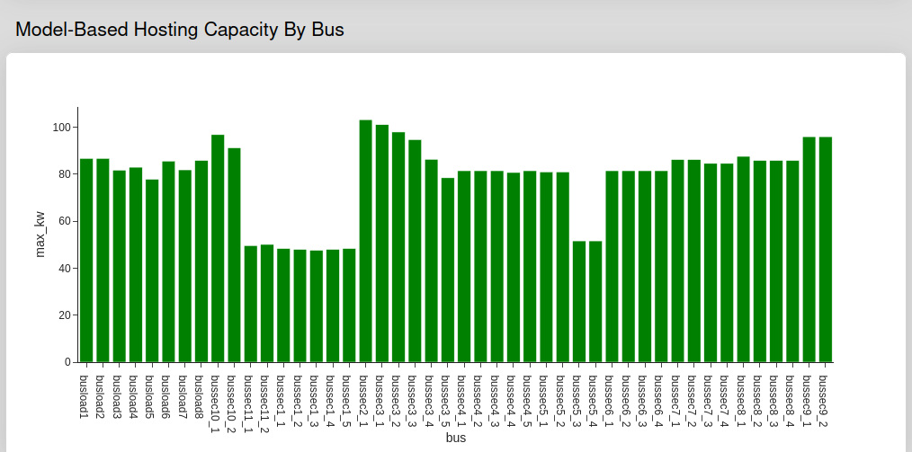 <br />

Data table of value outputs from the Model Based or Traditional Hosting Capacity algorithm
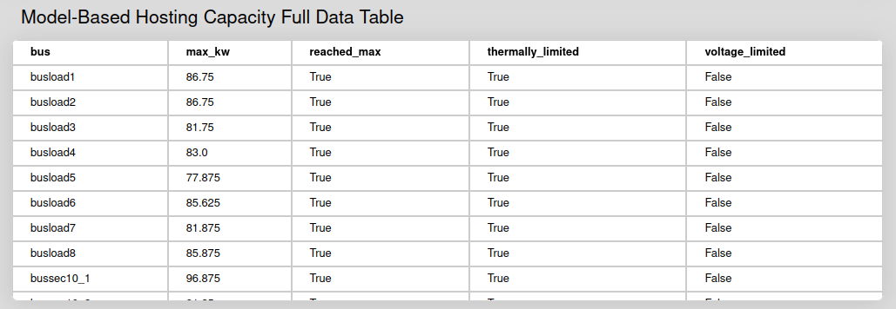 <br />

### Downline Load Outputs

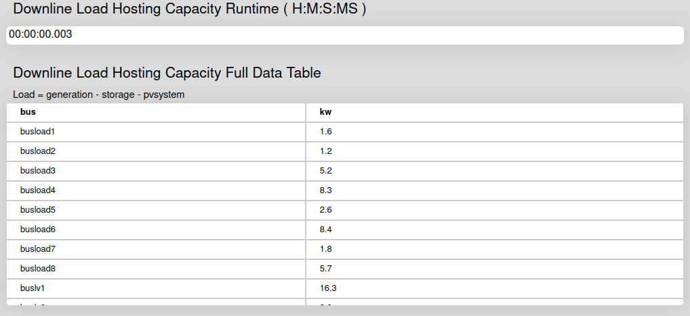

## Background on Hosting Capacity Methods

Solar photovoltaic (PV) system costs are now dominated by non-hardware or “soft” costs (e.g., customer acquisition, permitting, and interconnection costs). Public-facing hosting capacity (HC) maps have been key factors to reducing solar soft costs; HC maps, like the example in Figure 1, are visual representations of the maximum amount of solar that can be installed at various locations without adverse effects on the distribution network (i.e., locational HC). These maps can enable streamlined interconnection processes and direct access to siting and permitting data for stakeholders and decision-makers.

| 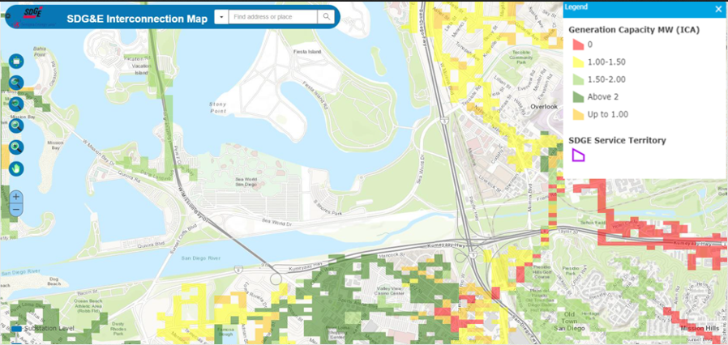 |
|:--:|
| *Figure 1. Public-facing HCA map example* |

However, hosting capacity analysis (HCA) must be performed to generate the data for these maps. Conventional model-based HCA methods are time-consuming and computationally intensive, making them impractical for many utilities and co-ops; they require iterative simulations on detailed distribution system models with long computation times. The accuracy of the HC solution is dependent upon the accuracy of the models, which are prone to errors because they require highly detailed information about many different components and are typically created and maintained manually. Some examples of the various inputs required for a typical distribution network model are shown in Figure 2. 

| 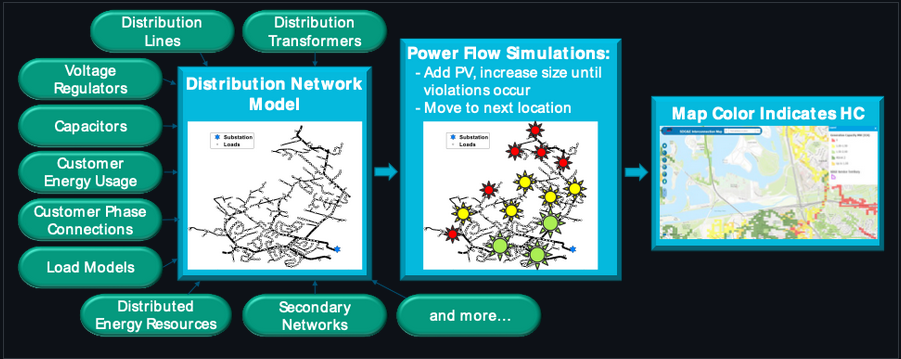 |
|:--:| 
| *Figure 2. Requirements for conventional model-based HCA* |

Once the model has been created, the locational hosting capacity analysis is conducted by placing a PV system at a specific location in the model and iteratively increasing its size to determine the largest PV system that can be installed at that location without violating any operational constraints. Once the HC for that location has been calculated, the process is repeated at each location in the model. This type of locational HCA is helpful to streamline interconnection requests by determining ahead of time the maximum PV installation size for each potential location. Note that any time the system changes (e.g., due to equipment upgrades or new PV installations) the analysis would have to be re-run. Given the high computational burden, most HC maps are updated very infrequently (often just once or twice per year). Aside from being time consuming, conventional model-based HCA is highly sensitive to modeling errors.

### Model-free HCA Approach

An overview of the model-free HCA approach is shown in Figure 3. First, smart meter data from a potential PV location is passed into the model-free HCA tool. Next, data-driven algorithms are applied to calculate HC subject to voltage and thermal constraints, and an HC map can be generated and updated for that location. This process can then be repeated for all locations with smart meter data available to fill out the HC map.

| 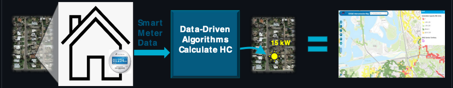 |
|:--:| 
| *Figure 3. Model-free HCA overview* |

This approach has many advantages over conventional model-based HCA methods: 1) it does not require any grid models or power flow simulations, so it is much faster, 2) any changes to the distribution network are inherently captured in the smart meter data, meaning it is robust to phase changes, network upgrades, etc. without user intervention, 3) it captures low-voltage secondary network characteristics, which are often missing or over-simplified in utility models.  The reduced computational burden also means that HC maps can be updated more frequently to keep pace with increasing levels of interconnection requests, making it useful for streamlining behind-the-meter (BTM) PV interconnection requests. For example, model-free HCA results can be used as a screening method to fast-track approvals or flag locations that require more analysis.

The input and output requirements of the model-free algorithms are summarized in Figure 4. It is assumed that no distribution system model or topology information is known. Previously developed algorithms to determine customer phasing, transformer groupings, and secondary network information may be leveraged. Note that the MoHCA algorithms are only able to assess local impacts of the interconnection. Impacts on substation equipment, the transmission system, or on protection are outside the scope of this project. All results from MoHCA algorithms will be compared to conventional model-based HCA results for the same datasets.

| 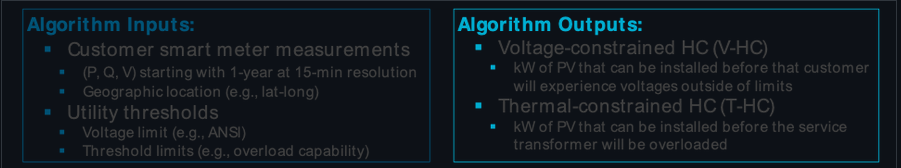 |
|:--:| 
| *Figure 4. MOHCA inputs and outputs.* |

### Algorithm Updates and Publications

#### “Improving Behind-the-Meter PV Impact Studies with Data-Driven Modeling and Analysis” [1]

This work showcases the vulnerability of model-based HC results to modeling errors, and highlights the potential improvements associated with data-driven analyses. The impacts of common modeling errors like incorrect customer phase labels or customer-transformer groupings were mostly local, affecting the HC results of nearby locations. Other modeling errors like incorrect parameters for voltage regulation equipment or simplified models of low-voltage secondary networks affected the HC results across the entire feeder.

| 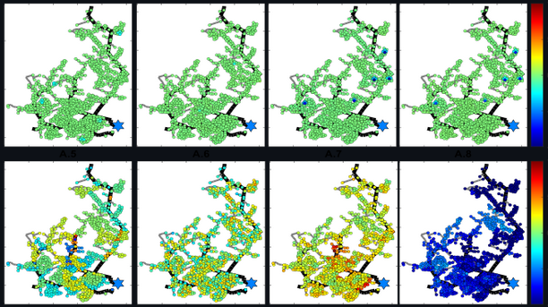 |
|:--:| 
| *Figure 5. Change in HC results due to different model error scenarios.* |

#### “Conditions for Estimation of Sensitivities of Voltage Magnitudes to Complex Power Injections” [2]

Before the voltage-constrained HC can be determined, the voltage sensitivity to changes in real and reactive power at a given location must be understood. This work paper expands on the theoretical basis and algorithms for analyzing sensitivity matrices relating voltage magnitudes to active and reactive power injections. 

| 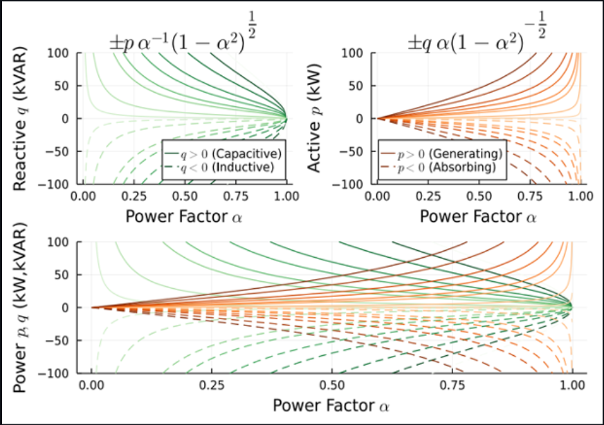 |
|:--:| 
| *Figure 6. Net reactive and active power injections as parameterized functions of the power factor.* |

#### “Calculating PV Hosting Capacity in Low-Voltage Secondary Networks Using Only Smart Meter Data” [3]

This paper presents a linear-regression based algorithm for calculating the voltage-constrained HC using smart meter data. A surface fit was applied to determine the coefficients of real and reactive power changes, which informed an extrapolation step that calculated the maximum PV injections. This algorithm was tested on two different smart meter datasets and was within 0.3 kW of the model-based HC results, on average.

| 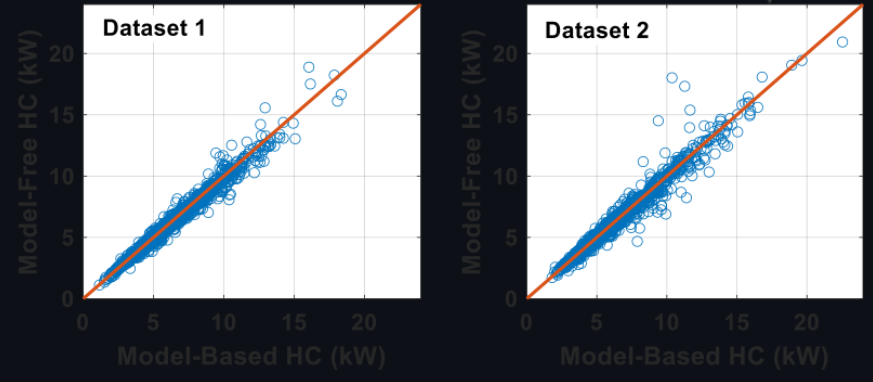 |
|:--:| 
| *Figure 7. Model-free regression-based HC results compared to model-based results.* |

#### “Predicting Voltage Changes of Low-Voltage Secondary Networks Using Deep Neural Networks” [4]

In this work, a deep neural network (DNN) was trained to predict ∆V given ∆P and ∆Q. After training, the DNN was used to predict voltage impacts of PV injections to calculate V-HC. Two versions of the algorithm were developed (depending on whether customer-transformer groupings are known) and evaluated on two different test circuits. Overall, the DNN approach worked well on the smaller, less complex test cases, but struggled as the size of the feeder and the complexity increased.

| 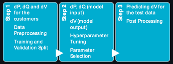 |
|:--:| 
| *Figure 8. DNN-based V-HC algorithm.* |

#### “A Model-free Approach for Estimating Service Transformer Capacity Using Residential Smart Meter Data” [5] (pending publication)

Before the thermal-constrained HC can be calculated for a specific location, the rating of the service transformer supplying it must be determined. This work adapts parameter estimation techniques to determine the impedance values of two nearby service transformers and then converts those to capacity ratings using a look-up table of known values. Since the topology information is unknown, geographic distance is used as a proxy for electrical distance, and multiples estimates are calculated for the same target transformer using a pair-wise estimation approach from each nearby transformer. Averaging these estimates resulted in 584/591 correct capacity predictions (98.82% accuracy).

| 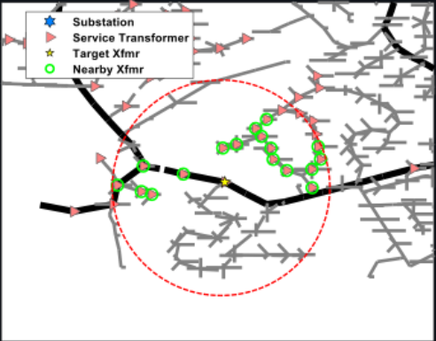 |
|:--:| 
| *Figure 9. Example of nearby service transformers used to estimate the impedance of the target transformer. * |

### References

1. J. A. Azzolini et al., "Improving Behind-the-Meter PV Impact Studies with Data-Driven Modeling and Analysis," in 2022 IEEE 49th Photovoltaics Specialists Conference (PVSC), 2022. Available: https://www.researchgate.net/publication/361172380_Improving_Behind-the-Meter_PV_Impact_Studies_with_Data-Driven_Modeling_and_Analysis
2. S. Talkington, D. Turizo, S. Grijalva, J. Fernandez, and D. K. Molzahn, "Conditions for Estimation of Sensitivities of Voltage Magnitudes to Complex Power Injections," IEEE Transactions on Power Systems, 2023. doi: 10.1109/TPWRS.2023.3237505. Available: https://ieeexplore.ieee.org/document/10018530
3. J. A. Azzolini, M. J. Reno, J. Yusuf, S. Talkington, and S. Grijalva, "Calculating PV Hosting Capacity in Low-Voltage Secondary Networks Using Only Smart Meter Data," in IEEE Innovative Smart Grid Technologies (ISGT) North America, 2023. doi: 10.1109/ISGT51731.2023.10066372. Available: https://www.researchgate.net/publication/367078155_Calculating_PV_Hosting_Capacity_in_Low-Voltage_Secondary_Networks_Using_Only_Smart_Meter_Data
4. J. Yusuf, J. A. Azzolini, and M. J. Reno, "Predicting Voltage Changes of Low-Voltage Secondary Networks Using Deep Neural Networks," in IEEE Power and Energy Conference at Illinois (PECI), 2023. Available: https://www.researchgate.net/publication/368982378_Predicting_Voltage_Changes_in_Low-Voltage_Secondary_Networks_using_Deep_Neural_Networks
5. J. A. Azzolini, M. J. Reno, and J. Yusuf, "A Model-free Approach for Estimating Service Transformer Capacity Using Residential Smart Meter Data," in IEEE Photovoltaic Specialists Conference (PVSC), 2023. 

### About Sandia

Sandia National Laboratories is a multimission laboratory managed and operated by National Technology & Engineering Solutions of Sandia, LLC, a wholly owned subsidiary of Honeywell International Inc., for the U.S. Department of Energy’s National Nuclear Security Administration under contract DE-NA0003525.