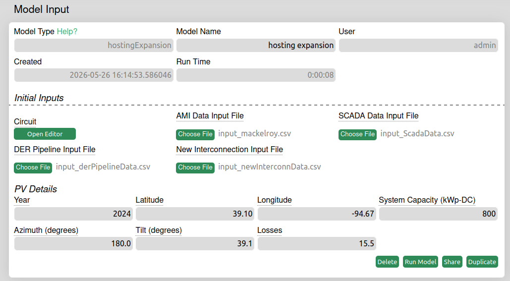
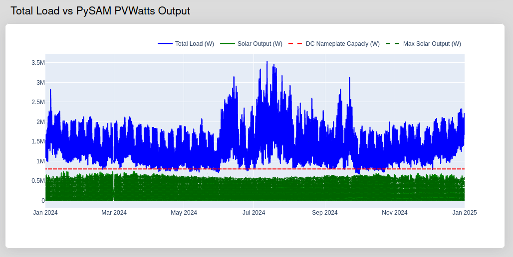
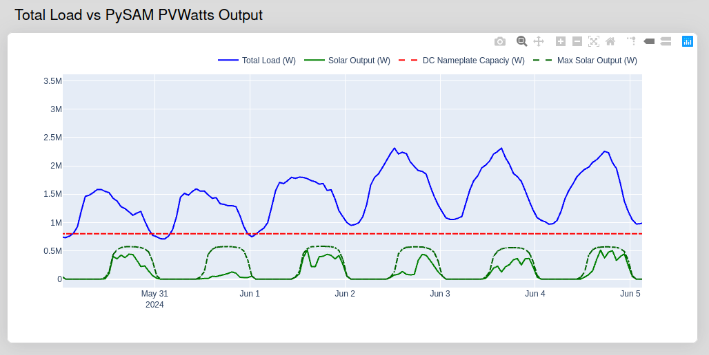

## Introduction

The hosting expansion model is an extension of the hosting capacity model. Its current functionality compares total load of a system, calculated via AMI data or inputted directly, vs solar output computated via the PySAM PVWattsv8 model simulation.

Documentation for PySAM PVWattsv8 [can be found here](https://nrel-pysam.readthedocs.io/en/main/modules/Pvwattsv8.html#pvwattsv8)

## Walkthrough

### Defining the Inputs <br />



**Input 0: Circuit File**<br />

To upload a circuit file:

1. Click "Open Editor" on hosting capacity model page.
2. Click "File" on the top left navigation bar in map interface.
3. Click "OpenDSS Conversion" to upload OpenDSS circuit file.

**Input 1: Meter/AMI Data Input File**

CSV file with 5 columns:

* [busname, datetime, volts reading, kWatts reading, kVAR reading]

| Input Title      | Input Datatype                                  |
| -------------    | -------------                                   |
| busname          | string                                          |
| datetime         | YYYY-MM-DDTHH:mm                                |
| v_reading        | float/decimal, must be actual not PU            |
| kw_reading       | float, avg over the measurement interval        |
| kvar_reading     | float, avg over the measurement interval        |

* Input titles much match those shown above.

#### Example of .csv input file (sandia1): <br />

```text
busname,datetime,v_reading,kw_reading,kvar_reading
bus1,2019-01-01T00:00,124.8201353,3.907200098,0.712799966
bus1,2019-01-01T00:15,124.589564,4.658400059,0.686399996
bus1,2019-01-01T00:30,124.6299914,4.963200092,1.051200032
```

**Input 2: Scada Data Input File**

CSV file with 11 columns:

* [busname, datetime, kVa, kVb, kVc, MWa, MWb, MWc, MVARa, MVARb, MVARc]

| Input Title      | Input Datatype                                  |
| -------------    | -------------                                   |
| busname          | string                                          |
| datetime         | YYYY-MM-DDTHH:mm                                |
| kVa              | float, avg over the measurement interval        |
| kVb              | float, avg over the measurement interval        |
| kVc              | float, avg over the measurement interval        |
| MWa              | float, avg over the measurement interval        |
| MWb              | float, avg over the measurement interval        |
| MWc              | float, avg over the measurement interval        |
| MVARa            | float, avg over the measurement interval        |
| MVARb            | float, avg over the measurement interval        |
| MVARc            | float, avg over the measurement interval        |

* Input titles much match those shown above.

**Input 3: DER Pipeline Input File**

CSV with 3 columns:

* [busname, kVA, tbd_solar_settings]

| Input Title      | Input Datatype                                  |
| -------------    | -------------                                   |
| busname          | string                                          |
| kVa              | float, avg over the measurement interval        |
| tdb              |                                                 |

**Input 4: New Interconnection Input File**

CSV with 3 columns:

[busname, kVA, tbd_solar_settings]

| Input Title      | Input Datatype                                  |
| -------------    | -------------                                   |
| busname          | string                                          |
| kVa              | float, avg over the measurement interval        |
| tdb              |                                                 |

### PV Details Inputs <br />

For PySAM simulations, addition information is required.

**Input 5: Year**
* Simulation Year. Used to gather solar resource data from [an NSRDB data set](https://developer.nlr.gov/docs/solar/nsrdb/nsrdb-GOES-aggregated-v4-0-0-download/).
* Must be 1998-2024.

**Input 5: Latitude**

* Floats accepted. Will be checked in code.

**Input 5: Longitude**

* Floats accepted. Will be checked in code.

**Input 5: System Capacity**

* DC-Output rating of solar panels in KW

**Input 5: Azimuth**

* Cardinal direction the PV System will face.

**Input 5: Tilt**

* The tilt of the solar panels measured as an angle in degrees between panels and ground.

**Input 5: Losses**

* DC System Losses as a %

## Defining the Outputs:

### TS_Load Outputs





Total Load vs Solar Output vs DC Nameplace (System Capacity) vs Maximum Historical Solar Output

Solar Output and Maximum Historical Solar Output are both calculated with the PYSAM PVWattsv8 model.

Maxmimum Historical Solar dataset is designed with clearsky data with windspeed and temperature set to 0.
