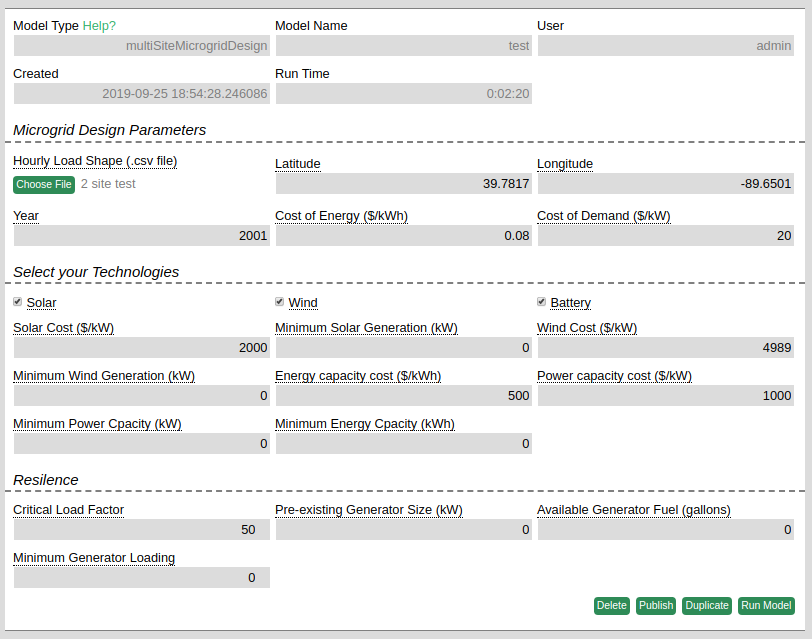
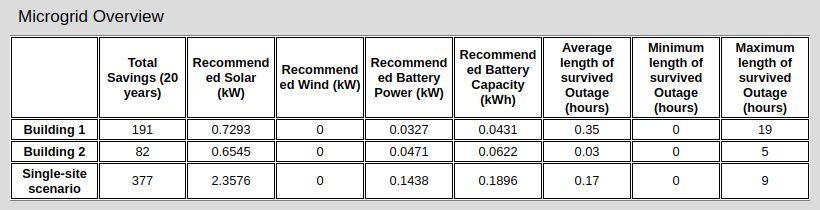
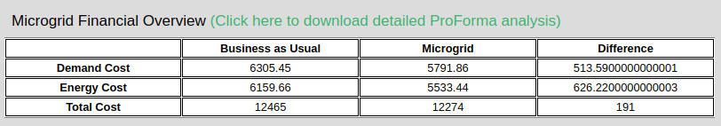
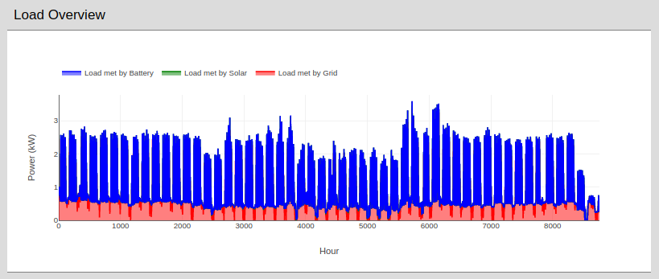
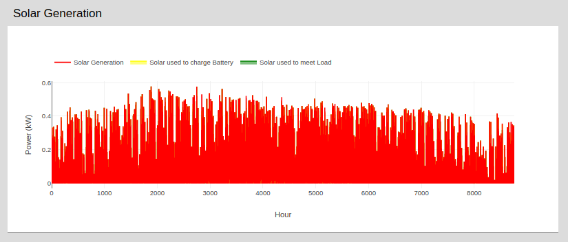
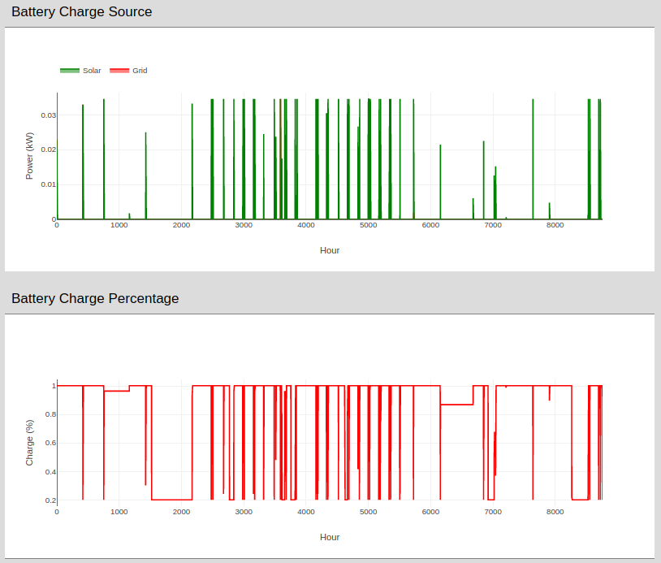
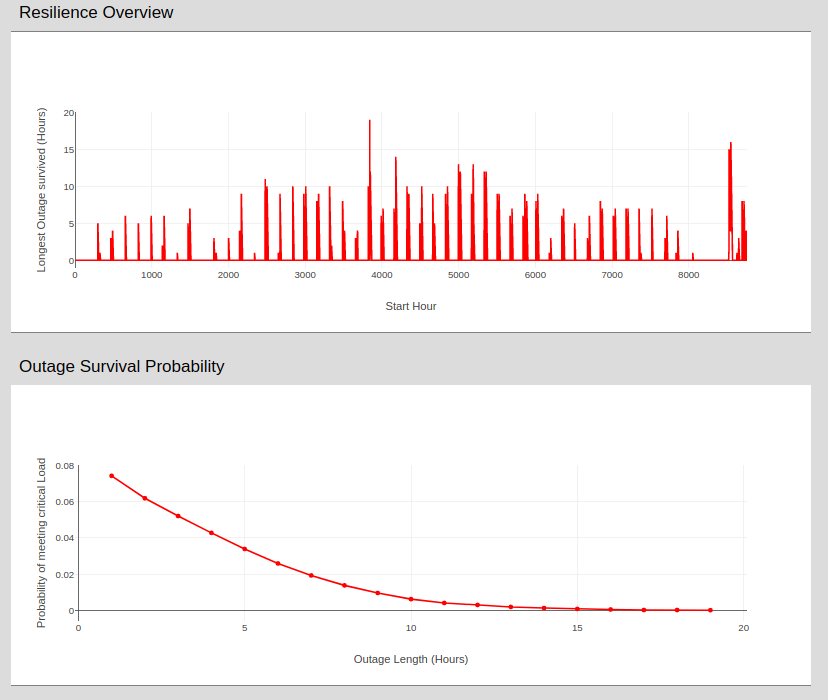

# Overview
The multiSiteMicrogridDesign model uses a 1yr load profile to determine the most economical combination of solar, wind, and storage technologies to use in a microgrid. The model also provides basic resiliency analysis. The financial and resiliency optimization is performed using the [NREL reOpt API](https://developer.nlr.gov/docs/energy-optimization/reopt/v3/)

You can run a [new copy of the model](https://omf.coop/newModel/microgridDesign/fromWiki) directly on omf.coop.

# Inputs 

### Technologies
The **hourly load shape** input is a multi-column csv with exactly 8760 rows. Each row in the csv corresponds to 1 hour in the year, and each column corresponds to a single site to be analyzed. Values are kWh consumed during that hour. Results are provided both for the scenario where each site is treated as a separate microgrid and where a single microgrid is expected to support all sites.

The **latitude** and **longitude** correspond to the location at which the microgrid is to be deployed. This information is used to determine local solar and wind data. 

The **year** corresponds to the year for which the load shapes are provided; this is used to gather appropriate solar and wind data.

The **cost of energy** and **cost of demand** inputs allow the user to experiment with different cost scenarios, and to provide information that is specific to their circumstance. Default values reflect average national costs.

The **solar, wind,** and **battery checkboxes** allow the user to select the technologies they wish to consider in their microgrid.

The technology **cost** inputs allow the user to specify values that are appropriate for their location. 

The technology **minimum** variable allow the user to experiment with different resilience scenarios. We recommend performing the analysis initially with the minimums set to 0, observing the recommended technology sizes and the corresponding resiliency and then increasing the minimum size to improve resilience. 

### Resilience
The **critical load factor** is the percentage of load that must be met in order to "survive" a power outage.

The **generator size** input allows the user to specify whether a pre-existing diesel generator is available for resiliency support during a power outage, and if so how much **available fuel** is present. The fuel burn rate is determined based on the generator size (see NREL API for details).

The **minimnum generator loading** is the percentage of load that must be met by the generator during a power outage.

# Outputs

The overview table summaries the effect of setting up a microgrid for each building (each column in the csv) and for all buildings in a single linked system. This single site scenario add all of the loads into single loadshape and provides recommendations based on the new load. The resilience values reflect the resiliency of the recommended system. This system is optimized to meet the provided loads in the most cost-efficient way possible, not to be resilient to power outages. We encourage the user to experiment with the minimum technology size inputs to meet their resiliency goals.  

The detailed results are provided for each scenario individually. The user can toggle between the different tabs to see the details of the corresponding scenarios.

The financial overview provides a high level overview of costs with and without the microgrid over a 20 year period. Maintenance and upgrade costs are included in accordence with NREL's reOPT system. The detailed ProForma financial analysis is available for download for the users that desire a more in depth financial breakdown. 

All plots are interactive, allow zooming and comparing the contributions of the different technologies. The plots present the data in a stacked fashion such that the overall height of the plot reflects the total load of the system and the height of each color segment reflects the contribution of that technology to the overall load.  

For each technology of interest to the user, information is provided on the expected power generation of the technology based on provided geographical and temporal information, as well as a hour by hour breakdown of how that technology impacts the system.

If battery technologies are selected to be included in the microgrid, information is provided regard the charge source of the battery as well as the charge percentage over time.

In order to perform the resiliency analysis, an outage is incurred at every hour and the number of hours for which the microgrid survives the outage is recorded. The resilience overview plot display this information. The outage survival probability is computed as the (number of outage survived for X number of hours) / (the total number of hours = 8760). Both of these plots are summarized in the microgrid overview table. We encourage users to experiment with different input settings and see how it affects the resiliency of the microgrid!

