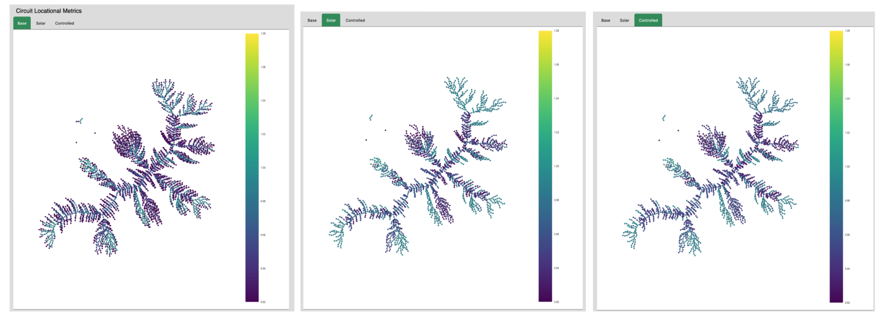
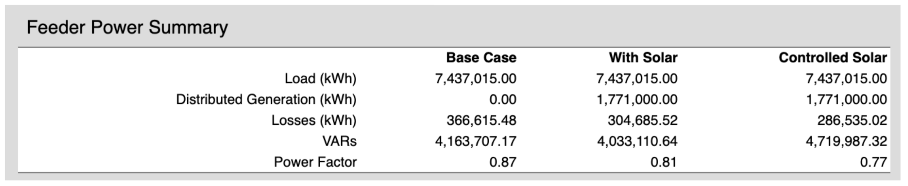
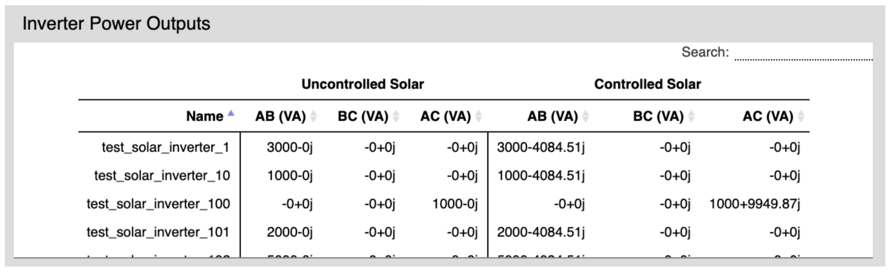
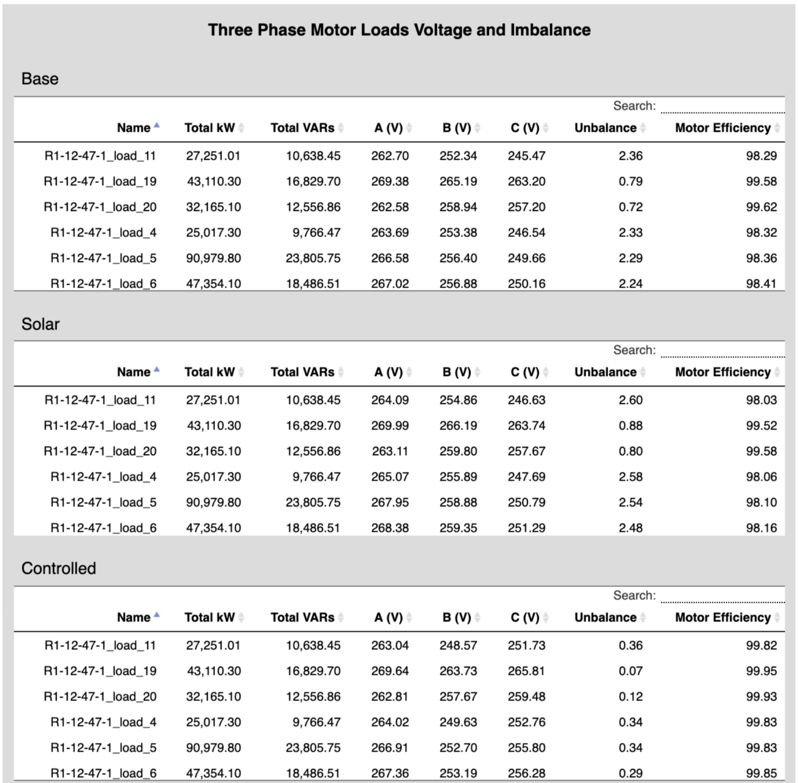

### Overview

The phaseBalance tool will allow co-ops to better evaluate and simulate the consequences of implementing distributed Steinmetz control methods to their specific feeder. The tool will enable its users not only to see how distributed generation impacts their feeder overall, but also the financial consequences of the implementation.

The phaseBalance model operates by calculating a number of variables, including power factor and unbalance, when all distributed generation is turned off. It then calculates the same variables when distributed generation is operating at full capacity. Then the model implements the distributed inverter control algorithm, and runs a final calculation of how this algorithm affects the feeder. Standard cost and feeder data required as input.

### Outputs

A visual “before” and “after” diagram of the feeder, graphing the unbalance when there is no solar generation (left), full solar generation (center), and after implementing controller (right). 

A summary of how Gridlab-D calculates the load, distributed generation, losses, all VARs, and power factor in each case. Assumed net metering when calculating energy revenue.

A summary of inverter outputs in volt amps, giving the user a detailed look into how the controller is manipulating each inverter. All results are searchable and sortable. 

A summary of how every three-phase motor on the feeder is affected by each case. Unbalance is calculated as specified by the user, and then motor efficiency is calculated using a polynomial fit to calculations posted by the EERE [1]. The tables are sortable and searchable.

### References

[1] DOE EERE Advanced Manufacturing Office, Premium Efficiency Motor Selection And Application Guide, 2014, https://www.energy.gov/sites/prod/files/2014/04/f15/amo_motors_handbook_web.pdf