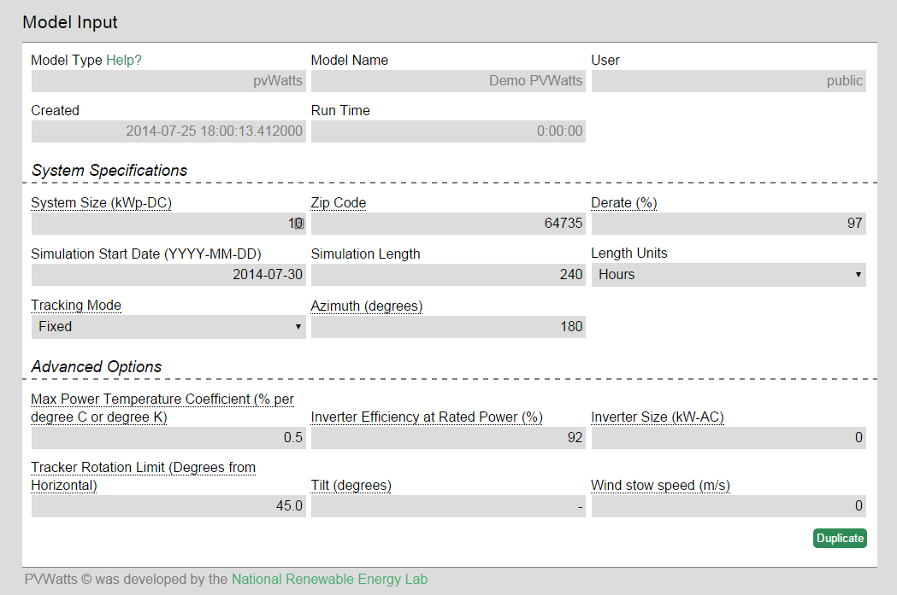
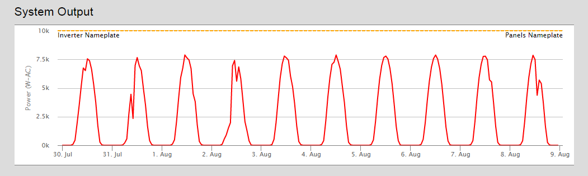

## Overview

The pvWatts model runs the NREL pvWatts tool for quick estimation of solar panel output.

### Introduction

The pvWatts model runs the NREL pvWatts tool for quick estimation of solar panel output.  Using system specifications (and optional advanced specifications) from the user, this model calculates expected system output.  This model is often used by other models in the OMF to provide the solar output data, but can be used as a standalone model as well.

### Walkthrough

Enter a value for each of the **System Specifications**, and if desired, for the **Advanced Options** as well.  Note that Tracker Rotation Limit and Wind stow speed will only impact single- or double axis tracking systems.

#### Model Results

The model will output the results directly below the model inputs. The graphs can be dynamically zoomed in and out on the page. The outputs of the PVWatts model are:

System Output: Graph showing the power produced by the system over the course of the simulation compared to the nameplate power rating.

Irradiance: Pulled from the TMY-2 data used to run the model, this graph displays 3 different irradiance measures (each in W/m^2) and how they vary over the course of the model.   Beam Normal Irradiance is the amount of solar radiation hitting a module directly from the sun.  Diffuse irradiance is solar radiation that hits a module after being reflected off another point.   Plane of Array Irradiance is a measure of the total amount of solar energy that is available to an array, based the location of the array and the direction of the modules, includes both diffuse and beam normal irradiance.

Other Climate Variables:  Shows other climate factors relevant to calculating solar output.  These include the ambient, or air, temperature, cell temperature (as solar cells heat up, their operating efficiency drops), and wind speed (if conditions are too windy, a tracking solar array will move into its stow position).
