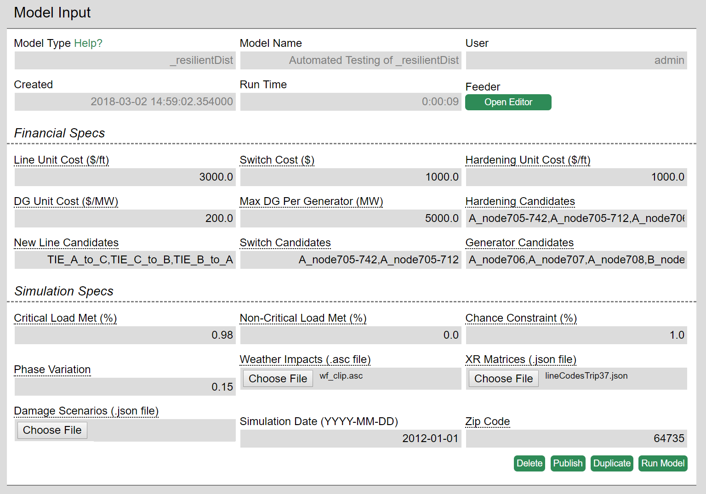
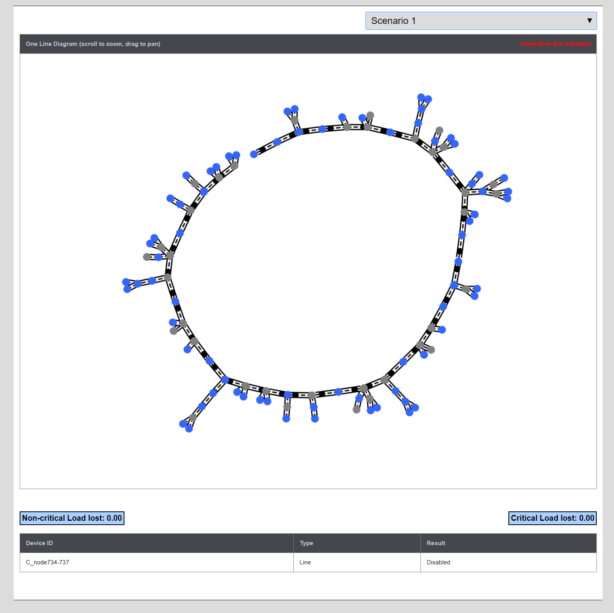
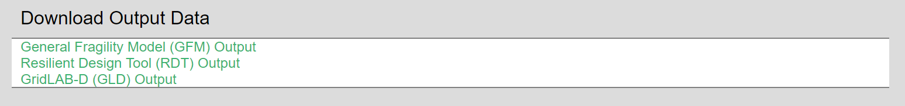

### Introduction

The Resilient Distribution model simulates the effect of weather hazards on the structure of an electrical distribution network. Users are able to compare the results and cost of hardening various individual components with the integrity of the network. The outputs include an optimal set of hardening options that improve the resiliency at the lowest possible cost. The model uses [General Fragility Model](https://github.com/lanl-ansi/generalized-fragility-model), [GridLAB-D](https://www.gridlabd.org), and [Resilient Distribution Tool](https://github.com/lanl-ansi/micot-application-rdt) as part of the data pipeline.

### How to Use the Model

The inputs are divided into two main categories: Financial and Simulation. Financial inputs include the cost of the components, generator attributes, and specification of individual components to be affected by the model.  Simulation inputs comprise of defining the damage scenarios used by the model to calculate the results of hazardous weather. Descriptions of the function of each input and their formatting can be found by hovering your mouse pointer over the input name.

**Getting the Feeder Imported**
This is optional. You can start with a pre-imported feeder on omf.coop.

1. Open www.omf.coop in Chrome, navigate to your resilientDist model, click on the green "Open Editor" button.
2. In the top-right of the menu bar, click "File".  You have the option of creating a new blank feeder or loading from an existing model, or importing a model in Milsoft Windmil, Eaton CYMDIST, or GridLAB-D format.

**Modifying the Feeder**

1. Add any desired components using the 'Add' dropdown menu.
2. Modify any components by clicking on them then clicking the 'Edit' button that is located on the pop-up menu.
3. Save the model using the option in the 'File' dropdown menu.
4. Exit the feeder editor.

Once you have a feeder with the desired components on it, run the model.

### Model Results

The model will output the results directly below the model inputs. The graphs can be dynamically zoomed in and out on the page using your mouse scroll wheel. The outputs of the resilientDist model are:

Design Solution - Describes the model's recommendations for component resiliency within the model.
Scenario Solution - Describes which of the components in the model were damaged by the weather scenario. 

Download Output Data - Gives users the option of downloading the raw outputs from the Resilient Distribution Model.

