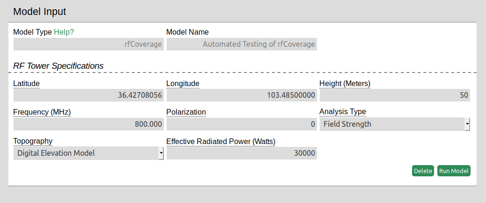
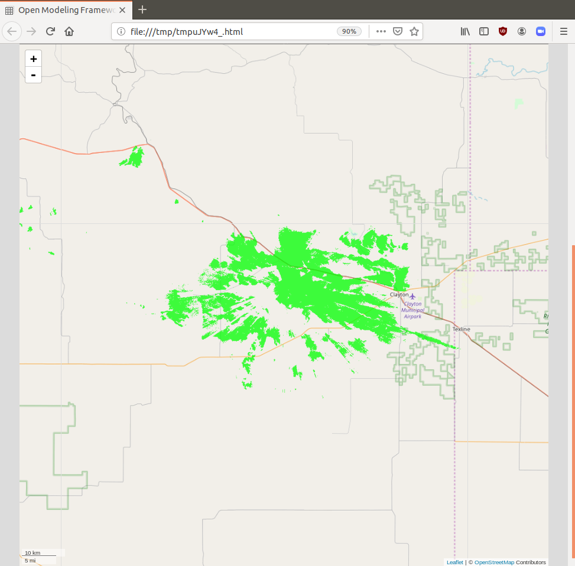
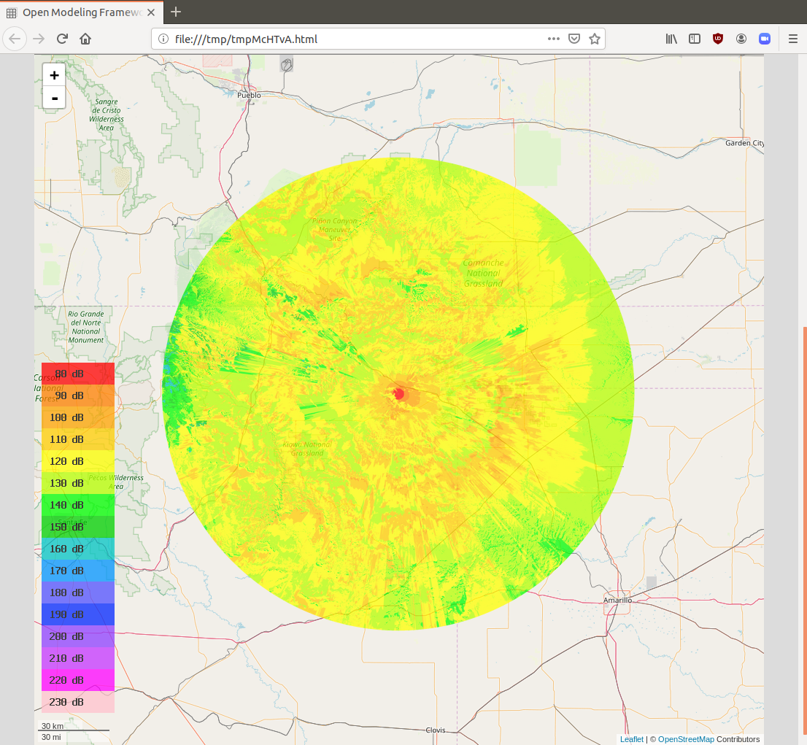
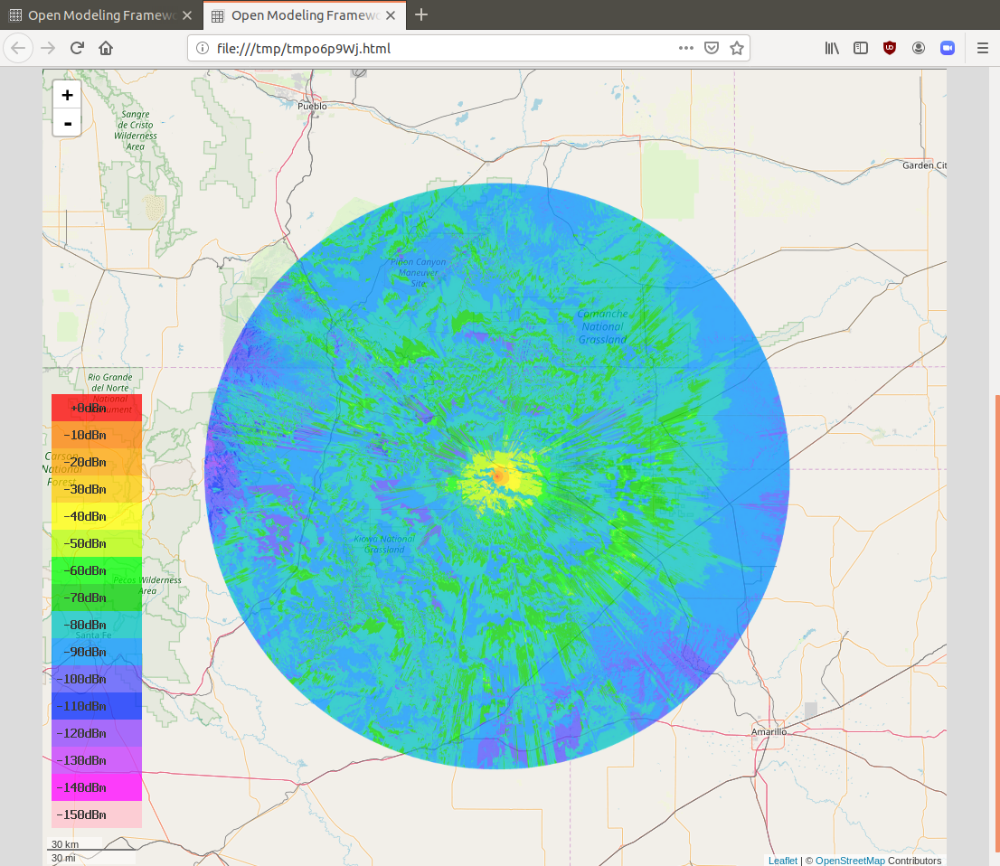
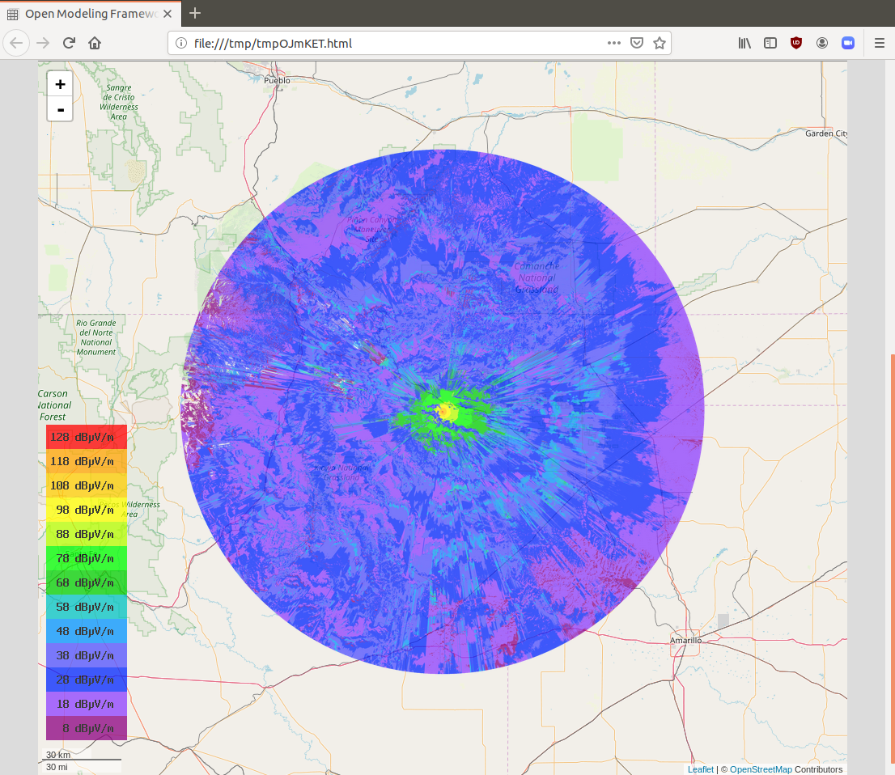
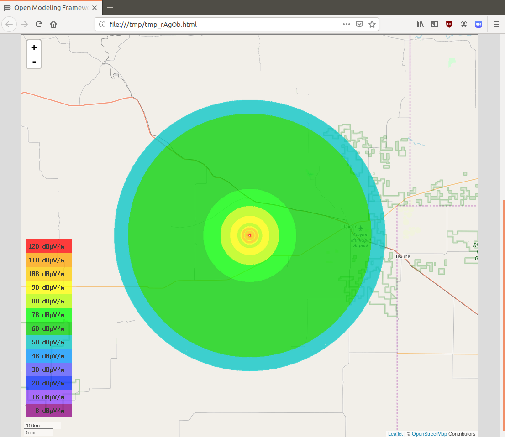

### Overview

This model provides an interactive visualization of radio frequency coverage from a tower to assist with communications planning. 

### Walkthrough

##### Defining the inputs:

Latitude and Longitude: set the location of the tower.

Height (of the tower): A higher tower will allow the signal to propagate further in the case of terrain interference.

Frequency: Enter a frequency between 20MHz and 20GHz. A lower frequency will propagate further and experience less path loss.

Polarization: This model uses linear polarization for the antenna and can be set to 0 for a horizontal plane and 1 for a vertical plane.

Analysis type: There are four types of analysis that can be run.

Line of sight analysis displays a geometric line of sight coverage map - that is to say where to signal reaches accounting for physical interference.

Path loss analysis displays the expected signal level in decibels. The colors on the map correspond to the dB scale in the bottom left.

Field Strength analysis displays field strength contours referenced to decibels over one microvolt per meter dBuV/m. This analysis takes into account the Effective Radiated Power input.

Received power analysis displays the power level contours in decibels over one milliwatt (dBm). This analysis takes into account the Effective Radiated Power input.

There are two topography options.
Sea Level: This options does not take into account terrain interference on the signal. It runs more quickly than the Digital Elevation Model and is a good check to run first. 

Digital Elevation Model: This option does take into account terrain interference on the signal. This option takes longer and pulls in terrain information for the geographic area covered based on the latitude and longitude inputs.
Effective Radiated Power is used in calculations for field strength and received power calculations. (Specified in Watts).

##### Outputs:
The model generates a coverage map image and displays it on top of a map. Path loss, field strength, and received power analysis will also generate a scale to reference. The map is interactive. Use the +/- buttons in the top right to zoom. Click and drag with the mouse to pan around the map.

Examples:

Line of sight

Path loss

Recieved power

Field strength

Field strength analysis with sea level topography 
