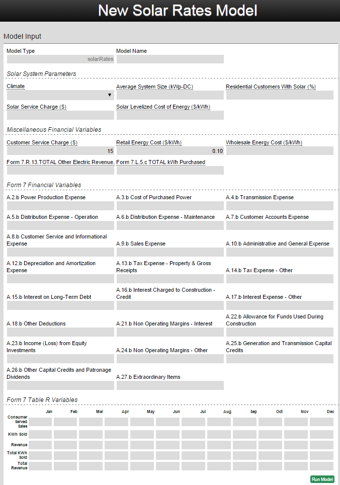
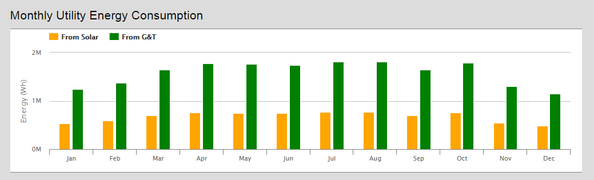
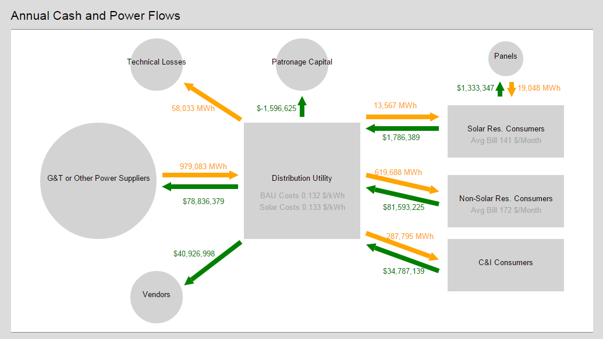

### Introduction

The solarCashflow model allows a utility to calculate what impact consumer-owned solar systems will have on their costs. The model takes financial data from the utility as well as information about their consumers’ typical solar system size to determine the average monthly bill for solar and non-solar customers as well as the total cost of power for all consumers. The model uses pvWatts, software from NREL, to calculate how much energy the solar system will produce. The economic inputs can all be collected from the RUS Form 7.

You can [try the model on omf.coop](http://omf.coop/newModel/solarCashflow/linkedFromWiki) by following that link.

### How to use the model

Before using this model, be sure that you have your utility’s Form 7, (“Financial and Operating Report Electric Distribution") on hand. For the Solar System Parameters, enter values based on what a typical residential solar array in your territory is. See the reference section, or hover over the input name for a description of each input. If you don’t know what a particular input is, you can leave it to the default value. Be sure to enter all percentages as whole numbers instead of decimals (i.e. 5 instead of 0.05). The Form 7 Financial Variables should be entered directly from the form, and to run the model, a whole year of Form 7 Table R Variables are required (or should be estimated).

Once all the inputs are filled click **Run Model**. If any input is empty or the wrong type, the model will not run. Once the model has run you can delete, publish, duplicate, or re-run the model.  Publishing the model will allow other OMF users to see your inputs and view the model’s results. Duplicating it will create another model with a different name but all the same inputs. Re-running the model allows the user to change inputs and see how they impact the results.  These options give users the ability to compare different economic, technical, or geographic scenarios.

### Model Results

The model will output the results directly below the model inputs.  The graphs can be dynamically zoomed in and out on the page. The outputs of the solarCashflow model are:

Hourly System Performance - Breakdown of how much power was produced each hour of the simulation in Watts-AC as well as a line indicating the nameplate rating of the array.

Monthly System Performance - Graph showing how much energy was produced each month of the simulation in Wh-AC. Compares the amount of energy consumed from solar and from other generation providers.

Annual Cash and Power Flow Model - Diagram showing where money and energy go in relation to the distribution utility.  Green lines represent money and orange lines represent energy. The Consumer boxes show the average bill that each class of consumer pays monthly. The center box shows how the utility cost of providing service changes with the addition of solar customers compared to the Business as Usual (BAU) case.

Form 7.A Statement of Operations - Business as Usual Versus Residential Solar: Table comparing the expenses of the BAU and Solar scenarios for each of the Form 7 categories.

Monthly Data Table - Monthly breakdown of energy generated, customers served, kWh sold and revenue.

Climate - Graph of the weather for every day of the simulation based on TMY2 data.

### Input Variables in Detail

Input field                                 |Explanation
---                                         |---
Model Type                                  |Model selected on home page
Model Name                                  |Name of the model, will appear on the main page
Climate                                     |Select location for weather data
Average System Size (kWp-DC)                |Average residential PV system size in your service territory
Residential Customers with Solar (%)        |Percentage of residential customers generating their own energy with PV modules
Customer Service Charge ($)                 |Cost for a residential customer
Retail Energy Cost ($/kWh)                  |Retail rate for consumers
Net Metering Maximum Export (%)             |Percentage of utility's load
Wholesale Energy Cost ($/kWh)               |Wholesale cost the utility pays for energy.  Form 7 (R.17.m/R.15.m)
Simulation Length                           |Period for which model will generate data
Length Units                                |Units to define the Simulation Length
Simulation Start Date (YYYY-MM-DD)          |Model start date, will determine climate data used
Derate (%)                                  |Overall DC to AC conversion of the PV system based on system component losses
Tracking Mode                               |Type of tracking system the PV array will use.
Tilt = Latitude                             |If  True, then the tile value will be the same as the Climate City's latitude, if False you can pick your own value in the next input field (Manual tile)
Azimuth (degrees)                           |Cardinal direction the PV system will face.  180 in the northenr hemisphere is due South.
Tracker rotation limit (deg)                |How far each module in a tracking system is able to rotate
Nominal operating cell temperature (C)      |Temperature of the cells within a PV module, typically higher than the reference cell temperature
Reference Cell Temperature (C)              |Factory estimated PV module cell temperature.
Max power temperature coefficient (%/C)     |Percentage decrease  of the solar array's output power for every degree over 25 C
Inverter efficency at rated power (frac)    |Fraction of DC power that is converted to AC
Diffuse fraction                            |Fraction of light that hits the solar panel instead of being reflected away
Rating condition irradiance (W/m2)          |PV module's rated operating irradiance.  Typically this is 1000
Min reqd irradiance for operation (W/m2)    |Minimum required irradiance for a PV module to operate
Wind stow speed (m/s)                       |When the wind velocity from the weather file for the current hour is greater than or equal to this value, the concentrator moves into stow position to prevent wind damage. The solar power intercepted by the receiver is zero during this hour.
Power Production Expense                    |Form 7.A.2
Cost of Purchased Power                     |Form 7.A.3
Transmission Expense                        |Form 7.A.4
Distribution Expense - Operation            |Form 7.A.5
Distribution Expense - Maintenance          |Form 7.A.6
Customer Accounts Expense                   |Form 7.A.7
Customer Service and Informational Expense  |Form 7.A.8
Sales Expense                               |Form 7.A.9
Administrative and General Expense          |Form 7.A.10
Depreciation and Amortization Expense       |Form 7.A.12
Tax Expense - Property & Gross Receipts     |Form 7.A.13
Tax Expense - Other                         |Form 7.A.14
Interest on Long-Term Debt                  |Form 7.A.15
Interest Charged to Construction - Credit   |Form 7.A.16
Interest Expense - Other                    |Form 7.A.17
Other Deductions                            |Form 7.A.18
Non Operating Margins - Interest            |Form 7.A.21
Allowance for Funds Used During Construction|Form 7.A.22
Income (Loss) from Equity Investments       |Form 7.A.23
Non Operating Margins - Other               |Form 7.A.24
Generation and Transmission Capital Credits |Form 7.A.25
Other Capital Credits and Patronage Dividend|Form 7.A.26
Extraordinary Items                         |Form 7.A.27
Consumer Served Sales                       |Form 7.R.1.a
kWh Sold                                    |Form 7.R.1.b
Revenue                                     |Form 7.R.1.c
TOTAL KWh Sold                              |Form 7.R.11
Total Revenue                               |Form 7.R.12
Model Type                                  |Model selected on home page
Model Name                                  |Name of the model, will appear on the main page
Climate                                     |Select location for weather data
System Size (kWp-DC)                        |Rated power output of the PV system in kWp-DC
Installation Cost ($)                       |Estimated cost to install the PV system including parts and labor
Op. and Maint. Cost ($)                     |annual cost to operate and maintain the solar system
Projected Life of System (Years)            |Estimated useful life of the PV system
Annual Array Degredation (%/Year)           |Estimated decrease in energy production from the PV array
Energy Cost ($/kWh)                         |Cost of energy for residential consumers expressed in dollars/kWh
Discount Rate (%)                           |Interest rate on the upfront system costs expressed as a percentage
SREC cashflow                               |Annual revenue from Solar Renewable Energy Credits
Simulation Length                           |Period for which model will generate data
Length Units                                |Units to define the Simulation Length
Simulation Start Date (YYYY-MM-DD)          |Model start date, will determine climate data used
PV Module Derate                            |Overall DC to AC conversion of the PV system based on system component losses
Mismatch                                    |The derate factor for PV module mismatch accounts for manufacturing tolerances that yield PV modules with slightly different current-voltage characteristics. Consequently, when connected together electrically they do not operate at their respective peak efficiencies.
Diodes/Connction                            |The derate factor for diodes and connections accounts for losses from voltage drops across diodes used to block the reverse flow of current and from resistive losses in electrical connections.
DC Wiring                                   |The derate factor for DC wiring accounts for resistive losses in the wiring between modules and the wiring connecting the PV array to the inverter.
AC Wiring                                   |The derate factor for AC wiring accounts for resistive losses in the wiring between the inverter and the connection to the local utility service.
Soiling                                     |The derate factor for soiling accounts for dirt, snow, or other foreign matter on the front surface of the PV module that reduces the amount of solar radiation reaching the solar cells of the PV module. Dirt accumulation on the PV module surface is location and weather dependent, with greater soiling losses (up to 25% for some California locations) for high-trafffic, high-pollution areas with infrequent rain. For northern locations in winter, snow will reduce the amount of energy produced, with the severity of the reduction a function of the amount of snow received and how long it remains on the PV modules. Snow remains the longest when sub-freezing temperatures prevail, small PV array tilt angles prevent snow from sliding off, the PV array is closely integrated into the roof, and the roof or other structure in the vicinity facilitates snow drifting onto the PV modules. 
Shading                                     |The derate factor for shading accounts for situations when PV modules are shaded by nearby buildings, objects, or other PV modules and array structure.
System Availibility                         |The derate factor for system availability accounts for times when the system is off due to maintenance and inverter and utility outages.
Age                                         |The derate factor for age accounts for losses in performance over time due primarily to weathering of the PV modules. The loss in performance is typically 1% per year. 
Tracking Mode                               |Type of tracking system the PV array will use.
Tilt = Latitude                             |If  True, then the tile value will be the same as the Climate City's latitude, if False you can pick your own value in the next input field (Manual tile)
Manual Tilt                                 |Tilt of the solar modules
Azimuth (degrees)                           |Cardinal direction the PV system will face.  180 in the northenr hemisphere is due South.
Tracker rotation limit (deg)                |How far each module in a tracking system is able to rotate
Max power temperature coefficient (%/C)     |Percentage decrease  of the solar array's output power for every degree over 25 C
Inverter efficiency at rated power (frac)   |Fraction of DC power that is converted to AC
Wind stow speed (m/s)                       |When the wind velocity from the weather file for the current hour is greater than or equal to this value, the concentrator moves into stow position to prevent wind damage. The solar power intercepted by the receiver is zero during this hour.
Feeder                                      |Feeder model that the simulation will run on