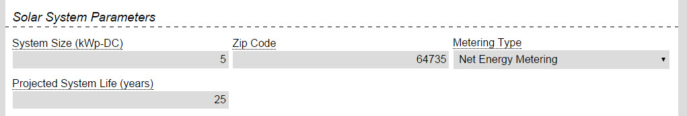
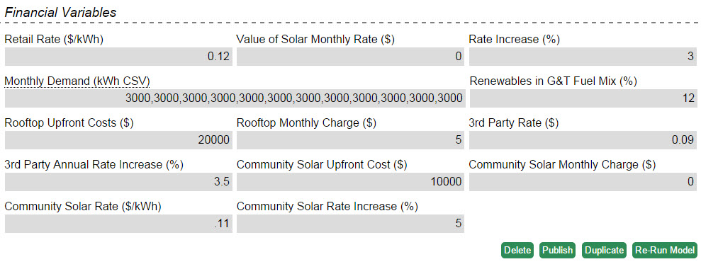
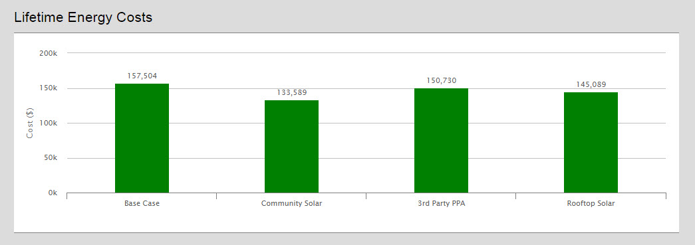
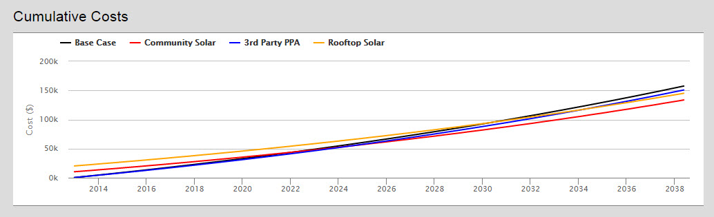

### Overview

This model calculates the expected costs for a consumer who buys solar in one of 3 different ways: through a PPA with a 3rd party, through a community solar project, or by buying a rooftop system.

You can [try the model on omf.coop](http://omf.coop/newModel/solarConsumer/linkedFromWiki) by following that link.

### Walkthrough

This model requires inputs for the solar array being modeled and the economic assumptions for each case as well as how the system will be metered. The solar array output is calculated from NREL's pvWatts. There are 3 metering types:
Net Energy Metering - All solar production is credited at the retail rate.
Production - All solar production is credited at the wholesale rate
Excess Energy Metering - Solar production up to the monthly demand is credited at the retail rate, but any production over the monthly load is credited at the wholesale rate.

This model examines 3 different solar programs: rooftop solar, 3rd party solar, and community solar as well as a base case with no solar.  For each solar program  the user enters information on the rate they are paid for solar energy, how that rate will increase over time, and if there are any associated charges on a monthly (such as a monthly charge for rooftop solar), or one-time basis (installing the rooftop array).  

The two other inputs are the Monthly Demand and Renewables in G&T Fuel Mix. The monthly demand is 12 comma separated values to represent the member’s monthly load. The Renewables in fuel mix is the percentage of how much green power the member is already receiving based on the G&T’s renewable portfolio.

### Model Results

**Lifetime Energy Costs** - Graph of total cost of each program to the member over the entire simulation.

**Cumulative Costs** - Line graph tracking the cumulative cost over time. Good for showing how the rate increases impact each program’s costs and benefits.

**Detailed Costs by Purchase Type** - Table of important metrics for each program including the lifetime costs, amount saved compared to the base case, average monthly bill, average energy cost, simple payback, and percentage of energy from green power.

Other outputs include the hourly solar generation, irradiance levels, and climate variables all drawn from the pvWatts engine.
