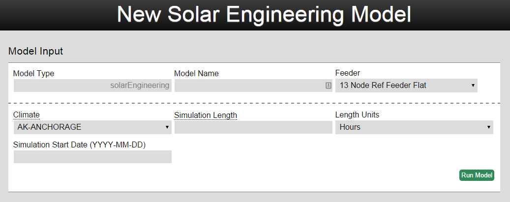
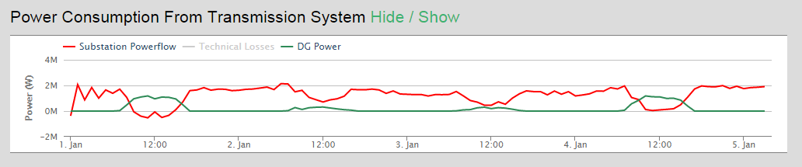
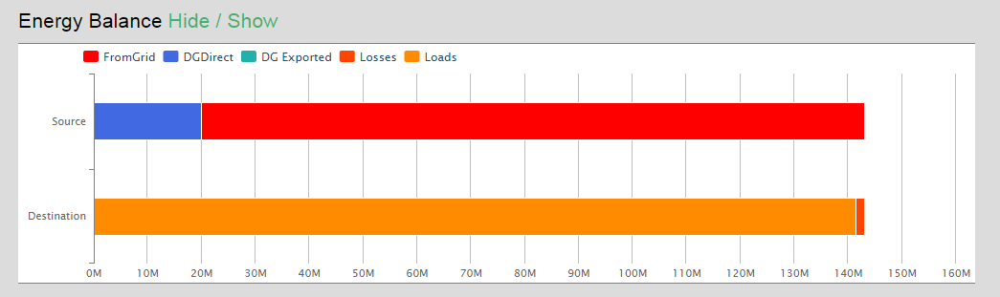
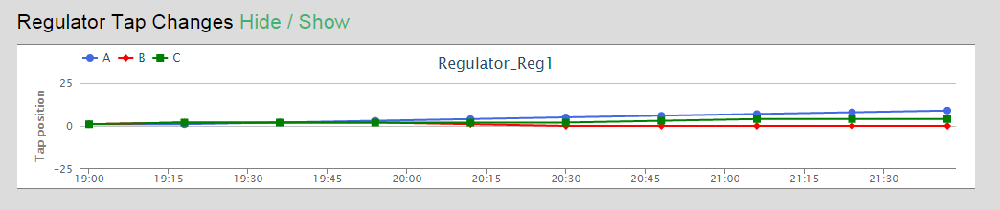
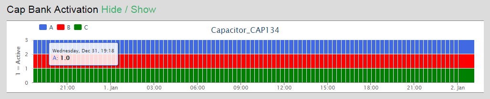
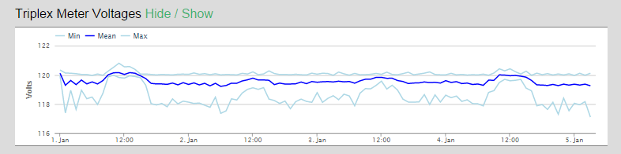
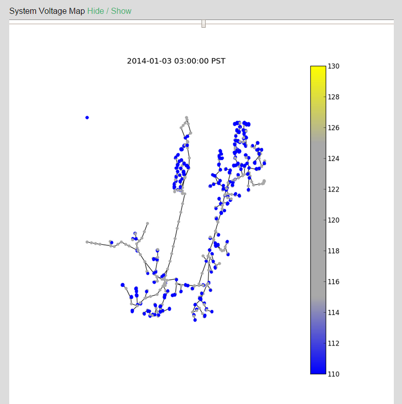

### Introduction

The Solar Engineering model calculates the technical system impacts of solar on a feeder including the amount of distributed power generated, regulator tap changes, capacitor activation, current flows, and meter voltages. Solar Engineering uses GridLAB-D as the engine to calculate these outputs.

You can [try the model on omf.coop](https://omf.coop/newModel/solarEngineering/linkedFromWiki) by following that link.



### How to Use the Model

Before running this model, be sure that the feeder you are using has solar modeled on it already. Modifying an existing feeder to simulate solar systems can be done through the feeder editor (steps described below). There are relatively few inputs for this model. The user only needs to enter a model name, the feeder, location for weather data, simulation length, and simulation start date. The most important input is the feeder, and the model results are dictated by solar system(s) on the feeder. For general feeder editing information go to the [gridEdit wiki article](./Other-~-gridEdit), or keep reading here for a specific guide on editing feeders for solar:

**Getting the Feeder Imported**

This is optional. You can start with a pre-imported feeder on omf.coop.

1. Get the Windmil .std and .seq files for your feeder.
1. Open www.omf.coop in Chrome and go to the feeder tab of the home screen.
1. At the bottom, select the Windmil files in the right boxes and give the results a name, and begin import.
1. Once the import is completed, open the new feeder. You need to reload the page with shift+F5 once to update the javascript. Or cmd+shift+R on a mac.
1. In the edit menu dropdown, choose “Static Loads to Houses”.
1. Save the feeder using the command in the grid dropdown menu.
1. Use either the Substation 1.4 MW template or the XX Percent Solar Template to simulate different types of solar systems.

**Substation 1.4 MW Template System (SUNDA Design)**

1. Open your Feeder in gridEdit. Using the grid dropdown menu, choose duplicate, and name the duplicated feeder.
2. Select a node in the model that isn’t the substation.
3. Add a meter via the add dropdown menu.
4. Select the meter, then add an inverter to the meter.
5. Select the inverter, then add a solar object to the inverter.
6. With the solar object still selected, click edit, and set area to “105000 sf” and the efficiency
to “0.155”. This corresponds to a 1.4 MW installation. Warning: Gridlab-D crashes and gives cryptic error messages if even a single variable is specified incorrectly. Type carefully.
7. Save the feeder via the option in the Grid dropdown menu.
8. Create a new solarEngineering model with this feeder.

**X% Distributed Solar**

1. Open the newly imported Feeder in gridEdit. Using the grid dropdown menu, choose duplicate, and
name the duplicated feeder.
2. Using the edit dropdown menu, put <XX> in the input box there, and click go on the “solar at meters” option.  This number represents the number of meters with a typical residential rooftop solar array.
3. Save the feeder.
4. Create a new solarEngineering model with this feeder.

Once you have a feeder with the desired solar systems on it, run the model.

### Model Results

The model will output the results directly below the model inputs. The graphs can be dynamically zoomed in and out on the page. The outputs of the solarEngineering model are:

Power Consumption from Transmission System- Chart showing the amount of power coming from the substation, distributed generation sources, and technical losses in watts.



Energy Balance- Graph of the total energy (in MWhs) by Source (where does it come from) and Destination (End use)



Regulator Tap Changes- Chart showing how the feeder’s taps change position over the simulation period.  If the model feeder does not include regulator taps then this graph will be hidden.



Cap Bank Activation- Graph showing which cap banks are active at what time.  If the model feeder does not include cap banks then this graph will be hidden.



Triplex Meter Voltages-Graph showing the minimum, mean, and max voltage values for the feeder during the simulation period.



System Voltage Map- Map of the feeder with the calculated voltage at each meter.



Irradiance- Graph of incoming solar power (global horizontal) in terms of watts/square foot calculated with TMY2 data.

Other Climate Variables- Graph of the rainfall, wind speed, temperature, and snow depth for every day of the simulation based on TMY2 data.

Study Details- Map showing location of the model simulation and table of model data.

### GridLAB-D Solar Object Conversion

GridLAB-D requires efficiency and area (sqft) ratings for its solar panel objects. Solar spec sheets report kW. To map from kW to the solar object's preferred inputs:

```
efficiency = 0.155
area = 75 ft^2/kW
```