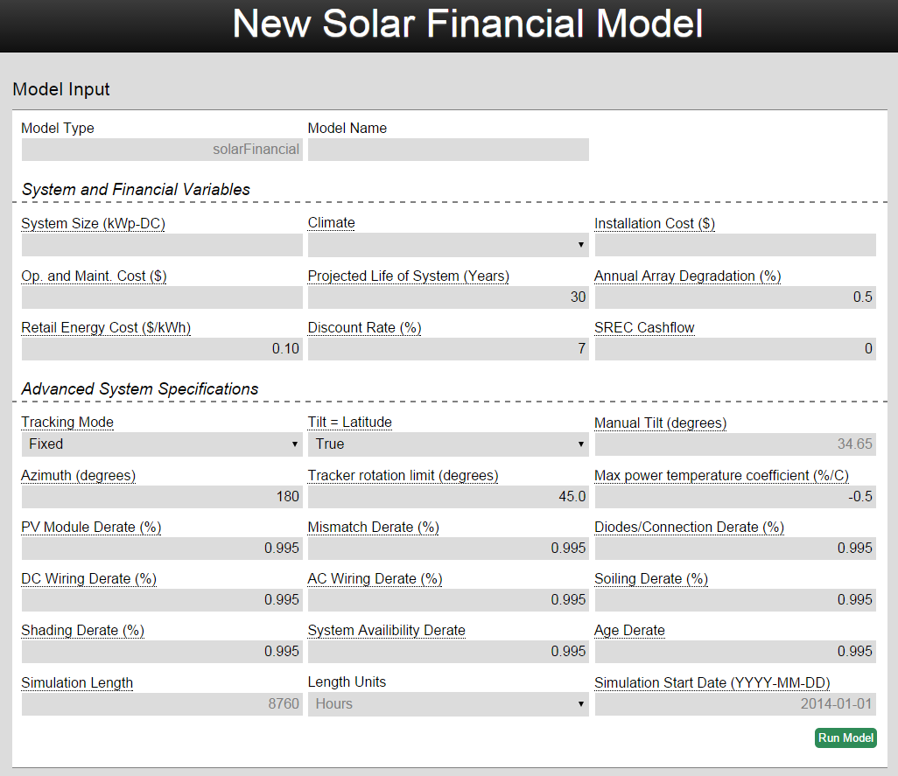
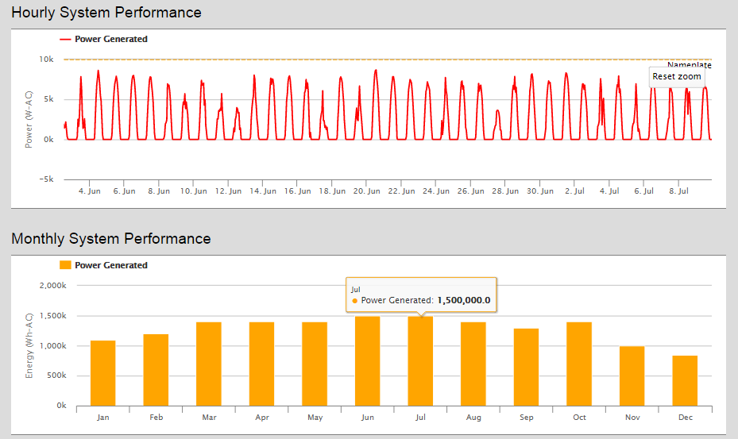
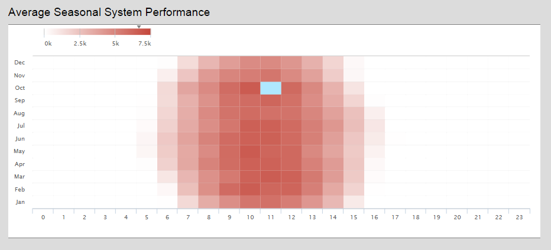

## Introduction
The Solar Financial model gives users the expected financial output of a PV system based on its costs and the amount energy it will likely produce.  The model uses pvWatts, an NREL model, to calculate how much energy the solar system will produce and the user’s assumptions about the price of installing and maintaining the array.

## How to Use the Model
Enter or change each input to match the system you want to model.  To see a description of each input either hover the mouse over the input's name or check the reference section.  If you don’t know what a particular input is, you can leave it to the default value.  Be sure to enter all percentages in as whole numbers instead of decimals (5 instead of 0.05).  Once all the inputs are filled click **Run Model**.  If any input is empty or the wrong type, the model will not run.  Once the model has run you can delete, publish, duplicate, or re-run the model.  Publishing the model will allow other OMF users to see your inputs and view the model’s results.  Duplicating it will create another model with a different name but all the same inputs.  Re-running the model allows the user to change inputs and see how they impact the results.  These options give users the ability to compare different economic, technical, or geographic scenarios.

## Model Results
The model will output the results directly below the model inputs.  The results can be downloaded as an excel file and the graphs can be dynamically zoomed in and out on the page.  The outputs of the solarFinanacial model are:
Hourly System Performance- Breakdown of how much power was produced each hour of the simulation in Watts-AC as well as a line indicating the nameplate rating of the array.

Monthly System Performance- Graph showing how much energy was produced each month of the simulation in Wh-AC. 

Average Seasonal System Performance- Graph showing how much energy is produced on average during each hour of the day in each month.  This lets the user see when the system production will peak throughout the year.

Climate- Graph of the weather for every day of the simulation based on TMY2 data.

Cash Flow- Graph of economics of the system.  Includes revenue from energy sales and the costs of purchasing and maintaining the system.  This data is in the annual data tab of the excel file.

Simulation Location- Where in the US the model simulated.

Monthly Data Table- Monthly breakdown of energy generated.

Annual Data Table- Annual economic data.
