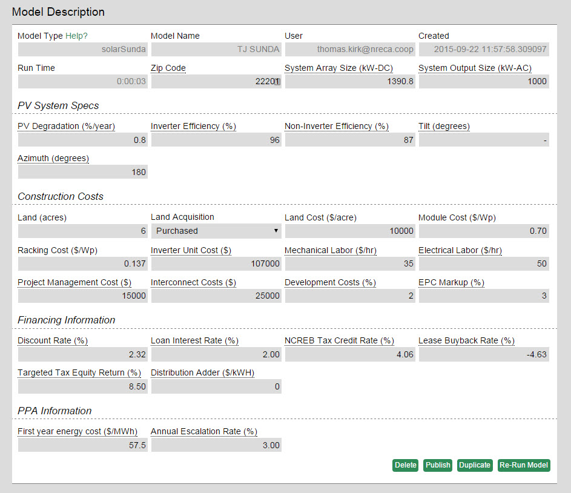
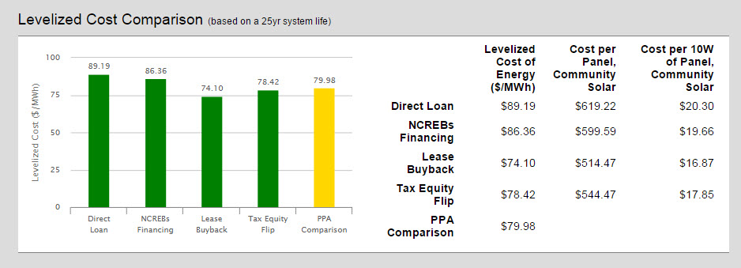
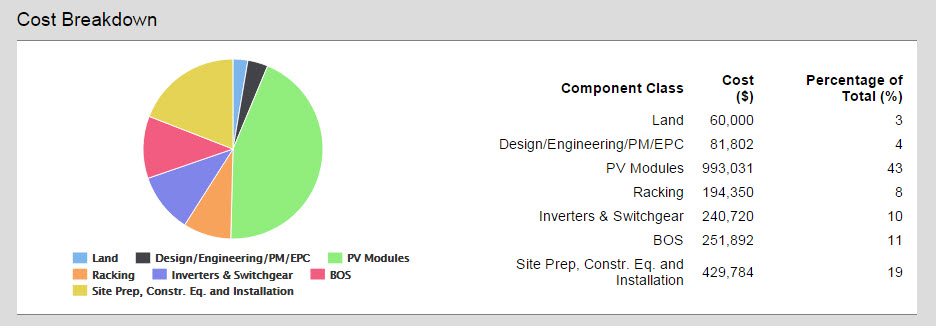

### Overview

The solarSunda model allows you to run multiple instances of the SUNDA Solar Costing Financing Screening Tool and compare their output visually. This tool allows a co-op to compare the levelized cost of a utility-scale solar installation using different financing structures. The financing structures included in this analysis are direct loan, NCREBs Financing, Lease Buyback, Tax-Equity Flip, and PPA.

You can [try the model on omf.coop](https://omf.coop/newModel/solarSunda/linkedFromWiki) by following that link.

If after running this screening tool, your utility is interested in pursuing a utility-scale solar PV installation, we encourage you to review the material at http://www.nreca.coop/SUNDA where you will find additional materials and reference designs for implementing utility-scale solar projects. Additional inquiries may be made to the NRECA SUNDA team at SUNDA@nreca.coop.

### Video Walkthrough

For instructions on how to use the model and an introduction to the concepts it uses, please see the [solarSunda walkthrough video](https://www.youtube.com/watch?v=aGwr7qyieZs&index=2&list=PLpJntTwNLWwqCAJnAsUl4_JNHqLFTh_GY).

A longer walkthrough [video](https://www.youtube.com/watch?v=idhf-NytEVM&index=1&list=PLpJntTwNLWwqCAJnAsUl4_JNHqLFTh_GY) exists for the [Excel model](https://www.dropbox.com/s/piyh2qc806c7ab2/SUNDA%20Solar%20Costing%20%20Financing%20Screening%20Tool%20-%20released.xlsm?dl=1) that allows editing more underlying assumptions.

### Walkthrough

The solarSUNDA model has many inputs, it takes in the PV system specs, relevant project costs, and financing information, but the typical user will only need to change a few inputs.  The most important inputs to change are **Zip Code**, **System Array Size** (both kW-DC and kW-AC should be changed proportionately), and **Land Acquisition**.  All other inputs can be changed as well, but we have made a concerted effort to be sure that the numbers and formulae used in it are reasonable and accurate to a sufficient degree to allow the tool to be used for screening and estimating purposes.  This means that the results should only be relied on to be accurate within about 5% and, as with any modeling tool, if you put garbage in you will get garbage out.

#### Model Results
The primary output of solarSUNDA is the **Levelized Cost Comparison** that shows the cost per MWh for energy from the PV system over its lifetime under each of the different financing options.  The chart on the right includes a community solar analysis as well for what price members would need to pay to cover the system’s cost.

The **Cost Breakdown** shows the cost and percentage different system components make of the toal project cost.

We encourage you to modify the model to suit your own needs. Please let us know of any refinements or corrections you make, so we may share these with the broader co-op community.