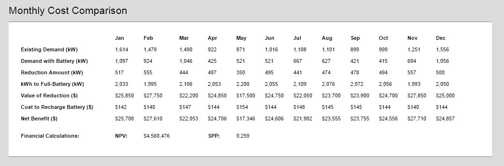
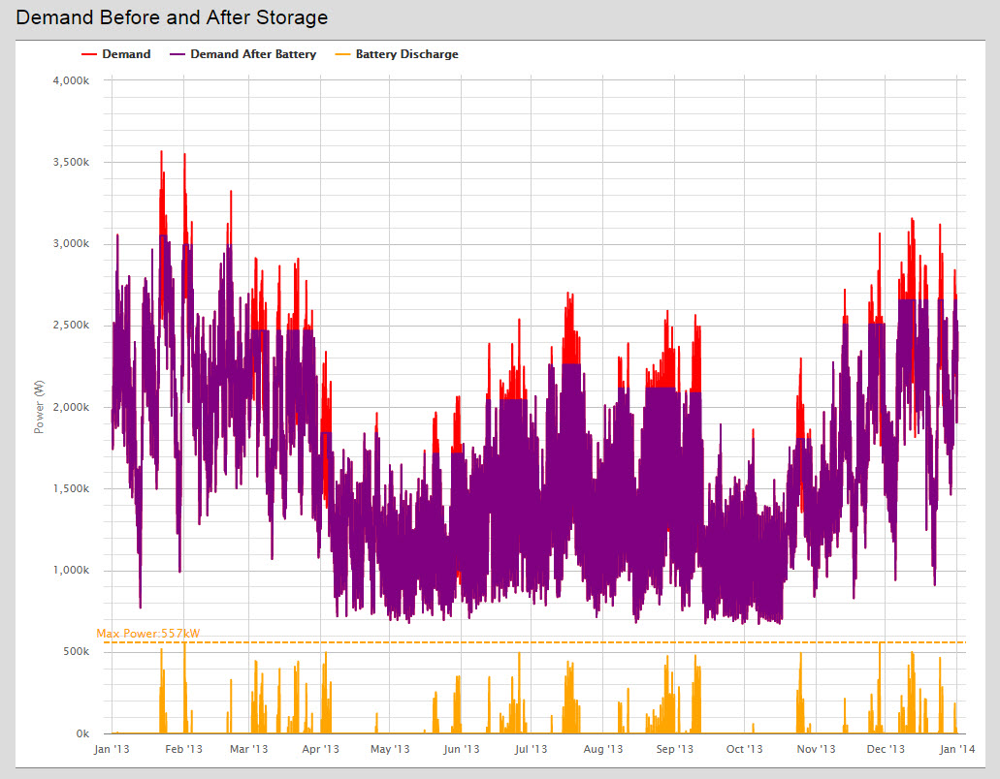
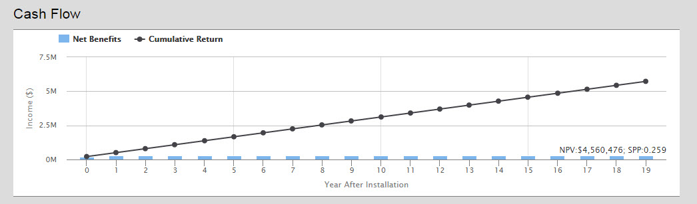

### Introduction

The [storagePeakShave model](https://www.omf.coop/quickNew/storagePeakShave) calculates the value of a distribution utility deploying energy storage based on three  possible battery dispatch strategies.  While energy storage systems may have multiple streams of value, this model only calculates direct savings from demand charges. Users can model energy storage behavior using a perfect dispatch scheme, a daily dispatch scheme, or a custom dispatch scheme. The optimal dispatch scheme calculates the maximum possible peak reduction. The daily dispatch scheme simulates daily dispatch between user selected peak hours. The custom dispatch scheme allows the user to select precisely when they would like the batteries to dispatch. 

### Walkthrough
The model requires the energy storage system’s technical specifications and cost, market characteristics (Demand Charge and Electricity Cost), and a Demand data for one year in a .csv file.

The default energy storage specifications are based on the Tesla Powerwall 7kWH, daily cycling unit, and a SolarEdge StorEdge inverter. Unit quantity refers to the number of units in the system at the rated unit capacity.  

The user can select which Dispatch Strategy they would like to simulate using dropdown menu. The daily dispatch strategy requires the user to input the peak hours that the battery would dispatch. The custom dispatch strategy requires a dispatch strategy .csv file. 


##### Demand File CSV Format

The demand file must be a comma separated value file (.csv). Microsoft Excel can output this format. It must have 1 column with no name. The power values must be integer substation demand measurements in **kW** of every hour of entire year. The result should be 1 column of 8760 rows.

An example of a valid .csv:
```csv
1981
1903
1917
...
2436
2280
```

If you would like to just try out the model, [an example demand file is available here](./images/demandExampleWinterPeak.csv).

##### Custom Dispatch Strategy File CSV Format

The custom dispatch strategy must be a comma separated value file (.csv). Microsoft Excel can output this format. It must have one column. The column values must be either a 1 or 0, 1 when the battery should dispatch and 0 when the battery should not dispatch. The time stamps must be a full year of data with measurements every 1 hour. The result should be 1 column with 8760 rows.

An example of a valid .csv:
```csv
0
0
1
0
1
1
1
...
```

If it is assumed that (for example) on 2/10/2011 between 7am and 10am will be peak hours the user should put 1's during those hours. This file shows multiple hours of 'dispatch' to ensure charging the batteries during peak hours is avoided.

### Model Results

**Monthly Cost Comparison**- Shows for each month how much demand is reduced by using the battery and the total savings from this reduction.  Uses this information to calculate Net Present Value (NPV) and Simple Payback Period (SPP) for the length for the total length of the project.



**Demand Before and After Storage** is a graph showing the system’s demand with and without the energy storage system operating.



**Cash Flow** is a visual reference for the value of the ESS.   The net benefits are calculated on an annual basis while the cumulative return takes into account the entire lifetime of the system.

