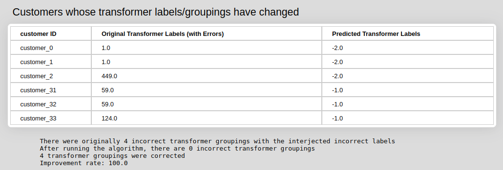
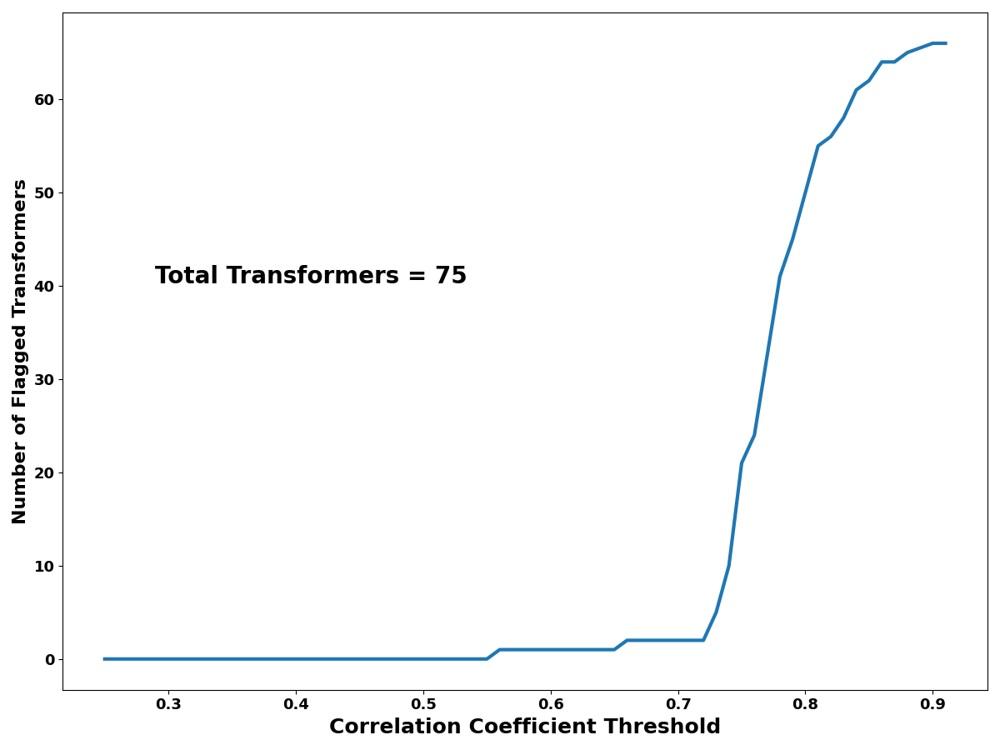

## Overview

The model corrects GIS errors where meters are not associated with the correct transformer. It does this by calculating voltage and power correlations between meters. It is based on code and results developed by [Logan Blakely](https://energy.sandia.gov/programs/electric-grid/advanced-grid-modeling/key-personnel/logan-blakely/) and [Matthew Reno](https://energy.sandia.gov/programs/electric-grid/advanced-grid-modeling/key-personnel/matthew-j-reno/) at Sandia National Laboratory.

## Model Inputs and Outputs

### File Inputs
The model requires four separate input files, each a .csv file with different readings from AMI meters. 
The four different files are separated into customer IDs, voltage, real power, and reactive power. Each row of each file corresponds to a customer - respective to the rows customer CSV file. None of the files contain headings.<br />
<br />
The customer CSV file consists of one column with no index listing each customer ID.<br />
The test customer CSV file used in the default model: [here](https://github.com/dpinney/omf/blob/master/omf/static/testFiles/transformerPairing/CustomerIDs_AMI.csv)<br />
An example of a valid customer AMI data file:<br />
```
customer_0
customer_1
customer_2
```
<br />
The voltage file is voltage AMI data; each row contains comma separated voltage values for the customer corresponding to the customer CSV. This means that the voltage values in row 0 correspond to the customer listed in row 0 of the customerCSV file. This pattern is followed for the real and reactive power CSVs.<br />

An example of what one of these files looks like:<br />
```
5.0738492473829432e+02,5.0738492473829432e+02,5.0738492473829432e+02,5.0738492473829432e+02
6.3092489043223449e+02,6.3092489043223449e+02,6.3092489043223449e+02,6.3092489043223449e+02
```
The test voltage AMI file: [here](https://github.com/dpinney/omf/blob/master/omf/static/testFiles/transformerPairing/voltageData_AMI.csv)<br />
The test realPower AMI file: [here](https://github.com/dpinney/omf/blob/master/omf/static/testFiles/transformerPairing/realPowerData_AMI.csv)<br />
The test reactivePower AMI file: [here](https://github.com/dpinney/omf/blob/master/omf/static/testFiles/transformerPairing/reactivePowerData_AMI.csv)<br />

### Model Outputs

The model output displays a table with a customer ID and the corresponding original labels that were incorrect and the predicted transformer label that they should be.

The model output also shows how many of those predicted labels were modified were accurately modified.



Correlation Coefficient Threshhold



## References