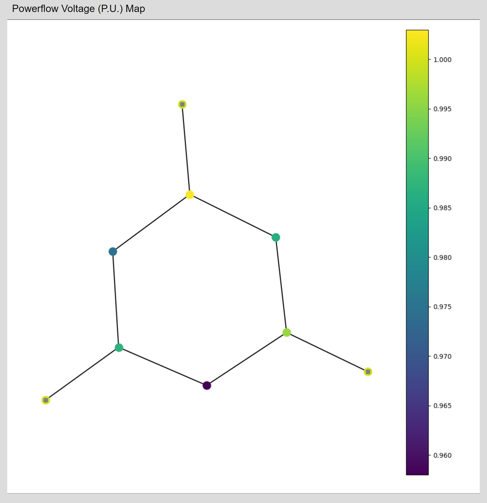
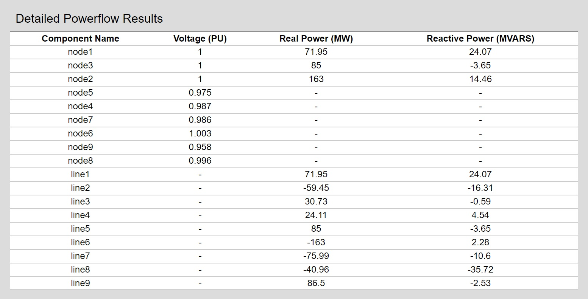

### Overview
The transmission model calculates the expected powerflow voltage results per bus on a given transmission circuit. The underlying calculations are handled by [MATPOWER](http://www.pserc.cornell.edu/matpower/).

### Walkthrough
The transmission model can be modified in real-time using a graphical interface by pressing the green 'Open Editor' button to the right of the name. Users are able to add, delete, relocate, or modify the information of each of the components.  Once the feeder has been changed to your requirements, the simulation can be further customized using the following inputs:

* Algorithm: The MATPOWER powerflow solver method. Can be set to NR (Newton Raphson), FDXB (Fast-Decoupled XB Version), FDBX (Fast-Decoupled BX Version) or GS (Gauss Seidel). These are the solution algorithms supported by MATPOWER.

* Model: The powerflow formulation, set to AC or DC.

* Tolerance: The termination tolerance for powerflow, in units P and Q dispatch per unit.

* Iteration: The maximum number of iterations for the NR, FDXB, FDBX or GS solver methods.

* Generation Limits: Whether or not to set power limits on the generators in the system. User can choose from “do not enforce” (0 code on backend), “enforce with simultaneous bus type conversion” (1 code on backend), and “enforce with one-at-a-time bus type conversion” (2 code on backend).

### Graphical Network Editor

To view and edit the transmission network, click on the green "Open Editor" button. This interface also allows importing MATPOWER case files. Please note that we only support version 2 of the MATPOWER case file format, but the `loadcase` and `savecase` functions in MATPOWER can be used to translate from version 1 to version 2. If you have a PSSE RAW file, you can use that after converting it to a MATPOWER case file with the `psse2mpc` function in MATPOWER.

### Model Results

**Power Voltage Map**- Graphical visualization of components and corresponding voltage levels on the feeder.

**Detailed Powerflow Results**- Tabular display of individual components and their Voltage, Reactive Power, and Real Power levels.

