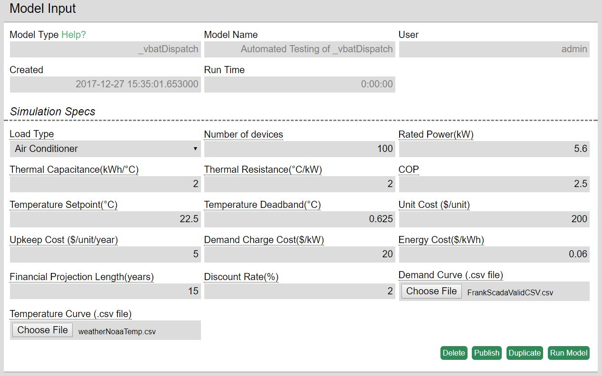
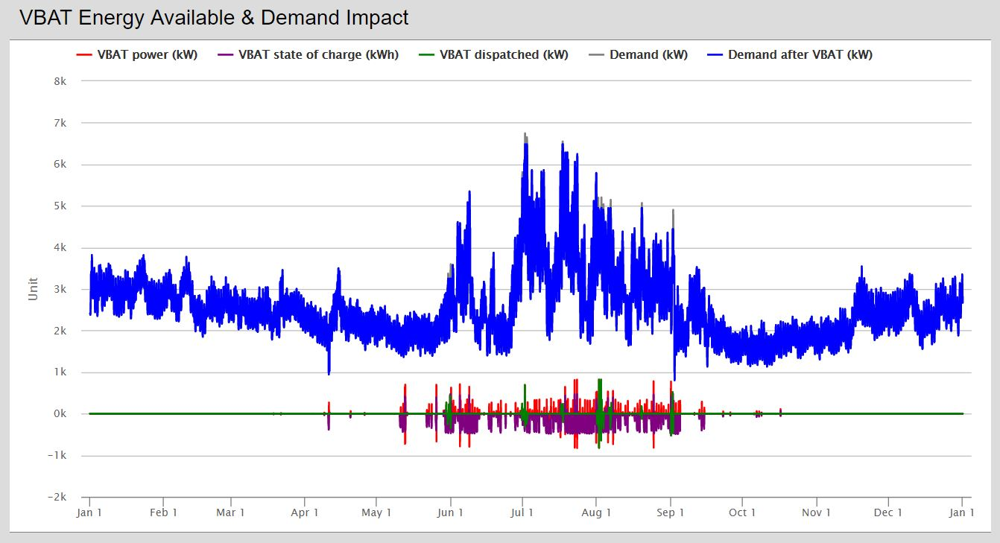
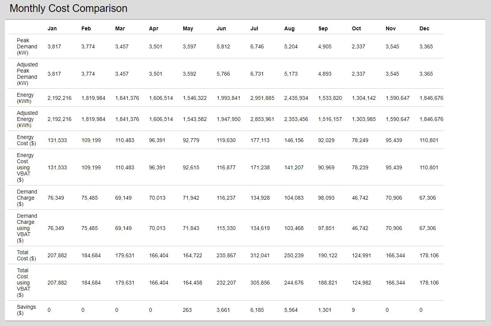
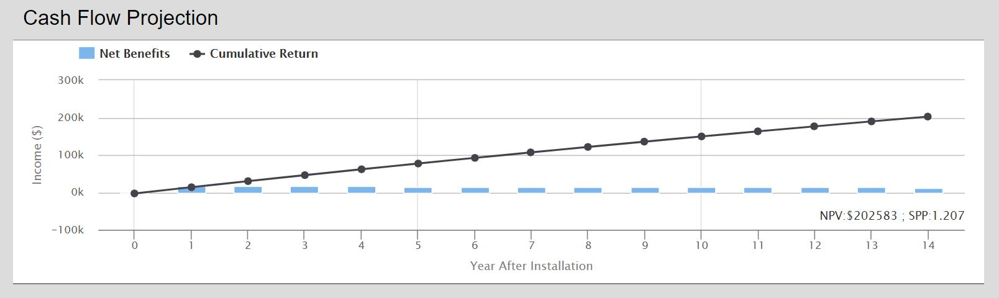

### Introduction
This model returns the expected savings of using thermostatically controlled loads in demand response programs. The underlying device model is PNNL's VBAT, which calculates the energy potential for thermal loads, an energy demand, and temperature settings. The results are outputted in three parts: the _VBAT Energy Available & Demand Impact_, shows a range of how much power could be saved over a year long period, the state of charge of the virtual battery, the unadulterated demand, demand after vbat reductions to achieve monthly peak shaving, and power actually dispatched; the second, _Monthly Cost Comparison_, shows a breakdown of demand, energy, energy cost, demand charge, total cost, and savings on a monthly basis to compare cost and performance of the system without and with VBAT; the third, _Cash Flow Projection_ shows the yearly cashflows as well as the overall balance.

Run the model here: https://omf.coop/newModel/vbatDispatch/fromWiki

### Walkthrough
The model requires the user to select the load type. Default values for the temperature settings are automatically loaded based on the device used, but can be changed. The next six parameters are for the financial analysis.



##### Demand File CSV Format
This file is a .csv file with 8760 hourly demand values in kW in a single column. Do not add a column title.

An example of a valid .csv:
```csv
1981
1903
1917
...
2436
2280
```

##### Temperature Curve File CSV Format
This file is a .csv file with 8760 hourly temperature measurements in Celsius in a single column. Do not add a column title.

An example of a valid .csv:
```csv
12.8
13.2
14.3
...
19.5
20.1
```

##### Random Numbers for Water Heater Format
The water heater random numbers file can be pre-generated by the model if the `Use the User-provided Random Numbers?` input is set to "No". This will create a `water_heater_random_numbers.csv` file in the model outputs.

##### PuLP Random Seed Format
The random seed used in the PuLP optimizer ranges from 0 to 2147483647. This will be set by the model if the `Use the User-provided Random Numbers?` input is set to "No".

### Model Results
**VBAT Energy Available & Demand Impact** - Shows an hourly breakdown of how much power(red), charge(purple), dispatched power(green), demand(grey), and demand with vbat dispatched(blue). Any area of the plot can be selected to zoom in. The zoom is reset by a button that appears on the upper right corner. By default dispatched power is toggled off. Any series can be toggled on/off by single clicking it's name.



**Monthly Cost Comparison** - Shows a table of the monthly breakdown of the demand, energy, energy cost, demand charge, and total cost without and with VBAT. The last row is the savings generated from VBAT.



**Cash Flow Projection** - Shows a graph that looks at the yearly cash flows (in blue) over the user specified duration, and the cumulation of cash flows (in black). The lower right corner displays the Net Present Value (NPV) and Simple Payback Period (SPP).

