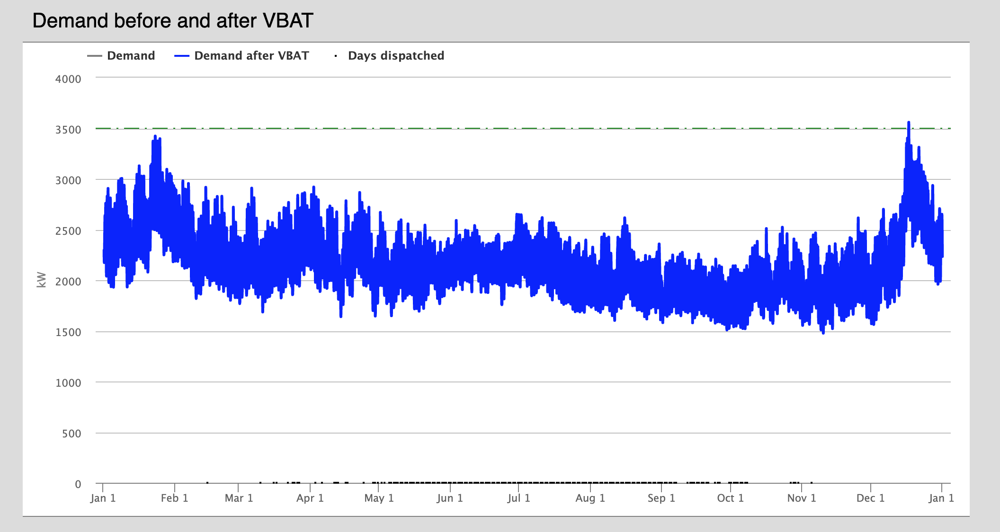
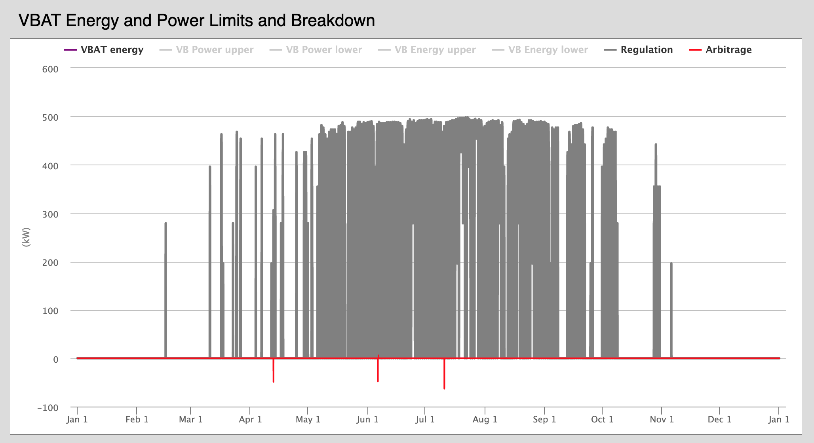
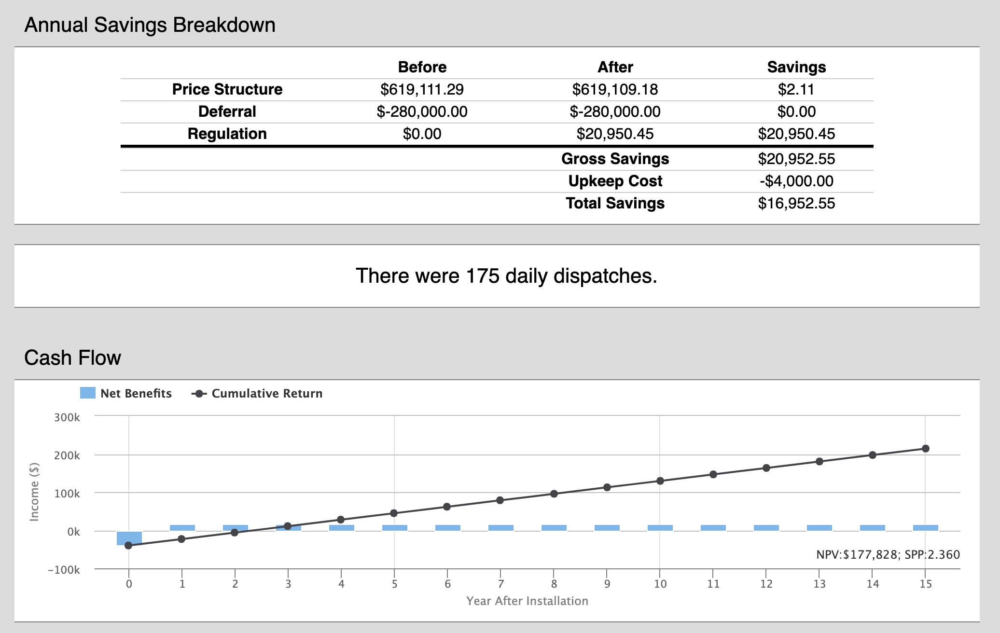

### Introduction
In coordination with the Pacific Northwest National Laboratory (PNNL), the OMF has integrated a linear programming model that stacks the benefits of direct load control across different revenue streams, by considering deferment strategies, regulation pricing, and other payment structures. Read more about our work with direct load control and the required inputs [here](./Models-~-vbatDispatch).

### Inputs
#### Input CSV
Requires 8760 rows with the following columns (It is important to name the columns properly. They are case sensitive.)

* "Hour": integers 1 - 8760
* "Load (kW)": Demand curve in kW
* "Reg-dn Price ($/MW)": Hourly regulation down pricing
* "Reg-up Price ($/MW)": Hourly regulation up pricing

Other standard direct load control inputs are required in addition to price structure information.

#### Temperature Curve
An 8760 temperature curve in degrees Celsius. Include no header.

#### G&T Curve (Option: G&T Peak)
An 8760 demand curve of the utility's G&T.

### Outputs
The consequences of the direct load program on the provided 8760 load curve is displayed as before and after. If deferral is chosen, that is also displayed as a line across the top of the chart.

The optimal dispatches are displayed how they are distributed across the stacked options. Users also have the options to view the storage capacity limits and power of the virtual batteries.

Monetary consequences are displayed, in addition to the number of days a utility should expect to dispatch given the restrictions provided by the user.

