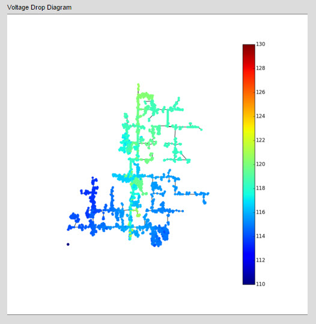

## Introduction

The voltageDrop model runs loadflow to show system voltages at all nodes.

It's a handy way to check that the circuit data is accurate. If there are problems with the feeder (incorrect phases, disconnected components, illegal variables, etc.) then the results will be blank.

Here is an example of a successful voltageDrop model: 