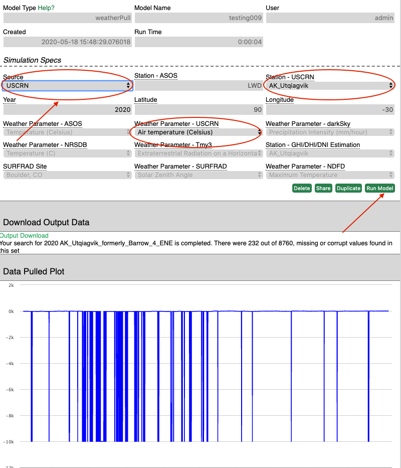

### Introduction
This model enables users to pull weather data at an hourly resolution for an entire year from two sets. The first set is NOAA's USCRN. The second is from Iowa State University's Iowa Environmental Mesonet. By selecting the set, year, station, and parameter, users can pull that information, obtain the validity of the data and download a .csv file based on their inputs.

### Walkthrough
There are four parameters required to run this model. The first is a drop down list of the data source: [USCRN](https://www.ncdc.noaa.gov/data-access/land-based-station-data/land-based-datasets/us-climate-reference-network-uscrn), [ASOS](https://www.ncdc.noaa.gov/data-access/land-based-station-data/land-based-datasets/automated-surface-observing-system-asos), [DarkSky](https://darksky.net/forecast/40.7127,-74.0059/us12/en), [NRSDB](https://nsrdb.nrel.gov/), [tmy3](https://rredc.nrel.gov/solar/old_data/nsrdb/1991-2005/tmy3/), [GHI/DHI/DNI estimation](https://github.com/tpt5cu/solarIrradiencePredictor), [surfrad](https://www.esrl.noaa.gov/gmd/grad/surfrad/sitepage.html), and the [NDFD](https://www.weather.gov/mdl/ndfd_data_grid). Each source has a difference set of stations and available data. 
The second parameter is the location. For some data sources, the location is the actual name of the station. For example, USCRN. Darksky however, allows for the user to input their own custom latitude and longitude. For ASOS you need to get an ICAO code, this [website](http://www.avcodes.co.uk/aptcodesearch.asp) can help you find a code. Note: For Airports in the US do not include the first letter (K), for all other countries leave the first letter. The third parameter is the year. Note, that some sources do not allow the current year as an input. 

The fourth parameter is the weather parameter itself. Each source has a different set of weather parameters.  

### Results
The data is displayed on hourly intervals for the period of one year. Currently there is no functionality to manually change the date range, but the user can click and zoom on a particular portion of the display. The user can also download the data to .csv. 

Note: there may not be any data available for certain years, stations, or weather parameters. If this is the case try a different parameter, nearby station, year, or source to find data close to what you are looking for.

### Useful Links
* Iowa State University's Iowa Environmental [Mesonet](https://mesonet.agron.iastate.edu/request/download.phtml?network=MD_ASOS)
* NOAA's USCRN hourly [dataset](https://www1.ncdc.noaa.gov/pub/data/uscrn/products/hourly02/) and [readme](https://www1.ncdc.noaa.gov/pub/data/uscrn/products/hourly02/README.txt)