## I. Introduction

Conservation Voltage Reduction (CVR) is a technique implemented to strategically regulate the supply voltage at the distribution feeders for reducing the coincident peak demand and overall energy consumption [1]. An added advantage of implementing this strategy is that it helps in reducing the overall ohmic losses for distribution feeders. The National Rural Electrification Cooperative of America (NRECA) has developed a software package [2] using the Open Modeling Framework (OMF) [3], which can be used by any utility/research entity to model the following:

(a)	Individual distribution feeders with all the customer loads, transformers, regulators and metering units

(b)	Run power flow analysis for calculating node voltages and branch currents and power flows

(c)	Losses and Energy Consumption over a period of time

(d)	Related financial impacts

This software package is hence very useful for analyzing the impact of strategies like CVR on the distribution system. For the current research work, this package was used to model different kinds of load profiles on one sample utility feeder and an analysis was done to understand how different load profiles will affect the overall savings and voltage at various nodes in the system. It should be noted that this study is in no way exhaustive and might not even include all the results which would be of interest to the reader. But, this report does provide a framework to analyze the impacts of CVR strategy which can be used to develop many more test cases in the future to do an exhaustive analysis. It should also be noticed that in this report, the focus was to obtain trends rather than the actual values themselves.

Following is the outline of the report: In section II of the report we outline the motivation and list the parameters which are to be varied and the quantities which have to be analyzed. In Section III we show the main results. In Section IV an analysis of ZIP estimates is given.

## II. Motivation

A utility may implement CVR strategy by using unique voltage regulator/ transformer load tap set points throughout the year or vary them according to the season. In any case, the regulation should be such that the load is always met and the End of Line voltage is always within the required band (120V± 5%). _Hence, in the current research work, our motivation is to bring out the usefulness of the CVR strategy for different load profiles_. A load profile is typically defined by certain parameters like ZIP ratios and power factor. In our study we use a static model of one feeder and analyze the effect when CVR is implemented for different load profiles.  

We set following parameters as independent variables in our study: 

1)	**Load ZIP ratios:** ZIP ratio is the relative ratio of the constant impedance (Z), constant current (I) and constant power (P) components in the load. It has been proven experimentally that these components vary over a wide range for different kinds of non-thermal loads on the system [1].

2)	**Power Factor:** Power factor is the ratio of the amount of real to the total apparent power (real + imaginary) power used in the system. The power factor is defines the quality of load (example: heating or motoring, resistive or reactive) in the system. 
 
3)	**Total Load** on the feeder system: The total load defines the magnitude of maximum demand that system (here a feeder) experiences for a predefined period of time.

We analyze the effect of the aforementioned independent variables on the following (dependent) quantities:

1)	**End of Line voltage:** This is the minimum voltage at any point along the feeder at a given state of system load and substation voltage. It may or may not be at the customer node located at the farthest end of the feeder. 

2)	**Losses:** These are the total ohmic losses incurred due to the inherent impedance of the feeder, transformer and other equipment conductors, at a certain load and substation voltage.
 
3)	**CVR savings:** These are the total savings accumulated by implementing CVR at the substation. The total savings are a sum of the savings from the reduction of coincident peak, reduction of losses and reduction of energy consumption. It should be noted that the savings will be negative for a utility due to the reduction of energy consumption, but the overall savings are usually positive due to huge savings on reduction of coincident peak.

## III. Results

Assumptions in the model: The savings are shown for zero operation maintenance and zero installation costs. The trends of the results indicate more useful information than the actual values shown. _The actual values are a function of various costs like the seasonal peak reduction per unit cost, the per-unit costs of electricity etc._

### III.a. Savings vs. Power Factor

We vary the power factor from 0.5 to 1 and analyze the variation in total savings. We find that there is a **linear increase in savings when power factor is increased** as shown in figure 1. This happens due to a higher decrease in peak demand at a higher power factor leading to higher savings.

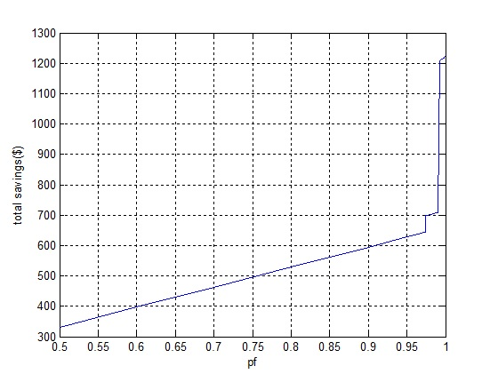

Fig.1. Total savings vs. power factor

For very high power factors, 0.97 and above we see a jump in savings (from that of 0.5-0.97) which again increases linearly up to 0.99 power factor. There is another jump in savings for power factors (>0.99). This is more clearly depicted in figure 2. One of the reasons that drives higher savings at higher power factors is the greater potential of lowering the voltage, and thus increasing savings. 

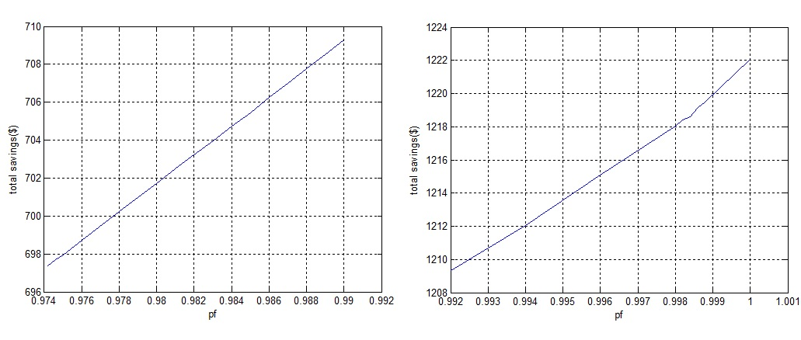

Fig.2. Jump in savings when the power factor is changed from 0.97 to 1.0

### III.b. Savings vs. ZIP ratio

For the purpose of current experiments we assume I ratio to be zero and hence the Z and P ratios are related as: Z= 1-P. The graphs of various savings for different Z ratios are shown in figure 3. Notice that the trend in all these graphs is linear. The total savings are linearly increasing with the Z ratios. **Hence higher Z ratio gives higher savings.** 

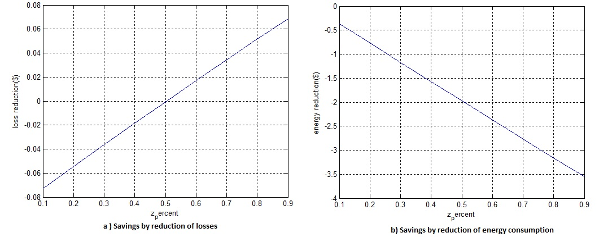

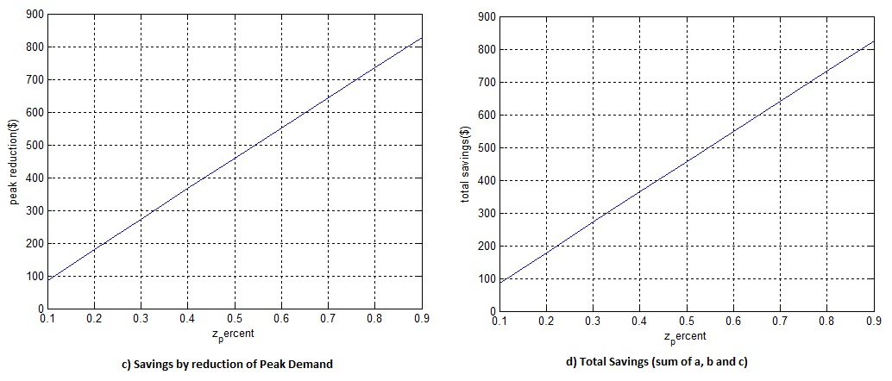

Fig.3. Savings vs ZIP variation (for I% = 0 and Z% = 1- P%)

### III.c. End of Line Voltages vs. load mix

The most important part of CVR analysis is to record voltage profile for the test feeder at each substation voltage level. This voltage profile should be regulated such that each node voltage across the feeder is within the permissible ANSI band (120V± 5%). Hence in our simulations, at each level of the substation voltage, the End of Line (EoL) Voltage is recorded. We simulated the EoL voltage for a particular feeder at different magnitudes of load when:

1. _the ZIP ratios are varied :_ refer to figure 4. The EOL of line voltage is **reducing with increasing load level** for every ZIP value, **the slope of reduction being higher for lower levels of Z** and vice versa. 

2. _the load power factors are varied :_ refer to figure 5. The EOL of line voltage is **reducing with increasing load level** for every power factor value, but **there is a slight variation in the EOL voltages due to change in power factors, with lower pfs leading to slightly lower EOL voltages** . 

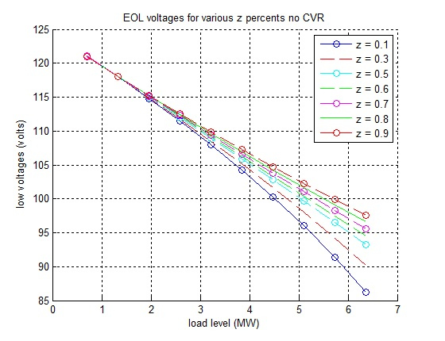

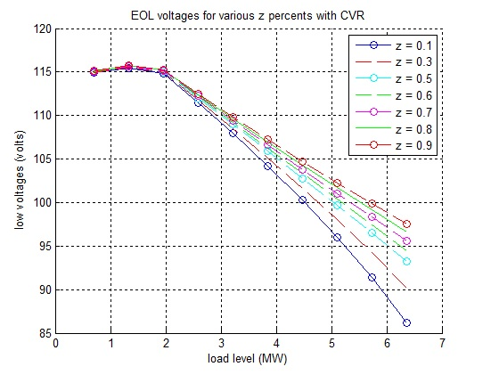

Fig.4. End of Line voltages for various load levels at different ZIP ratios. 
(Top: Without CVR, Bottom: With CVR)

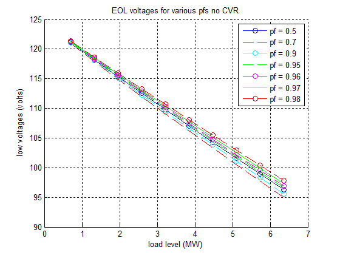

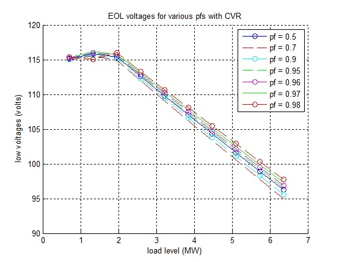

Fig.5. End of Line voltages for various load levels at different power factors. 
(Top: Without CVR, Bottom: With CVR)

### III.d. Losses vs. load mix
The total losses include the ohmic losses in the feeder conductor, the transformer and other equipment losses. These ohmic losses are directly dependent upon the inherent impedance of the conductor, and the load that is being served. Higher the load level, higher the losses. We also investigate the impacts on total losses when the ZIP ratios and the power factors are varied. We find:

1. _the ZIP ratios are varied :_ refer to figure 6. The total losses are **increasing with increasing load levels** for every ZIP value, **the rate of increase being higher for lower levels of Z** and vice versa. 

2. _the load power factors are varied :_ refer to figure 7. Total losses are **increasing with increasing load levels** for every power factor value, **there is minimal variation in the losses due to change in power factors**.

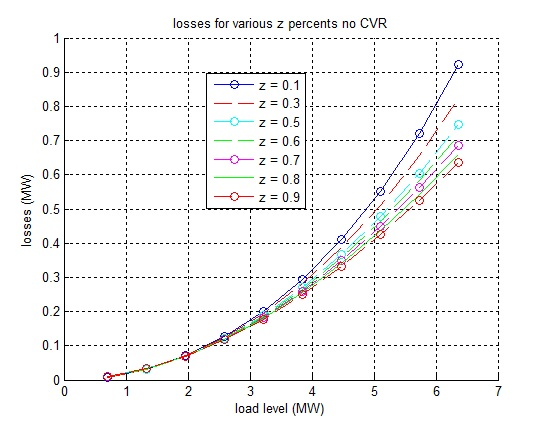

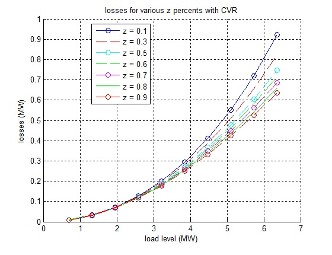

Fig.6. End of Line voltages for various load levels at different ZIP ratios. 
(Top: Without CVR, Bottom: With CVR)

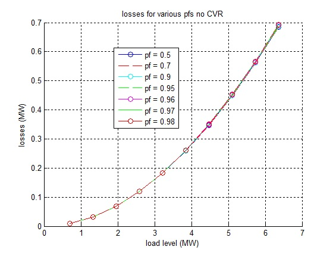

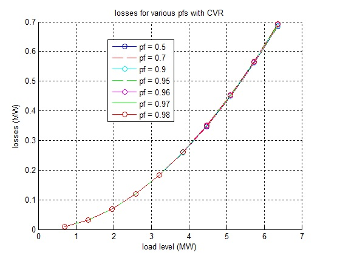

Fig.7. Losses for various load levels at different power factors. 
(Top: Without CVR, Bottom: With CVR)

### IV. ZIP estimates from raw data

As can be seen from the above analysis, the overall savings are directly affected by the relative percentages of constant Z, constant I and constant P components of the load. We obtained typical ZIP data from a load study done by PNNL with WECC [4]. In tables below, we have listed the typical ZIP estimates obtained for various regions for different types of load mixes. 

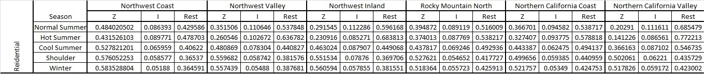

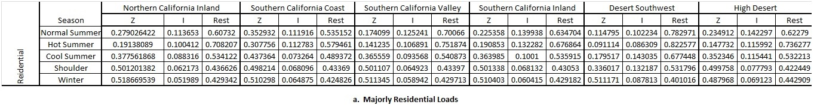

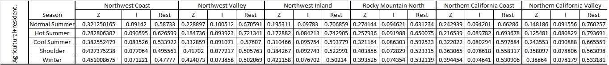

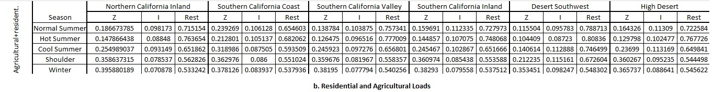

Fig.8. Tables showing ZIP estimates for different climate zones in California.

## References

[1] Schneider, Fuller, Tuffner, Singh, “Evaluation of Conservation Voltage Reduction on a National
Level”, Prepared by Pacific Northwest National Laboratory for the U.S. Department of Energy, July
2010.

[2] Pinney, “Costs and Benefits of Conservation Voltage Reduction. CVR warrants a careful examination- Initial Findings,” NRECA DOE Smartgrid demonstration project, November 15, 2013.

[3] https://omf.coop/

[4]http://www.wecc.biz/committees/StandingCommittees/PCC/TSS/MVWG/LMTF/Shared%20Documents/Forms/DispForm.aspx?ID=10
