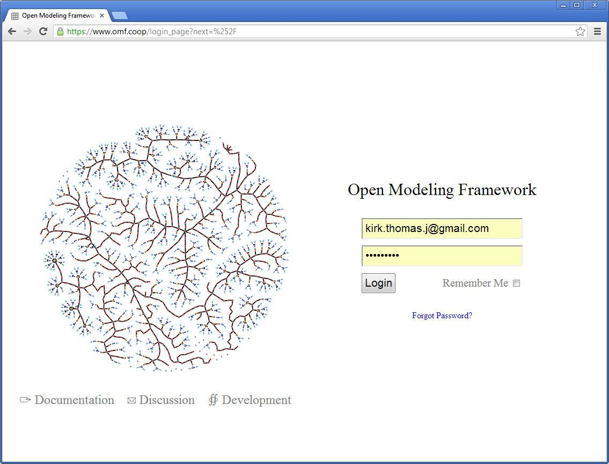
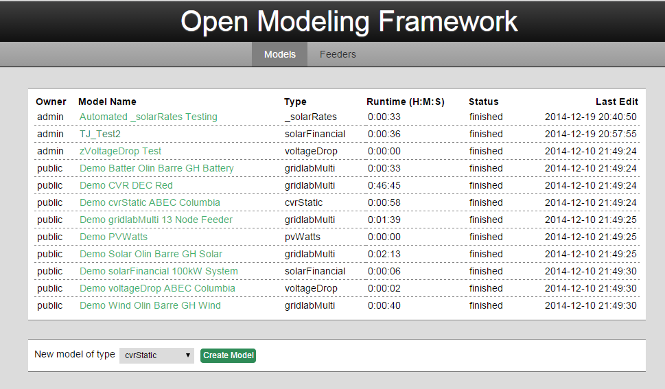
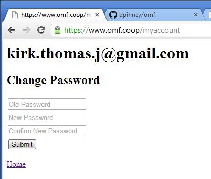
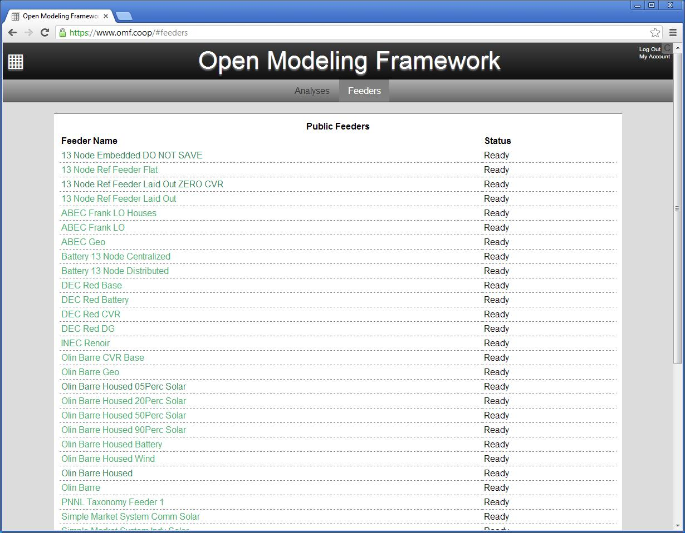
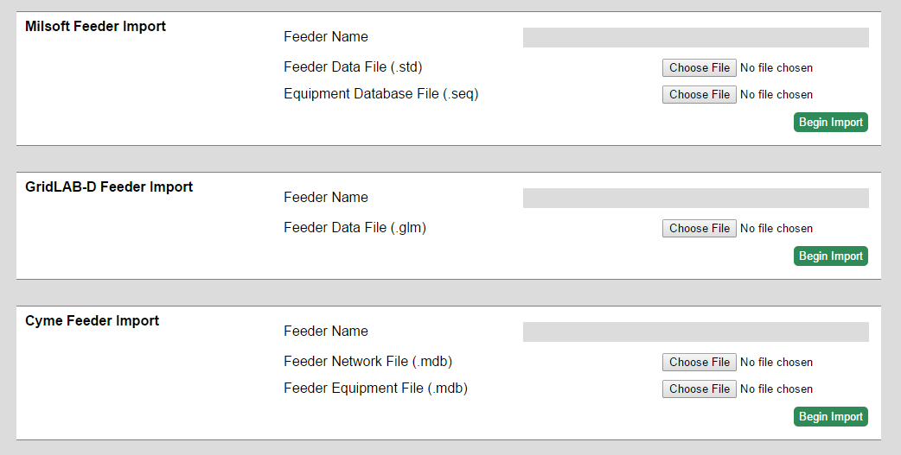
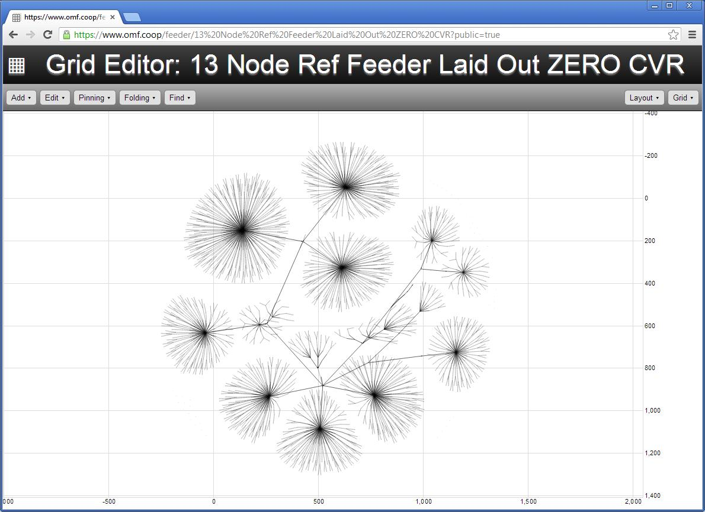
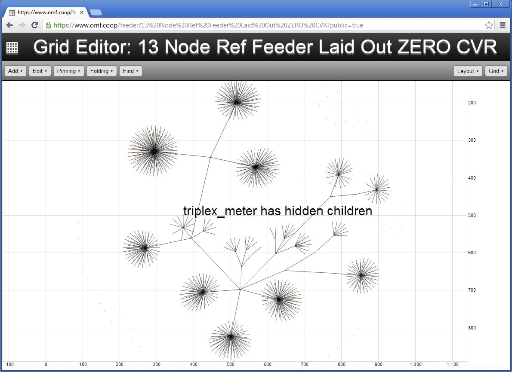
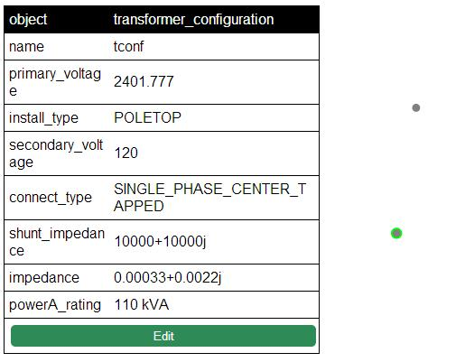
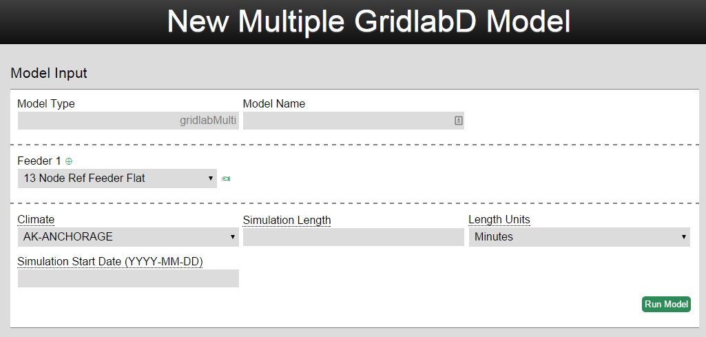
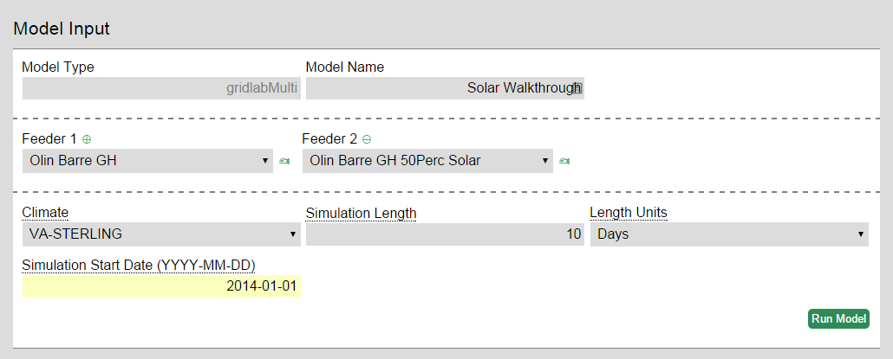

## An Open Modeling Framework Tutorial

This tutorial is designed to help a first time user navigate the [Open Modeling Framework (OMF)](https://www.omf.coop/) designed by the [Cooperative Research Network](http://www.nreca.coop/programs/CRN/Pages/default.aspx).

The OMF is a tool for simulating power systems behavior in order to provide a cost benefit analysis of potential technologies. For example, the OMF can be used to model how the addition of 15% solar generation on a target feeder will affect your operations. The OMF tool is highly flexible and gives users the advantage of being able to customize the model to reflect their own feeder network, technological inputs, weather variations, and other factors. Reporting output can include feeder power consumption, detailed power flow and monetization. Analyses are run on a computer cluster hosted by NRECA and typically take less than an hour to complete; some models run in as little as a minute.

This tutorial will lead the user through an ad hoc solar analysis model, and showcase the other solar models that are available on the OMF.

**Please note that there have been some interface changes since this tutorial was written, so some of the menu options and button locations will look different.**

**System Requirements**: The OMF is compatible with Chrome. There are no hardware requirements as the model is run in the cloud.

Tutorial Contents:

1. [Quick-Start Guide](./Walkthrough%20of%20a%20Solar%20Analysis#1-quick-start-guide)
2. [Set-up and Log-in](./Walkthrough%20of%20a%20Solar%20Analysis#2--setup-and-login)
3. [Feeders](./Walkthrough%20of%20a%20Solar%20Analysis#3--feeder-editing)
4. [Additional Resources](./Walkthrough%20of%20a%20Solar%20Analysis#4--conclusion-and-additional-resources)

## 1. Quick-Start Guide
The Open Modeling Framework (OMF) is a set of Python libraries for simulating power systems behavior with an emphasis on cost-benefit analysis of emerging technologies: distributed generation, storage, networked controls, etc.  The OMF leverages existing programs (such as pvwatts and Gridlab-D) to give it greater functionality and focuses on integrating different models and providing outputs that are easy to visually interpret.  The OMF can provide analyses on voltage drops, CVR, and solar including financial, rate, and engineering impacts.  Any user with feeder models in Milsoft can import their own models into the OMF and run simulations on them.  With the OMF you can analyze how much energy a CVR program will save, the cost of a PV system, how your rate structure will need to change if 20% of your customers put rooftop solar on their homes, the meter voltages along your feeder under different scenarios, and many others.  Let’s consider how an imaginary co-op might use the OMF: 

John Smith at Lonely Mountain Electric wants to know what will happen if 50% of the residents on feeder A-1 running up the mountain install solar on their roofs.  His board has asked him to look into this issue because they’re concerned about the technical and financial considerations.  John decides that before he calls in a consultant, he’s going to use the OMF to get a general idea of the situation.  He logs into the OMF and checks the public models for one that matches his situation, he finds a solar analysis that a nearby co-op has already done and checks their results.  Liking what he sees, John decides to continue and imports feeder A-1 from Milsoft to the OMF.  He then uses the OMF feeder editor to add solar at 50% of the meters and saves it as a new feeder.  Next John creates a new model that uses the Gridlab-D engine and imports both feeders, the original without solar, and the new one with solar.  He runs the model for a specified amount of time and analyzes the results.  He’s able to see how power consumption, and meter voltage change in each scenario and then using the embedded cost-benefit tool he can figure out the capacity cost, energy cost, and cumulative savings of each scenario- as well as easily recalculate them with different financial assumptions.  John is happy because the analysis was quick and effective.

In using the OMF there are several important conceptual terms to know:

**Model**- Primary analytic product of the OMF.  The model takes inputs from the user and uses an underlying engine such as Gridlab-D to run a simulation for a given length of time.  Often the user will import feeders into the model, but there are some models that do not require this.

**Feeder**- A model of a feeder imported from Milsoft, GridLAB-D, or modified from a public feeder.

**Type**- Also called model type, this refers to the underlying engine that is powering the model or the purpose of the model.  For example, the gridlabMulti type refers to GridLab-D as its engine, but the solarFinancial model type refers to its purpose.  Most models use GridLab-D or pvwatts to do their calculations.

**Public**- Public models or feeders can be seen and duplicated by all OMF users.  Only the creator or a site admin can delete them.

**Publish**- Publishing a feeder or model makes it public.  Do not publish anything you do not want others to see.

The rest of the tutorial will demonstrate how to perform an ad hoc solar analysis model, and showcase the other solar models that are available. 

## 2.  Setup and Login

This is the log-in screen to the OMF:

On the bottom left of the screen there are three links: Documentation, Discussion, and Development.

**Documentation** leads to this walkthrough located on the OMF’s github wiki.
**Discussion** leads to a Google Group forum that is used to discuss issues and solutions for the OMF among users.
**Development** leads to the github development site used to code the OMF.

Once you have the necessary permissions to access the OMF, enter your email address and password to login.

This is the homepage of the OMF:

The homepage shows **Public Models** that are already designed. Models are the primary product of the OMF and their composition depends on the type of model selected.  Typically they will incorporate climate data, a feeder (not all models need an input feeder, while others can have multiple), and user generated inputs.   For each model the owner, name, type, runtime, status and last edit are listed: 
**Model Name**- this column displays the name of each model and is user-generated. 
**Type**- displays the model used in the analysis and is either selected from a pre-existing list.  For example, the type gridlabMulti uses the Gridlab-D program to run it’s simulation, while a pvwatts model will use the pvwatts program. 
**Runtime**- displays how long the analysis took to process.  Typical models run in a few minutes or less.
**Status**- displays whether the analysis is “running”, or “finished”. Models that are finished can be opened by the user to either view the reports generated by the model or duplicate the analysis in order to run it themselves with possible minor variations. 
Below the Public Models are the user’s **Private Models**. After building and running the example analysis it will appear there with the option to publish it. The lattice-square in the top-left corner is a home-page button that will bring the user back to this screen. In the top right-corner are links to Log Out and My Account. **My Account** will bring you to this screen:

That allows the user to change their password.

In the top middle of the homepage are the links **Models** (selected by default) and **Feeders**. Clicking Feeders will bring a new page that displays all of the public feeders by their name and status (ready or not ready). 

##3.  Feeder Editing

Below the public feeders are the user’s private feeders. For each Private Feeder the same information as the public feeder is displayed (name and status) along with another **action** drop-down menu that allows the user to either publish or delete the feeder. Published feeders will appear in the top menu of Public Feeders and will be accessible by other users.

 Below the feeders are the feeder import boxes:

Currently the OMF allows users to import feeders from Milsoft, Grid-Lab D and Cyme.  Regardless of the feeder type, use **Feeder Name** to give the feeder a name to identify it in the OMF and select the appropriate file/s to be imported (pay attention to the file type required).  After the feeder is named and the files are selected **begin import**, this should only take a few moments.

To edit the feeder for this example, go back to the homepage and click **Feeders** at the top next to Analyses. Clicking on any of the feeder names will bring up the Grid Editor page. The public feeders are designed to be ready for analysis, or templates for users to modify depending on their needs. Click on the **13 Node Ref Laid Out Zero CVR** at the top of the Public Feeders list.

Before making any changes click on the **Grid** menu in the top right corner and select **Save as Private Feeder**.  To show that this is the feeder without solar penetration, give it the name **Baseline**.

This will ensure that the original feeder template remains unchanged for other users and gives the user a workspace for their own feeder designs.

The Grid Editor workspace is mainly a white space designing the feeder layout and all of the different objects that comprise it.  To navigate the workspace you can you your mouse scroll-wheel to zoom in and out, or double-click to zoom-in and shift+double-click to zoom-out.  There are several menus along the top that assist the user with various tasks.  The Add and Edit menus can change the data used to define the feeder while the rest define how the data is displayed:
**Add**- Allows the user to add more objects to the feeder including nodes, meters, transformers, lines, load, and more.
**Edit**- Allows for changes in the zoom scale, setting static load to houses, and changing the amount of solar energy at all the meters in the feeder.
**Pinning**-  Applies only to the visual representation of the data.  All objects in the Feeder are by default unpinned, if the user moves an object the rest of the objects will move as well according to their defaults and tolerances. The pinning menu allows the user to pin all or select objects, which will then move only when directly by the user.
**Folding**- Applies only to the visual representation of the data.  This menu is used to simplify the feeder on screen by hiding specified or bottom level objects into the next level up. For example, the same feeder in picture 11 now appears as this when two levels are folded:

Feeders that are folded will display a message stating that they have “hidden children”.
**Find**- A simple search tool that lets the user find specific elements in the feeder, and inform them of how many instances there are of that word.
**Layout**- Establishes the physical rules of the feeder including Gravity, Theta, Friction, Link Strength, Link Distance, and Charge. All of these values can be changed by the user.
**Grid**- For private feeders, this menu allows the user to Rename, Save, and Leave the Feeder.

The Feeder visualization is an object based system that is made to be easily interactive. Clicking on any object will highlight it and bring up its characteristics. 

Clicking the green edit button lets the user change existing attributes of the object, or add their own. For an in-depth explanation of each attribute found in the Grid Editor objects, use the GridLabD documentation [found here](http://sourceforge.net/apps/mediawiki/gridlab-d/index.php?title=Power_Flow_User_Guide)

For this model we want to simulate the impact of 50% solar penetration on the feeder.  To add this go back to the **Edit** drop-down menu, type in 50 for the **Solar at Meters** option and hit **go**.  It will take a few minutes to add the solar to the feeder.

Once you are satisfied with the feeder configuration be sure to **Rename** the feeder and then **save** it again with a new name.  The feeders are now ready for use in our analysis.

## 4. Solar Models

To continue the model tutorial, click on Models at the top of the page (or go back to the homepage) and select  **gridlabMulti** from the dropdown and then **Create Model** on the bottom left of the screen.

This will bring you to the **New Model** screen that presents the user with options to create their simulation.

**Model Name** is the main title of the simulation that will appear on the home screen.
**Feeder** is the feeder that the simulation will run on.  Click the green circle with a plus in it to add more feeders or click the green hand next to the feeder to bring up the feeder editor page in a new tab.
**Climate** controls some of the climate variables that will be input to the system. For most analyses the location should be kept the same for both studies to make them more comparable.
**Simulation Length** is used to determine over what period the model will run. Typically models are set to simulate a year to accumulate significant data.
**Simulation Start Date** is used to test daily and seasonal effects on the model. 

To continue the analysis, give the model a name, select the original feeder without the added solar, then click the green plus to add another feeder and select the edited feeder with 50% solar.  If you do not have a feeder with solar on it, then use the publically available Olin Barre GH feeder that has different levels of solar already modeled.  Be sure to enter values for climate, simulation length, and start date as well.

In this example the variable being tested is the effect of 50% solar penetration on a typical feeder in Virginia over ten days in the winter.

Once all inputs for the analysis are correct and then click **Run Model** in the bottom right corner.

The analysis will now appear on the main page under Private Analyses with the Status **Running** until the simulation is complete, at which point it will read **Finished**. While the model is running you do not need to stay on the OMF site, it will run independently. The action button will now have new commands, **View Reports** and **Publish**. Additionally there are actions **delete** to remove the analysis and **duplicate** to copy the analysis and allow editing.

The reports page displays the model’s outputs:
 Most of the reports are graphs displaying selected variables over the time frame of the analysis. To zoom into a particular report, click and drag the mouse across the time span of interest. Positioning your mouse over any of the graphs will provide the exact value for that variable on that day. Variables may also be turned on or off by clicking their name at the top of the report. 
The **Cost-Benefit Analysis** (Monetization Report) is dynamic and can be re-calculated with new values for the input parameters. 
The **Model Runtime Statistics** show results from the profiler such as how long each object ran for, the simulation rate, and other stats.
At this point, the analysis has run, the reports may be viewed at any time, and the final choice is whether to publish this analysis, or keep it private. Publishing the report makes it public- other users cannot delete public reports but they can view or duplicate them. 

## 4.  Conclusion and Additional Resources

A [video example](images/OMF_Preview.mp4) of a CVR analysis in the OMF is available.

If you have any further questions or comments please post them to the [OMF forum](https://groups.google.com/forum/?fromgroups#!forum/open-modeling-framework).