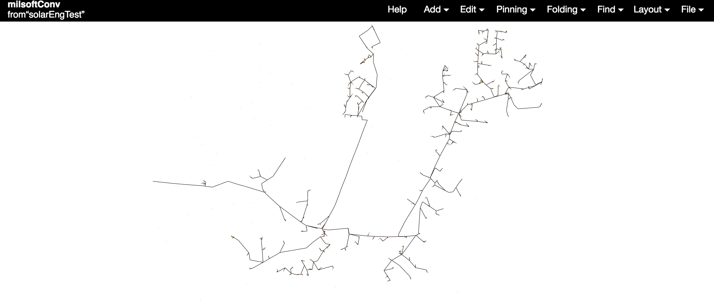
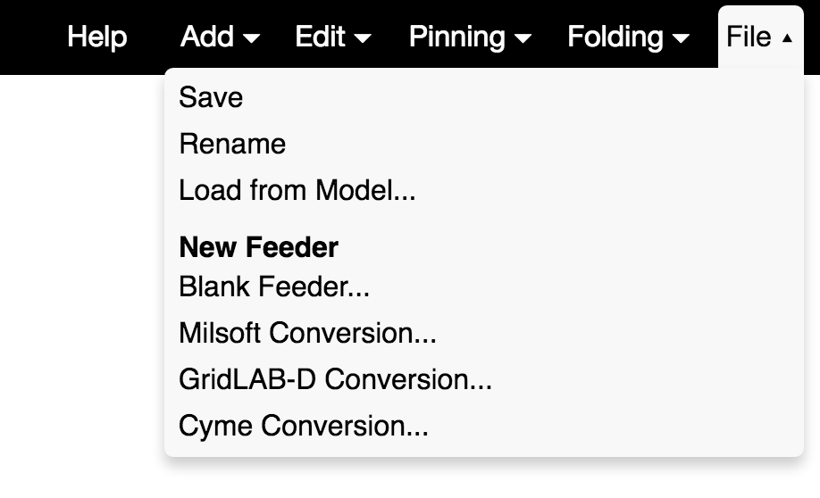
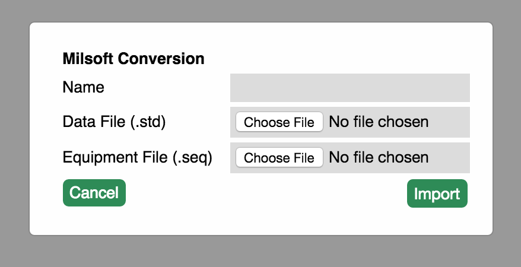
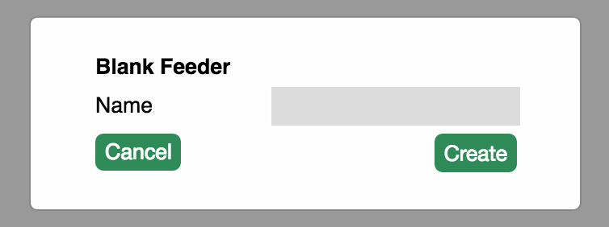
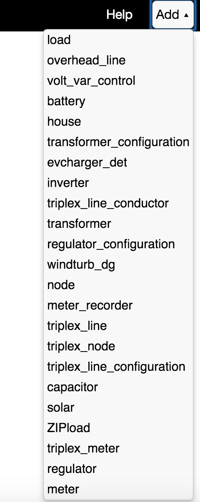
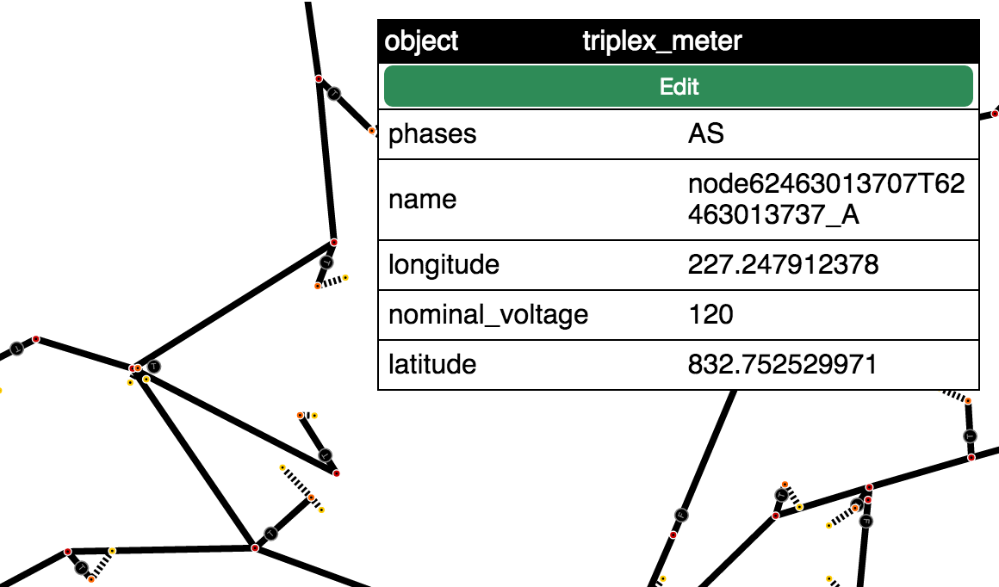
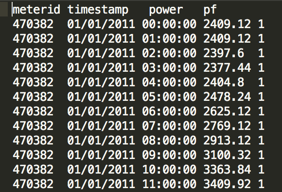
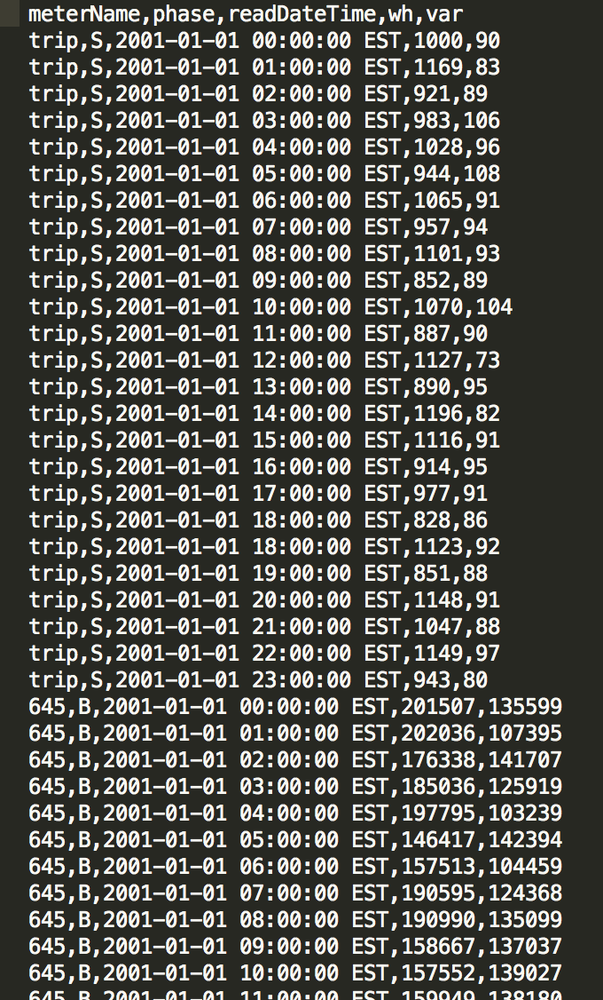

# Overview

The Grid Editor workspace is mainly a white space designing the feeder layout and all of the different objects that comprise it. To navigate the workspace you can you your mouse scroll-wheel to zoom in and out, or double-click to zoom-in and shift+double-click to zoom-out. There are several menus along the top that assist the user with various tasks.The grid editing tool is used to import, edit, and create new feeders for use in the many different simulations on the OMF.

## Walkthrough
 

The grid edit tool has the capability to import feeders from Milsoft, Gridlab-D, and Cyme. Feeders can be imported under the "File" dropdown menu. 

These imported feeders are converted to a useable format on the OMF. Find more information about Milsoft Windmil [here](./Other-~-Windmil-Data-Import), and Gridlab-D [here](http://gridlab-d.sourceforge.net/wiki/index.php/Creating_GLM_Files).

Users can also create a new blank feeder from scratch using the Blank Feeder option under the File dropdown menu. 

Once a feeder is imported or created, the user can edit their feeders using the "Add" button. Users can add many different things from new loads and distributed generation, to batteries and electric vehicles. To add new features, users should select the node to which they want to add a new feature, and click the "Add" button on the toolbar. Then select the feature from the dropdown menu. 

The edit feature allows the user to edit the specifics of each piece of the imported or created feeder. The edit feature can be found by clicking on the piece of the feeder the user wants to edit and selecting the "Edit" button on the object box that appears. After editing, click the "Save" button to save your changes. 

## Other Tools

Pinning- Applies only to the visual representation of the data. All objects in the Feeder are by default unpinned, if the user moves an object the rest of the objects will move as well according to their defaults and tolerances. The pinning menu allows the user to pin all or select objects, which will then move only when directly by the user. 

Folding- Applies only to the visual representation of the data. This menu is used to simplify the feeder on screen by hiding specified or bottom level objects into the next level up.

Find- A simple search tool that lets the user find specific elements in the feeder, and inform them of how many instances there are of that word. The user can cycle through the matches using the Next button.

Layout- Establishes the physical rules of the feeder including Gravity, Theta, Friction, Link Strength, Link Distance, and Charge. All of these values can be changed by the user.

### Scada Loadshapes
Users can calibrate their feeders using uploaded SCADA data in the form of a csv file. SCADA calibration makes it possible to apply load shapes to node objects in the feeder. The CSV should be formatted like the image below.

### AMI Load Modeling

Users can attach AMI load models to their feeders using uploaded AMI data in the form of a csv file. AMI load modeling makes it possible to apply load shapes to objects in the feeder. The CSV should be formatted like the image below.

After the feeder has been created or imported, and edited to the users satisfaction, they should save the feeder using the "Save" option under the File dropdown.

To exit from the grid edit tool simply close the window.