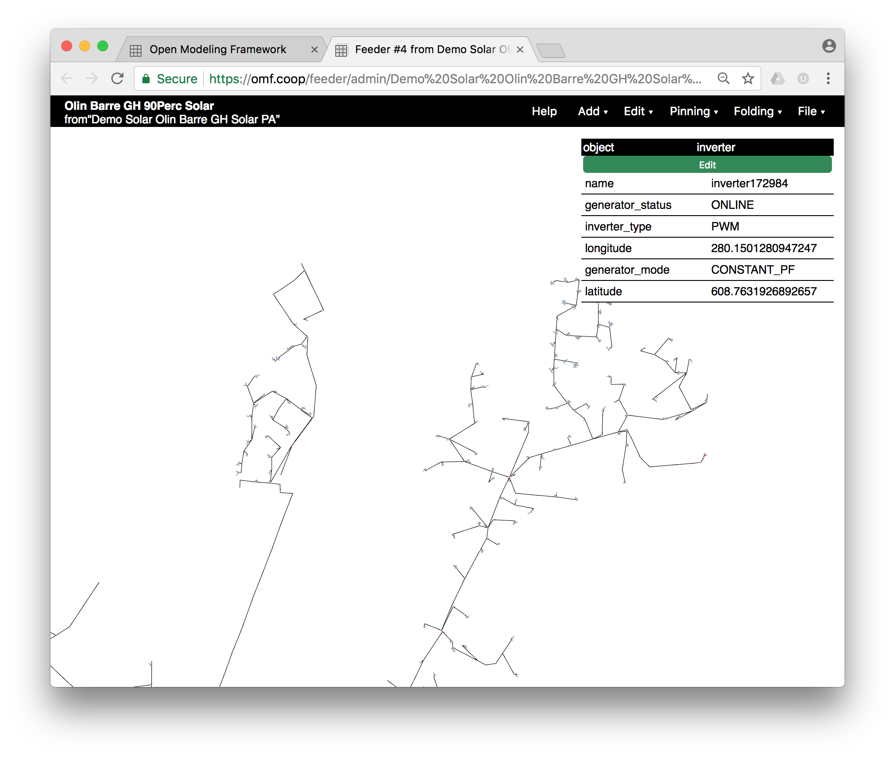
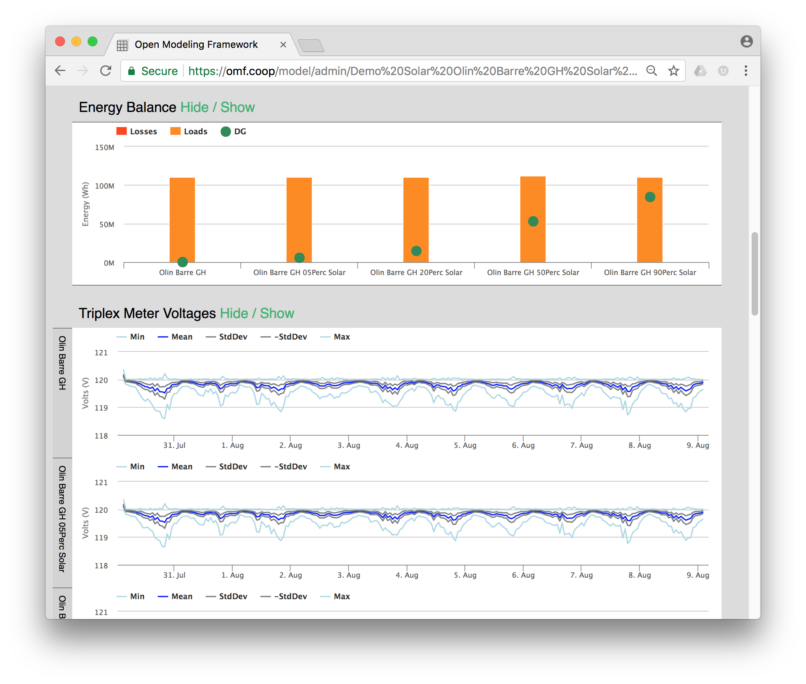
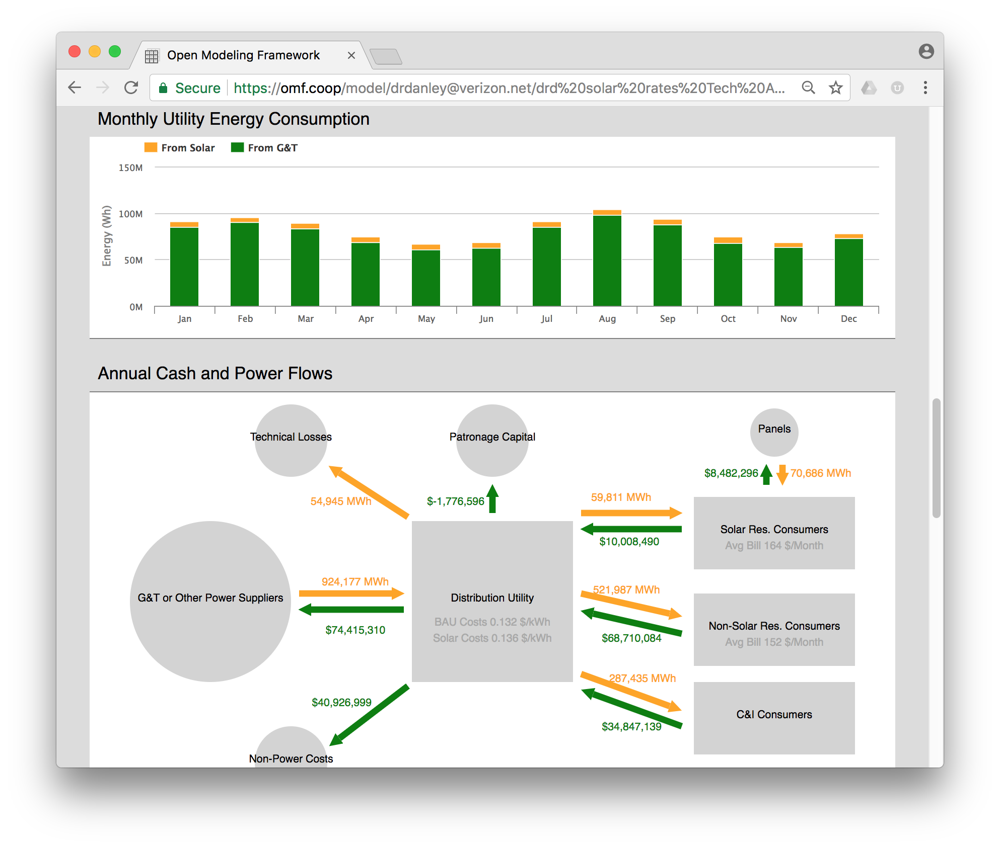
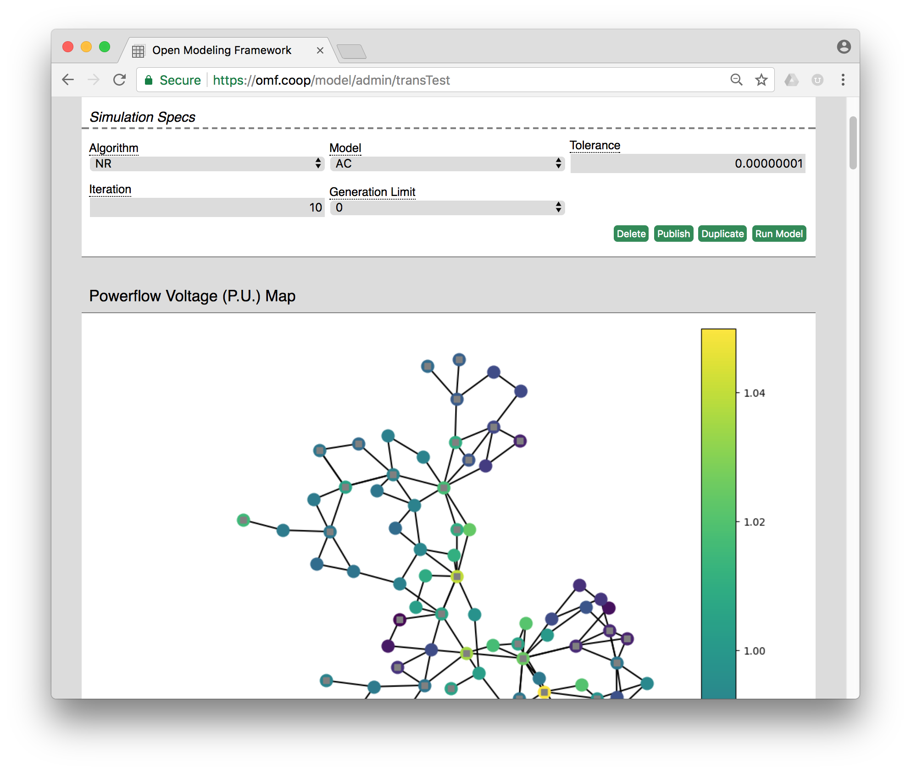

### Introduction

The Open Modeling Framework (OMF) is a set of Python libraries for simulating power systems behavior with an emphasis on cost-benefit analysis of emerging technologies: distributed generation, storage, networked controls, etc.

The OMF has an easy-to-use web frontend. You can run it yourself or use the free and public site at https://www.omf.coop.

### Getting Started

* [**Create an account on omf.coop and look at the example models**](https://www.omf.coop/)
* [**Walkthrough of a solar analysis**](./Other-~-Walkthrough-of-a-Solar-Analysis)
* A [**video overview**](https://drive.google.com/file/d/1vBv2nmYjUtIiBgowrpg0An68QHd0p3GL/view) of the OMF.

### Details on the Decision Models in the OMF

* [anomalyDetector](./Models-~-anomalyDetector.md)
* [circuitRealTime](./Models-~-circuitRealTime.md)
* [commsBandwidth](./Models-~-commsBandwidth.md)
* [cvrDynamic](./Models-~-cvrDynamic.md)
* [cvrStatic](./Models-~-cvrStatic.md)
* [cyberInverters](./Models-~-cyberInverters.md)
* [demandResponse](./Models-~-demandResponse.md)
* [derConsumer](./Models-~-derConsumer.md)
* [derInterconnection](./Models-~-derInterconnection.md)
* [derUtilityCost](./Models-~-derUtilityCost.md)
* [disaggregation](./Models-~-disaggregation.md)
* [evInterconnection](./Models-~-evInterconnection.md)
* [faultAnalysis](./Models-~-faultAnalysis.md)
* [forecastLoad](./Models-~-forecastLoad.md)
* [forecastTool](./Models-~-forecastTool.md)
* [gridlabMulti](./Models-~-gridlabMulti.md)
* [hostingCapacity](./Models-~-hostingCapacity.md)
* [microgridControl](./Models-~-microgridControl.md)
* [microgridDesign](./Models-~-microgridDesign.md)
* [networkStructure](./Models-~-networkStructure.md)
* [outageCost](./Models-~-outageCost.md)
* [phaseBalance](./Models-~-phaseBalance.md)
* [phaseId](./Models-~-phaseId.md)
* [pvWatts](./Models-~-pvWatts.md)
* [resilientCommunity](./Models-~-resilientCommunity.md)
* [resilientDist](./Models-~-resilientDist.md)
* [restoration](./Models-~-restoration.md)
* [rfCoverage](./Models-~-rfCoverage.md)
* [smartSwitching](./Models-~-smartSwitching.md)
* [solarCashflow](./Models-~-solarCashflow.md)
* [solarConsumer](./Models-~-solarConsumer.md)
* [solarEngineering](./Models-~-solarEngineering.md)
* [solarFinancial](./Models-~-solarFinancial.md)
* [solarSunda](./Models-~-solarSunda.md)
* [storageArbitrage](./Models-~-storageArbitrage.md)
* [storageDeferral](./Models-~-storageDeferral.md)
* [storagePeakShave](./Models-~-storagePeakShave.md)
* [transformerPairing](./Models-~-transformerPairing.md)
* [transmission](./Models-~-transmission.md)
* [vbatDispatch](./Models-~-vbatDispatch.md)
* [vbatStacked](./Models-~-vbatStacked.md)
* [voltageDrop](./Models-~-voltageDrop.md)
* [weatherPull](./Models-~-weatherPull.md)

### Other Tools in the OMF

* [Windmil Data Import](./Other-~-Windmil-Data-Import.md)
* [Forecast Based Dispatch](./Other-~-Forecast-Based-Dispatch.md)
* [gridEdit](./Other-~-gridEdit.md)
* [Load Profile Effect on CVR](./Other-~-Load-Profile-effect-on-CVR.md)
* [Walkthrough of a Solar Analysis](./Other-~-Walkthrough-of-a-Solar-Analysis.md)
* [Weather Data](./Other-~-Weather-Data.md)

### Developer Documentation

* [Architecture Notes](./Dev-~-Architecture-Notes.md)
* [Deploying the OMF Web Service](./Dev-~-Deploying-the-OMF-Web-Service.md)
* [How to Create Your First Model Type](./Dev-~-How-to-Create-Your-First-Model-Type.md)
* [How to Debug a Gridlab Model](./Dev-~-How-to-Debug-a-Gridlab-Model.md)
* [HTTP API Container](./Dev-~-HTTP-API-Container.md)
* [Installation Instructions](./Dev-~-Installation-Instructions.md)
* [Mac OS X GLD Install Instructions](./Dev-~-Mac-OS-X-GLD-Install-Instructions.md)
* [Notes on calibrateFeeder.py](./Dev-~-Notes-on-calibrateFeeder.py.md)
* [Packaging the OMF for Distribution](./Dev-~-Packaging-the-OMF-for-Distribution.md)

### Example Screenshots

### Support

The core OMF framework was built with the help of the DOE Office of Electricity (OE). Since then it has been used to support research by the DOE Office of Energy Efficiency and Renewable Energy (EERE), Advanced Research Projects Agency - Energy (ARPA-E) NODES, GRIDDATA and OPEN2013 programs, and multiple projects in the DOE Grid Modernization Laboratory Consortium (GMLC).